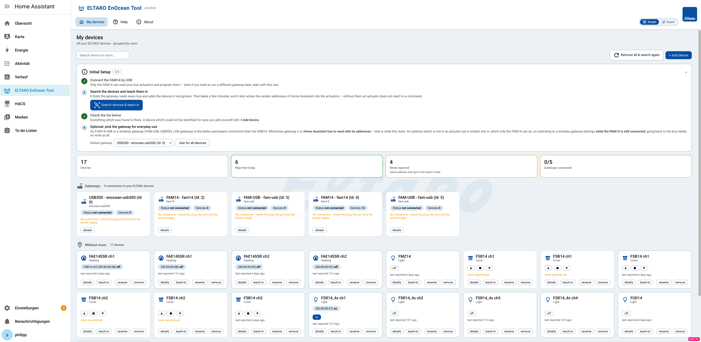
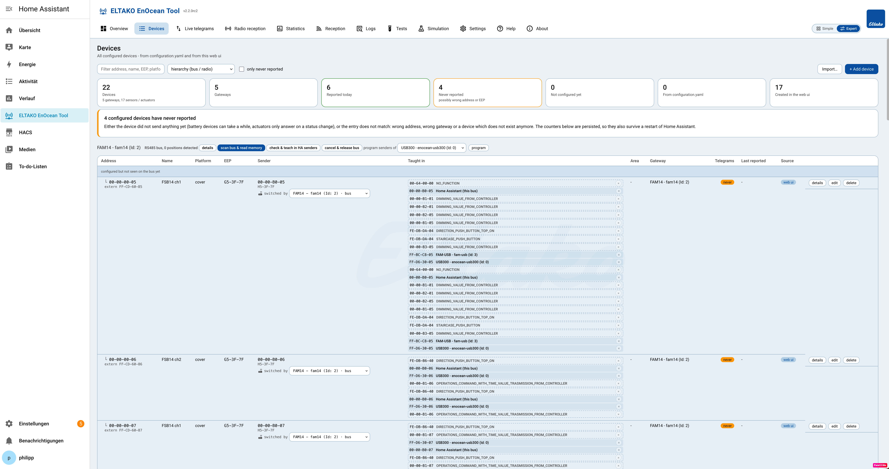

[](https://github.com/hacs/integration)
[](changes.md)
[](https://github.com/grimmpp/home-assistant-eltako/commits/main)
[](https://community.home-assistant.io/t/eltako-baureihe-14-rs485-enocean-debugging/49712)
[](LICENSE)
[](https://paypal.me/grimmpp)

# ELTAKO Bus Integration (RS485 &ndash; EnOcean) for Home Assistant

**Brings the ELTAKO Series 14 (RS485 bus) and EnOcean wireless devices into Home Assistant** &ndash; lights,
switches, covers, heating, meters and sensors as native Home Assistant entities, plus everything you need
to set them up and to find out why something does not work.

The integration is not limited to ELTAKO hardware: it speaks the **EnOcean standard**, ELTAKO devices are
just the ones named as examples throughout the documentation.

* **Nothing to enter, nothing to write.** Install it, add the integration &ndash; that is the whole setup. It
  looks for your gateways itself (serial ports and mDNS) and reads the RS485 bus, and the **ELTAKO** panel
  is in the sidebar, where gateways, devices and settings are configured graphically. Whatever is not
  detected is added there with a form, or in `configuration.yaml` for those who prefer files &ndash; the yaml
  still works and still wins, it is just not required for anything anymore. See
  [plug & play](docs/plug-and-play/readme.md).
* **See what is on the bus.** Live view of every telegram, statistics per EnOcean address, a passive list of
  all bus members, an active bus scan which reads the memory of every actuator, and
  [functional tests](docs/device-tests/readme.md)
  against the real hardware.
* **One panel, no extra package.** The [web ui](docs/web-ui/readme.md)
  is part of the integration &ndash; no add-on, no build step, no second installation to keep up to date.

New in this version: see the [change log](changes.md).

---

# Quick start

**1. Install the repository via HACS.** This integration is not part of the Home Assistant core
repositories, so [HACS](https://hacs.xyz/) is needed to install it. Click the button to open it directly in
your Home Assistant:

[](https://my.home-assistant.io/redirect/hacs_repository/?owner=grimmpp&repository=home-assistant-eltako&category=integration)

*Alternatives:* enter the url of this repository as a
[custom repository](https://hacs.xyz/docs/faq/custom_repositories/) in HACS, or install it by hand &ndash; clone
the repository and run `./install_custom_component_eltako.sh`, which copies `custom_components/eltako` into
your Home Assistant configuration. See
[installing a specific version or branch](docs/install-specific-version-or-branch.md) - which also
covers **beta versions and release candidates**: those are published as github pre-releases, HACS
only offers them when *show beta versions* is switched on, and the web ui marks them as what they
are on every page.

**2. Add the integration.** *Settings &rarr; Devices & services &rarr; Add integration &rarr; ELTAKO*. **Nothing is
asked and nothing has to be entered**: no gateway, no serial port, no `configuration.yaml`, no restart &ndash;
the dialog is over the moment you picked ELTAKO, there is not even an option to choose. The integration then looks for the hardware itself: every
free serial port is probed (FAM14, FGW14-USB, FAM-USB, USB300 &hellip;) and LAN gateways which announce
themselves via mDNS are picked up. Every gateway which is identified beyond doubt is set up on its own.

What you get is an entry called **ELTAKO Core** &ndash; the base component, holding no hardware: it is what
makes Home Assistant load the integration, and with it come the web ui, its websocket api and the
automatic detection. Every gateway found gets its own entry next to it; those are the hardware.

> This step is not optional, and it is not this integration being demanding: Home Assistant loads a custom
> integration only when it has a config entry or when its domain is in `configuration.yaml`. Until then none
> of its code runs, so nothing can put a panel into the sidebar. If you prefer files, a single line
> `eltako:` in your `configuration.yaml` does the same job &ndash; everything else is configured in the web ui
> either way.

**3. Open the ELTAKO panel.** It is in the sidebar right away (for administrators), and Home Assistant opens
it for you once, right after the installation &ndash; the web ui is part of the integration and **on by
default**. The overview page draws the running detection live. Everything from here on happens there. The
sidebar entry can be hidden later (*Settings &rarr; Web UI &rarr; Show in sidebar*, or on the integration page
under *Configure*); the panel then stays reachable under `/eltako`.

**A gateway which was not detected** &ndash; an FGW14-USB cannot be told apart from any other serial adapter, and
a LAN gateway which does not announce itself cannot be found at all &ndash; is added with **"+ add gateway"** on
the overview page: type, serial port or host, done. The ports of a scan are offered as suggestions. See
[gateways](docs/gateways/readme.md) and
[how to use gateways](docs/gateway_usage/readme.md).

**4. Add your devices** on the *Devices* page. Whichever way fits your setup:

| Way | Good for |
| --- | --- |
| [**Plug & play**](docs/plug-and-play/readme.md) | Series 14 racks: the bus is read and every device which can be identified beyond doubt is added. Everything ambiguous is listed with its reason instead of being guessed. Switch it on with one click on the overview page. |
| **By hand** | The device form with the device catalog as a template &ndash; selecting *FSR14_4x* prefills EEP, sender EEP and the PCT14 teach-in position. |
| **Import** | An `.eodm` project of the [EnOcean Device Manager](https://github.com/grimmpp/enocean-device-manager), an **ELTAKO PCT14 export (.xml)** or an existing `eltako:` yaml &ndash; with a preview before anything is applied. |

**5. Teach in the senders.** Actuators only obey a sender they know. The web ui has
*check & teach in HA senders* per FAM14, and there are
[teach-in buttons](docs/teach_in_buttons/readme.md)
per device for everything which is not on a bus.

That is the whole setup. Devices created this way can be edited and deleted again, in the web ui as well as
in the Home Assistant device page.

<details>
<summary><b>Prefer configuration files?</b> Everything can still be written in <code>configuration.yaml</code></summary>

Nothing was taken away: gateways, devices and the general settings can be declared in
`configuration.yaml` as before, and a device declared there always wins over the web ui &ndash; it cannot be
edited or deleted there, because the next reload would bring it back. Remove it from the yaml instead.

See [the configuration explained](docs/update_home_assistant_configuration.md)
and the example [`ha.yaml`](ha.yaml), which is
verified by a unit test and therefore never outdated. To generate it from your installation, use the
[EnOcean Device Manager](https://github.com/grimmpp/enocean-device-manager).

The web ui itself is switched off there as well, if it is not wanted:

```yaml
eltako:
  general_settings:
    enable_frontend: False
```

</details>

---

# The web ui

Own panel in the sidebar, part of the integration. Every page has its own url and can be bookmarked
(e.g. `/eltako#/telegrams`). Full description: [docs/web-ui](docs/web-ui/readme.md).

It comes in **two views**, switched at the right end of the navigation bar &ndash; the same installation,
once without and once with everything.

**Simple** &ndash; your devices as cards, grouped by room: state, switch, rename, remove. The
*Initial Setup* guide at the top says what a fresh installation needs, and ticks off what is done.
No EEPs, no bus positions, no base ids.

[](docs/web-ui/img/simple-view.png)

**Expert** &ndash; everything the panel can do: gateways, the hierarchical bus view with the memory of
every actuator, live telegrams, statistics, device tests, simulation and all settings.

[](docs/web-ui/img/expert-view.png)

The pages of the panel:

| Page | What it is for |
| --- | --- |
| **Overview** | One tile per gateway (type, protocol, base id, connection, serial path) with add / edit / remove, counters for devices, entities and telegram rate, the plug & play run with its report, and the usb/serial port scan. |
| **HA Entities** | Use the devices &ndash; switch, dim, move covers, adjust temperatures. |
| **Devices** | All configured devices of all gateways with their source (yaml / web ui), the hierarchical view of the bus incl. the passively detected bus members, the active bus scan with the memory read-out, and add/edit/remove. |
| **Live telegrams** | Live stream of every telegram: time, direction, gateway, address, device name, entity ids, EEP, raw data and decoded values. Filterable, pausable, exportable, and telegrams can be sent from here. |
| **Statistics** | One row per EnOcean address: telegram counters, intervals, first/last seen, message types, entity ids, current state and the last decoded values. |
| **Tests** | [Functional tests](docs/device-tests/readme.md) against the real hardware: configuration check, teach-in test, burst test, cover travel times. |
| **Simulation** | [Gateways and devices without hardware](docs/simulation/readme.md): a simulated FAM14, USB300 or LAN gateway with virtual lights, covers, heating and sensors &ndash; define the values they report, trigger their telegrams, let them send periodically and announce their profile. |
| **Settings** | The general settings of the integration, editable at runtime. Values changed here override `configuration.yaml`, every override shows its origin and can be reset. |
| **Help** | Documentation, tutorials and every supported device, EEP, gateway and platform &ndash; compiled by the backend, so the lists always match the version you run. |
| **About** | Version, Home Assistant version, gateways, devices/entities, feature list and dependencies. |

---

# Supported gateways

Detected automatically where that is possible, and added on the overview page of the web ui where it is
not &ndash; no gateway has to be declared anywhere. Several of them can be used in parallel, also on the same
bus, and they can act as repeaters. See
[docs/gateways](docs/gateways/readme.md),
[how to use gateways](docs/gateway_usage/readme.md)
and [multiple gateway support](docs/multiple-gateway-support/readme.md).

| Gateway | Connection | Library |
| --- | --- | --- |
| **ELTAKO FAM14**, **ELTAKO FGW14-USB** | ESP2, RS485 bus, 57600 baud | [eltako14bus](https://github.com/grimmpp/eltako14bus) |
| **ELTAKO FAM-USB** | ESP2, 9600 baud | [eltako14bus](https://github.com/grimmpp/eltako14bus) |
| **EnOcean USB300** | ESP3 (ESP2 feature set), 57600 baud | [Python EnOcean](https://github.com/kipe/enocean), [esp2_gateway_adapter](https://github.com/grimmpp/esp2_gateway_adapter) |
| [**PioTek FAM-USB 515**](https://www.piotek.de/FAM-USB-515) | ESP3 (ESP2 feature set), 57600 baud | [Python EnOcean](https://github.com/kipe/enocean), [esp2_gateway_adapter](https://github.com/grimmpp/esp2_gateway_adapter) |
| [**PioTek MGW LAN**](https://www.piotek.de/PioTek-MGW-POE) | ESP3 via TCP/LAN, port 5100 | [Python EnOcean](https://github.com/kipe/enocean), [esp2_gateway_adapter](https://github.com/grimmpp/esp2_gateway_adapter) |
| [**EUL &ndash; EnOcean USB/WLAN light (TCM515)**](https://busware.de/tiki-index.php?page=EUL) | ESP3 via USB or Wifi, very large range | needs to be flashed with the provided software, detected by [eo_man](https://github.com/grimmpp/enocean-device-manager) |

---

# Supported devices and EEPs

<!-- generated: supported devices and eeps - do not edit, run generate_docs.py -->

**68 device types** and **26 EnOcean Equipment Profiles** are supported, **24** of them can become a Home Assistant entity. The lists below are generated from the code, so they describe exactly this version &ndash; the **Help** page of the web ui shows the same for the version you run.

| Platform | What it covers | EEP of the device | Sender EEP (what Home Assistant sends) |
| --- | --- | --- | --- |
| **binary sensor** | Contacts, rocker switches, occupancy and water sensors - everything with a state of on/off. | `A5-07-01`, `A5-08-01`, `A5-30-01`, `A5-30-03`, `D5-00-01`, `F6-01-01`, `F6-02-01`, `F6-02-02`, `F6-10-00` | &ndash; |
| **[climate](docs/heating-and-cooling/readme.md)** | Heating and cooling: room thermostats and the actuators they control. | `A5-10-06` | `A5-10-06`, `F6-02-01`, `F6-02-02` |
| **[cover](docs/relays-and-switches/readme.md)** | Blinds and shutters incl. travel times and tilt. | `G5-3F-7F` | `H5-3F-7F` |
| **[light](docs/lights-tutorial/readme.md)** | Switchable and dimmable lights. | `A5-38-08`, `M5-38-08` | `A5-38-08`, `F6-02-01`, `F6-02-02` |
| **sensor** | Measured values: temperature, humidity, brightness, air quality, meter readings, weather. | `A5-04-01`, `A5-04-02`, `A5-04-03`, `A5-06-01`, `A5-07-01`, `A5-08-01`, `A5-09-0C`, `A5-10-03`, `A5-10-06`, `A5-10-12`, `A5-12-01`, `A5-12-02`, `A5-12-03`, `A5-13-01`, `F6-10-00` | &ndash; |
| **[switch](docs/relays-and-switches/readme.md)** | Relays and everything else which is switched on and off. | `F6-02-01`, `F6-02-02`, `M5-38-08` | `A5-38-08`, `F6-02-01`, `F6-02-02` |

<details>
<summary><b>All 68 devices</b> &ndash; the hardware types the integration knows by name</summary>

| Device | Brand | What it is | Connection | Addresses | Platform | EEP | Sender EEP |
| --- | --- | --- | --- | --- | --- | --- | --- |
| **F3Z14D** | ELTAKO | Electricity/Gas/Water Meter | RS485 bus | 3 | sensor | `A5-12-01`, `A5-12-02`, `A5-12-03` | &ndash; |
| **F4HK14** | ELTAKO | Heating/Cooling (4 channels) | RS485 bus | 4 | climate | `A5-10-06` | `A5-10-06` |
| **F4SR14_LED** | ELTAKO | Relay for LED (4 channels) | RS485 bus | 4 | light | `M5-38-08` | `A5-38-08` |
| **F4T55E** | ELTAKO | Wireless 4-way pushbutton (E-Design55) | wireless | 1 | binary_sensor | `F6-02-01` | &ndash; |
| **FABH65S** | ELTAKO | Light, temperature and occupancy sensor | wireless | 1 | sensor | `A5-08-01` | &ndash; |
| **FAE14SSR** | ELTAKO | Heating/Cooling | RS485 bus | 2 | climate | `A5-10-06` | `A5-10-06` |
| **FB55EB** | ELTAKO | Occupancy sensor | wireless | 1 | binary_sensor | `A5-07-01` | &ndash; |
| **FBH65** | ELTAKO | Light, temperature and occupancy sensor | wireless | 1 | sensor | `A5-08-01` | &ndash; |
| **FBH65S** | ELTAKO | Light, temperature and occupancy sensor | wireless | 1 | sensor | `A5-08-01` | &ndash; |
| **FBH65TF** | ELTAKO | Light, temperature and occupancy sensor | wireless | 1 | sensor | `A5-08-01` | &ndash; |
| **FD2G14** | ELTAKO | Dali Gateway | RS485 bus | 16 | light | `A5-38-08` | `A5-38-08` |
| **FD62NP-230V** | ELTAKO | Light dimmer | wireless | 1 | light | `A5-38-08` | `A5-38-08` |
| **FD62NPN-230V** | ELTAKO | Light dimmer | wireless | 1 | light | `A5-38-08` | `A5-38-08` |
| **FDG14** | ELTAKO | Dali Gateway | RS485 bus | 16 | light | `A5-38-08` | `A5-38-08` |
| **FFT60** | ELTAKO | Temperature and Humidity Sensor | wireless | 1 | sensor | `A5-04-02` | &ndash; |
| **FFTE** | ELTAKO | Window/door contact | wireless | 1 | binary_sensor | `F6-10-00` | &ndash; |
| **FGW14** | ELTAKO | Bus Gateway | RS485 bus |  | *detected only* | &ndash; | &ndash; |
| **FHD60SB** | ELTAKO | Twilight and daylight sensor | wireless | 1 | sensor | `A5-06-01` | &ndash; |
| **FHK14** | ELTAKO | Heating/Cooling | RS485 bus | 2 | climate | `A5-10-06` | `A5-10-06` |
| **FJ62/12-36V DC** | ELTAKO | Cover | wireless | 1 | cover | `G5-3F-7F` | `H5-3F-7F` |
| **FJ62NP-230V** | ELTAKO | Cover | wireless | 1 | cover | `G5-3F-7F` | `H5-3F-7F` |
| **FL62-230V** | ELTAKO | Relay | wireless | 1 | light | `M5-38-08` | `A5-38-08` |
| **FL62NP-230V** | ELTAKO | Relay | wireless | 1 | light | `M5-38-08` | `A5-38-08` |
| **FLC61NP-230V** | ELTAKO | Relay | wireless | 1 | light | `M5-38-08` | `A5-38-08` |
| **FLGTF** | ELTAKO | Temperature and Humidity Sensor | wireless | 1 | sensor | `A5-04-02`, `A5-09-0C` | &ndash; |
| **FLT58** | ELTAKO | Temperature and Humidity Sensor | wireless | 1 | sensor | `A5-04-02` | &ndash; |
| **FMH1W** | ELTAKO | Wireless single button | wireless | 1 | binary_sensor | `F6-01-01` | &ndash; |
| **FMSR14** | ELTAKO | Multisensor relay | RS485 bus |  | *detected only* | &ndash; | &ndash; |
| **FMZ14** | ELTAKO | Relay (multifunction) | RS485 bus | 1 | light | `M5-38-08` | `F6-02-01` |
| **FMZ61** | ELTAKO | Relay (multifunction) | wireless | 1 | light | `M5-38-08` | `F6-02-01` |
| **FR62-230V** | ELTAKO | Relay | wireless | 1 | light | `M5-38-08` | `A5-38-08` |
| **FR62NP-230V** | ELTAKO | Relay | wireless | 1 | light | `M5-38-08` | `A5-38-08` |
| **FSB14** | ELTAKO | Cover | RS485 bus | 2 | cover | `G5-3F-7F` | `H5-3F-7F` |
| **FSB61-230V** | ELTAKO | Cover | wireless | 1 | cover | `G5-3F-7F` | `H5-3F-7F` |
| **FSB61NP-230V** | ELTAKO | Cover | wireless | 1 | cover | `G5-3F-7F` | `H5-3F-7F` |
| **FSDG14** | ELTAKO | Electricity Meter | RS485 bus | 1 | sensor | `A5-12-01` | &ndash; |
| **FSG14_1_10V** | ELTAKO | Dimming for electr. ballasts (1-10V) | RS485 bus | 1 | light | `A5-38-08` | `A5-38-08` |
| **FSM60B** | ELTAKO | Digital input with battery status | wireless | 1 | binary_sensor | `A5-30-01` | &ndash; |
| **FSR14** | ELTAKO | Relay | RS485 bus | 1 | light | `M5-38-08` | `A5-38-08` |
| **FSR14M_2x** | ELTAKO | Relay (2 channels, with metering) | RS485 bus | 2 | light, sensor | `A5-12-01`, `M5-38-08` | `A5-38-08` |
| **FSR14_1x** | ELTAKO | Relay (1 channel) | RS485 bus | 1 | light | `M5-38-08` | `A5-38-08` |
| **FSR14_2x** | ELTAKO | Relay (2 channels) | RS485 bus | 2 | light | `M5-38-08` | `A5-38-08` |
| **FSR14_4x** | ELTAKO | Relay (4 channels) | RS485 bus | 4 | light | `M5-38-08` | `A5-38-08` |
| **FSR61-230V** | ELTAKO | Relay | wireless | 1 | light | `M5-38-08` | `A5-38-08` |
| **FSR61/8-24V UC** | ELTAKO | Relay | wireless | 1 | light | `M5-38-08` | `A5-38-08` |
| **FSR61G-230V** | ELTAKO | Relay | wireless | 1 | light | `M5-38-08` | `A5-38-08` |
| **FSR61LN-230V** | ELTAKO | Relay | wireless | 2 | light | `M5-38-08` | `A5-38-08` |
| **FSR61NP-230V** | ELTAKO | Relay | wireless | 1 | light | `M5-38-08` | `A5-38-08` |
| **FSSA-230V** | ELTAKO | Socket switch actuator | wireless | 1 | light | `M5-38-08` | `A5-38-08` |
| **FSU14** | ELTAKO | Clock/timer module | RS485 bus |  | *detected only* | &ndash; | &ndash; |
| **FSUD-230V** | ELTAKO | Cover | wireless | 1 | cover | `G5-3F-7F` | `H5-3F-7F` |
| **FSVA-230V-10A** | ELTAKO | Socket switch actuator | wireless | 1 | light, sensor | `A5-12-01`, `M5-38-08` | `A5-38-08` |
| **FT55** | ELTAKO | Wireless 4-way pushbutton | wireless | 1 | binary_sensor | `F6-02-01` | &ndash; |
| **FTFSB** | ELTAKO | Temperature and Humidity Sensor | wireless | 1 | sensor | `A5-04-02` | &ndash; |
| **FTK** | ELTAKO | Window/door contact | wireless | 1 | binary_sensor | `F6-10-00` | &ndash; |
| **FTKE** | ELTAKO | Window/door contact | wireless | 1 | binary_sensor | `F6-10-00` | &ndash; |
| **FTR78S** | ELTAKO | Thermostat | wireless | 1 | sensor | `A5-10-03` | &ndash; |
| **FTS14EM** | ELTAKO | Wired inputs (switches, contacts) | RS485 bus | 1 | binary_sensor | `A5-08-01`, `D5-00-01`, `F6-02-01`, `F6-02-02`, `F6-10-00` | &ndash; |
| **FUD14** | ELTAKO | Light dimmer | RS485 bus | 1 | light | `A5-38-08` | `A5-38-08` |
| **FUD14_800W** | ELTAKO | Light dimmer | RS485 bus | 1 | light | `A5-38-08` | `A5-38-08` |
| **FUD61NP-230V** | ELTAKO | Light dimmer | wireless | 1 | light | `A5-38-08` | `A5-38-08` |
| **FUD61NPN-230V** | ELTAKO | Light dimmer | wireless | 1 | light | `A5-38-08` | `A5-38-08` |
| **FUTH** | ELTAKO | Temperature sensor and controller | wireless | 1 | sensor | `A5-10-06`, `A5-10-12` | &ndash; |
| **FWG14MS** | ELTAKO | Weather Station Gateway | RS485 bus | 1 | sensor | `A5-13-01` | &ndash; |
| **FWS61** | ELTAKO | Weather Station | wireless | 1 | sensor | `A5-13-01` | &ndash; |
| **FWZ14_65A** | ELTAKO | Electricity Meter | RS485 bus | 1 | sensor | `A5-12-01` | &ndash; |
| **MS** | ELTAKO | Weather Station | wireless | 1 | sensor | `A5-13-01` | &ndash; |
| **WMS** | ELTAKO | Weather Station | wireless | 1 | sensor | `A5-13-01` | &ndash; |

</details>

<details>
<summary><b>All 26 EEPs</b> &ndash; what they are and where they can be used</summary>

| EEP | What it is | Entity platform | Usable as sender for | Devices |
| --- | --- | --- | --- | --- |
| `A5-04-01` | Temperature and Humidity Sensor | sensor | &ndash; | &ndash; |
| `A5-04-02` | Temperature and Humidity Sensor | sensor | &ndash; | FFT60, FLGTF, FLT58, FTFSB |
| `A5-04-03` | Temperature and Humidity Sensor | sensor | &ndash; | &ndash; |
| `A5-06-01` | Brightness Twilight Sensor | sensor | &ndash; | FHD60SB |
| `A5-07-01` | Occupancy Sensor | binary_sensor, sensor | &ndash; | FB55EB |
| `A5-08-01` | Light, Temperature and Occupancy sensor | binary_sensor, sensor | &ndash; | FABH65S, FBH65, FBH65S, FBH65TF, FTS14EM |
| `A5-09-04` | CO2, Temperature and Humidity Sensor | *recording only* | *recording only* | &ndash; |
| `A5-09-0C` | Air quality sensor | sensor | &ndash; | FLGTF |
| `A5-10-03` | Thermostat - current and desired temperature | sensor | &ndash; | FTR78S |
| `A5-10-06` | Heating and Cooling | climate, sensor | climate | F4HK14, FAE14SSR, FHK14, FUTH |
| `A5-10-12` | Temperature Controller Command | sensor | &ndash; | FUTH |
| `A5-12-01` | Automated Meter Reading - Electricity | sensor | &ndash; | F3Z14D, FSDG14, FSR14M_2x, FSVA-230V-10A, FWZ14_65A |
| `A5-12-02` | Automated Meter Reading - Gas | sensor | &ndash; | F3Z14D |
| `A5-12-03` | Automated Meter Reading - Water | sensor | &ndash; | F3Z14D |
| `A5-13-01` | Weather station | sensor | &ndash; | FWG14MS, FWS61, MS, WMS |
| `A5-30-01` | Digital Input with battery status | binary_sensor | &ndash; | FSM60B |
| `A5-30-03` | Digital Inputs | binary_sensor | &ndash; | &ndash; |
| `A5-38-08` | Central Command Gateway | light | light, switch | F4SR14_LED, FD2G14, FD62NP-230V, FD62NPN-230V, FDG14, FL62-230V, FL62NP-230V, FLC61NP-230V, FR62-230V, FR62NP-230V, FSG14_1_10V, FSR14, FSR14M_2x, FSR14_1x, FSR14_2x, FSR14_4x, FSR61-230V, FSR61/8-24V UC, FSR61G-230V, FSR61LN-230V, FSR61NP-230V, FSSA-230V, FSVA-230V-10A, FUD14, FUD14_800W, FUD61NP-230V, FUD61NPN-230V |
| `D5-00-01` | Single input contact | binary_sensor | &ndash; | FTS14EM |
| `F6-01-01` | one button switch | binary_sensor | &ndash; | FMH1W |
| `F6-02-01` | 2-part Rocker switch, Application Style 1 (European, bottom switches | binary_sensor, switch | climate, light, switch | F4T55E, FMZ14, FMZ61, FT55, FTS14EM |
| `F6-02-02` | 2-part Rocker switch, Application Style 2 (US, top switches on) | binary_sensor, switch | climate, light, switch | FTS14EM |
| `F6-10-00` | Windows handle | binary_sensor, sensor | &ndash; | FFTE, FTK, FTKE, FTS14EM |
| `G5-3F-7F` | ELTAKO Shutters | cover | &ndash; | FJ62/12-36V DC, FJ62NP-230V, FSB14, FSB61-230V, FSB61NP-230V, FSUD-230V |
| `H5-3F-7F` | ELTAKO Shutter Command | &ndash; | cover | FJ62/12-36V DC, FJ62NP-230V, FSB14, FSB61-230V, FSB61NP-230V, FSUD-230V |
| `M5-38-08` | ELTAKO Gateway Switching - This is implemented pretty rudimentary | light, switch | &ndash; | F4SR14_LED, FL62-230V, FL62NP-230V, FLC61NP-230V, FMZ14, FMZ61, FR62-230V, FR62NP-230V, FSR14, FSR14M_2x, FSR14_1x, FSR14_2x, FSR14_4x, FSR61-230V, FSR61/8-24V UC, FSR61G-230V, FSR61LN-230V, FSR61NP-230V, FSSA-230V, FSVA-230V-10A |

</details>

Full reference: [docs/supported-devices.md](docs/supported-devices.md).

<!-- /generated -->

Beyond the entities themselves:

* **[Send message service](docs/service-send-message/readme.md)** &ndash;
  sends any EnOcean message, so non-EnOcean and EnOcean devices can be combined in
  [automations](https://www.home-assistant.io/getting-started/automation/). Not supported there: A5-09-0C
  (air quality) and A5-38-08 (central command). Arbitrary telegrams can also be sent from the live view of
  the web ui, either built from an EEP or as raw ESP2 hex.
* **[Events](docs/telegram-events/readme.md)** &ndash;
  every incoming telegram is published on the Home Assistant event bus, and
  [rocker switches](docs/rocker_switch/readme.md)
  send button events with timing information, which is what the
  [blueprints](blueprints/automation) for dimming
  and central on/off are built on. That way an EnOcean switch can control a Zigbee or Wifi light as well.
* **[Telegram logging and analysis](docs/telegram-analysis/readme.md)** &ndash;
  records all telegrams incl. EEP and entity references into a rotating file, detects devices which are not
  configured yet, and can export everything into an InfluxDB for
  [analysis with Grafana](docs/grafana/readme.md).

---

# Documentation

The complete table of contents is in [docs/](docs/readme.md).
A good place to start:

* [Example setup: wiring and teach-in of Series 14 devices](docs/01_getting_started/readme.md)
* [Simple ELTAKO setup](docs/simple_eltako_setup.md)
* [Configuration explained](docs/update_home_assistant_configuration.md)
* [Plug & play](docs/plug-and-play/readme.md)
* [Lights](docs/lights-tutorial/readme.md) &middot;
  [Relays and switches](docs/relays-and-switches/readme.md) &middot;
  [Heating and cooling](docs/heating-and-cooling/readme.md) &middot;
  [Window and door contacts](docs/window_sensor_setup_FTS14EM.md)
* [Automations triggered by wall-mounted EnOcean switches](docs/rocker_switch/readme.md)
* [Logging](docs/logging/readme.md) and
  [telegram analysis](docs/telegram-analysis/readme.md)
* [Web ui](docs/web-ui/readme.md) &middot;
  [Device tests](docs/device-tests/readme.md) &middot;
  [Simulation without hardware](docs/simulation/readme.md)
* [Change log](changes.md)

---

# Development and testing

[Architecture](docs/architecture/readme.md) explains
how the integration is put together and where to start.

Only what Home Assistant loads by file name (`const.py`, `config_flow.py`, the entity platforms)
sits at the top of [`custom_components/eltako/`](custom_components/eltako); everything else is grouped by
what it does &ndash; `core/` (gateway, entity base, startup), `config/`, `catalog/`, `observation/`,
`simulation/`, `tools/`, `frontend/`. Each subpackage's `__init__.py` lists its modules in one line
each, and [The layout](docs/architecture/readme.md#the-layout) says which group a new module belongs in.

There are three ready-to-use environments for manual testing:

* **[Development container](docs/dev-container/readme.md)** &ndash;
  `cd dev && ./start.sh` starts a Home Assistant with the integration mounted live, a seeded admin user
  (admin/admin), the example configuration [`ha.yaml`](ha.yaml)
  and 24 h of example telegram history. Optionally with InfluxDB + Grafana (`./start.sh analytics`).
* **[Standalone runtime](docs/standalone/readme.md)** &ndash;
  runs `custom_components/eltako` unchanged **without** Home Assistant, for tests, analysis and calibration.
* **[Simulation](docs/simulation/readme.md)** &ndash;
  no hardware at all: a simulated FAM14, USB300 or LAN gateway with virtual devices, one click for a
  complete example installation. The detection picks the devices up like real ones, and switching a
  simulated light really switches the entity. Also on the command line
  (`python -m eltako_standalone simulate starter`).

Testing through a Home Assistant instance is slow, so the repository carries unit and component tests which
give quick feedback. They live in [`tests/`](tests),
and a vscode `settings.json` to run them from the ide is prepared:

```
python -m unittest discover tests -v
```

The lists of supported devices and EEPs above are **not written by hand** &ndash; they are rendered from the
device catalog, the platform schemas and the profile registry of `eltakobus`, the same source the *Help*
page of the web ui uses. After changing any of them, run:

```
python generate_docs.py
```

`tests/test_generated_docs.py` renders them again and fails while a generated file is out of date, so the
documentation cannot silently drift away from the code.

# Dependencies

* [Home Assistant Community Store (HACS)](https://hacs.xyz/) &ndash; needed to install custom components.
* [Eltako14Bus Python library](https://github.com/grimmpp/eltako14bus) &ndash; serial communication with FAM14 and FGW14-USB.
* [Python EnOcean](https://github.com/kipe/enocean) &ndash; serial communication with the USB300 and other ESP3 devices.
* [esp2_gateway_adapter](https://github.com/grimmpp/esp2_gateway_adapter) &ndash; makes ESP3 compatible with the rest of the integration, which works on ESP2.
* [ELTAKO PCT14](https://www.eltako.com/en/software-pct14/) &ndash; for programming and configuring Series 14 devices natively (not required, but its exports can be imported).
* [EnOcean Device Manager (eo_man)](https://github.com/grimmpp/enocean-device-manager) &ndash; for inventorying and managing EnOcean devices (not required, but its projects can be imported).

# Useful Home Assistant add-ons

* [File Editor](https://github.com/home-assistant/addons/tree/master/configurator)
* [Log Viewer](https://github.com/hassio-addons/addon-log-viewer)
* [Terminal & SSH](https://github.com/home-assistant/addons/tree/master/ssh)
* [Studio Code Server](https://github.com/hassio-addons/addon-vscode)

# External documentation

* [Full setup journey and automation project with ELTAKO](https://github.com/cvanlabe/ELTAKO-home-automation/tree/main) from [Cedric Van Labeke](https://github.com/cvanlabe) &ndash; **recommended**
* [Home Assistant developer docs](https://developers.home-assistant.io/)
* [EnOcean Equipment Profiles &ndash; EEP 2.1](https://www.trio2sys.fr/images/media/EnOcean_Equipment_Profiles_EEP2.1.pdf)
* [EnOcean Equipment Profiles &ndash; EEP v2.6.7](https://www.enocean-alliance.org/wp-content/uploads/2017/05/EnOcean_Equipment_Profiles_EEP_v2.6.7_public.pdf)
* [ELTAKO technical specification of devices](https://www.eltako.com/fileadmin/downloads/de/Gesamtkatalog/Eltako_Gesamtkatalog_KapT_low_res.pdf) &ndash; contains the mapping of EEPs to devices
* [OpenHAB binding for EnOcean](https://github.com/fruggy83/openocean)

# Contribution and support

This integration has grown far beyond the use cases realized in one home: the variety of supported devices
keeps increasing and the stability is reaching a professional level. Keeping that up needs a proper
development and test environment &ndash; which is where support in the form of devices and money goes.

You can contribute by:

* Helping users in the Home Assistant community ([ELTAKO "Baureihe 14 &ndash; RS485" (EnOcean) debugging](https://community.home-assistant.io/t/eltako-baureihe-14-rs485-enocean-debugging))
* Reporting [issues](https://github.com/grimmpp/home-assistant-eltako/issues)
* Creating [pull requests](https://github.com/grimmpp/home-assistant-eltako/pulls)
* Providing [documentation](docs)
* Supporting the development and test environment with devices and/or money
  [](https://paypal.me/grimmpp)

# Credits

Thanks to [chrysn](https://gitlab.com/chrysn) and [Johannes Bosecker](https://github.com/JBosecker), who
initiated the first version of this code, made it publicly available on their GitLab repositories and shared
it in the Home Assistant community
([ELTAKO "Baureihe 14 &ndash; RS485" (EnOcean) debugging](https://community.home-assistant.io/t/eltako-baureihe-14-rs485-enocean-debugging)).
This fork was decoupled because of many fundamental changes to the original repository.

Big thanks as well to [Cedric Van Labeke](https://github.com/cvanlabe), who provides a very good
[documentation](https://github.com/cvanlabe/ELTAKO-home-automation/tree/main) and helped with the first steps
into this world, and to [LHBL2003](https://github.com/LHBL2003), who is eagerly testing and pushing things to
a good quality with pull requests and issues.
