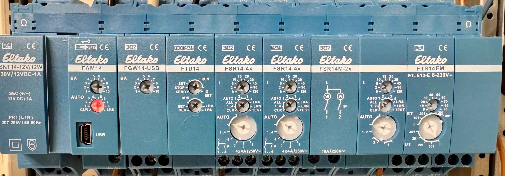
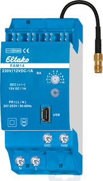
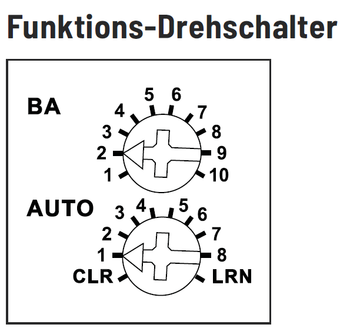
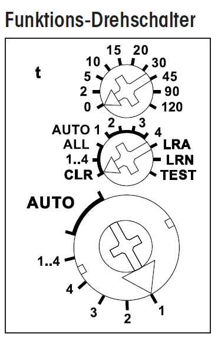

# Getting Started - Example Setup

 

From left to right:
1. SNT14-12/12W (power supply)
2. FAM14 (bus master)
3. FGW14-USB (USB adapter)
4. FTD14 (wireless telegram duplicator)
5. FSR14-4x (4-channel relay)
6. FSR14-4x (4-channel relay)
7. FSR14M-2x (2-channel relay with power metering)
8. FTS14EM (10-channel input module)

 

## Wiring
1. Connect the bus rail.
2. Connect the "HOLD" inputs/outputs (FAM14 + FGW + FTS14EM).
3. Connect the electrical components, e.g. push-buttons to the input module (FTS14EM) and lights to the switching relays (FSR14-4x, etc.).

 

## FAM14
 

### Rotary switches

#### Upper rotary switch
* **Position 1**: The FAM14 is in "SCAN" mode - it cannot be reached from eo_man or PCT14.
* **Position 2**: The FAM14 is in "normal" mode - it can be connected to via USB.

#### Lower rotary switch
The lower rotary switch can be left at "Pos. 1".

 

## Teaching in the FAM14
The FAM14 assigns a bus address to each actuator. This address is later used to control the device from Home Assistant.

1. Set the FAM14 to "Pos. 1" to start the teach-in process.
2. Then set the actuators (e.g. FTD14, FSR14-4x, FSR14M-2x, FTS14-EM) to "LRN" one after another.
3. The FAM14 confirms each address assignment by flashing green.
4. Afterwards, turn the FAM14 back to "Pos. 2".

## Teaching in an actuator
Use case: a conventional push-button is connected to the FTS14-EM input module and shall control the light on channel 1 of the FSR14-4x.

1. Set the **lower** rotary switch of the **FSR14-4x** to "Pos. 1" (for channel 1).
2. The **upper** rotary switch defines the type of switch:
   - 0 = directional push-button
   - 5 = impulse relay (latching)
   - 10 = relay function
3. Now set the **middle** rotary switch to "LRN".
4. Press the push-button connected to the **FTS14-EM** input.
5. Set the **FSR14-4x** back to **"Auto"** on the lower rotary switch, to **"Auto (1-4)"** on the middle rotary switch and to **"Pos. 0"** on the upper rotary switch.
   - Pos. 0 means a switch-off delay of 0 min = permanently on
   - Pos. 2 = 2 min
   - Pos. 5 = 5 min
   - ...

The push-button on the FTS14-EM (e.g. input 1) is now taught in to channel 1 of the FSR14-4x and works independently of Home Assistant.
