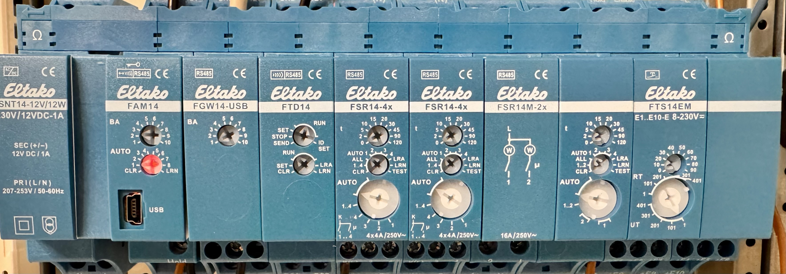
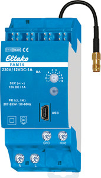
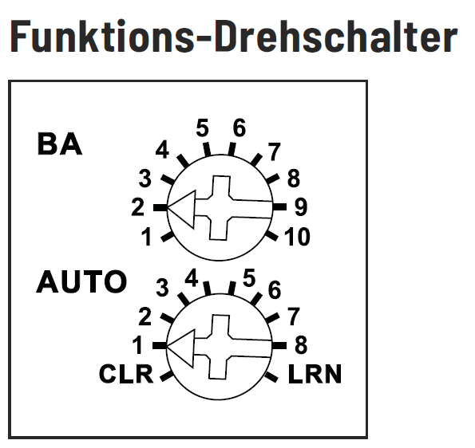
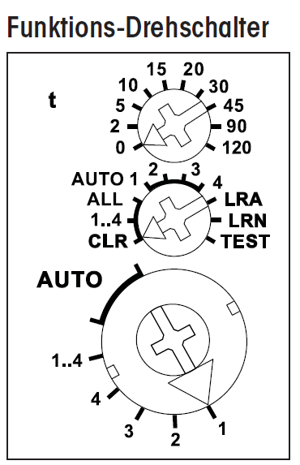

# My Setup

 

Von links nach rechts:
1. SNT14-12/12W (Netzteil)
2. FAM14 (BUS-Master)
3. FGW14-USB (USB-Adpater)
4. FTD14 (Funk Telegram Duplizierer)
5. FSR14-4x (4x Relais)
6. FSR14-4x (4x Relais)
7. FSR14M-2x (2x Relais mit Strom-Meter)
8. FTS14EM (10x Eingangsmodul)

 

## Anschluss: 
1. Verbinden der BUS-Leiste
2. Anschluss der "HOLD" Ein/Ausgänge (FAM14 + FGW + FTS14EM)
3. Anschluss der elektrischen Komponenten z.B. Taster für das Eingangsmodul (FTS14EM) + z.B. Lampen für die Schaltrelais (FSR14-4x, etc)

 

## FAM14:  
 

### Drehschalter: 

### oberer Drehschalter:
Stellung 1: FAM14 ist im "SCAN"-Modus - der FAM14 ist nicht erreichbar in eo_man oder pct14 
Stellung 2: FAM14 ist im "Normal"-Modus - via USB kann sich mit dem FAM14 verbunden werden.

### unterer Drehschalter:
der untere Drehschalter kann auf "Pos. 1" gelassen werden.
 

## Einlernen des FAM14:
Der FAM14 soll den einzelnen Aktuatoren eine Adresse auf dem BUS zuteilen.
Die Adresse wird später zur Steuerung über Homeassistant verwendet.

1. zum Einlernen wird der FAM14 auf "Pos. 1" gestellt.
2. anschließend werden die Aktuatoren z.B. FTD14, FSR14-4x, FSR14M-2x, FTS14-EM nacheinander auf LRN gestellt.
3. der FAM14 bestätigt durch grünes aufblinken die Adressvergabe
4. der FAM14 wird danach wieder auf "Pos. 2" zurückgedreht 

## Einlernen eines Aktuators:
Usecase: am Eingabemodul FTS14-EM ist ein konventioneller Taster angeschlossen, dieser soll das Licht am FSR14-4x auf Kanal 1 steuern.

1. **FSR14-4x** wird am unteren Drehschalter auf "Pos 1" (für Kanal 1) gestellt
2. Der obere Drehschalter definiert dabei die Art des Schalters. 
   - 0 = Richtungstaster
   - 5 = Stromstoßrelais
   - 10 = Relaisfunktion
3. Der mittlere Drehschalter wird jetzt auf "LRN" gestellt.
4. Der Taster am **FTS14-EM** Eingang wird jetzt gedrückt.
5. **FSR14-4x** wird am unteren Drehschalter auf **"Auto"**, der mittlere Drehschalter auf **"Auto (1-4)"** und der obere Drehschalter auf **"Pos. 0"** gestellt
   - Pos. 0 steht für 0min Nachlaufverzögerung = dauer an
   - Pos. 2 = 2min
   - Pos. 5 = 5min
   - ...

Der Taster am FTS14-EM (z.B. Eingang 1) ist jetzt auf Kanal 1 am FSR14-4x eingelernt und funktioniert unabhänging von Homeassistant.