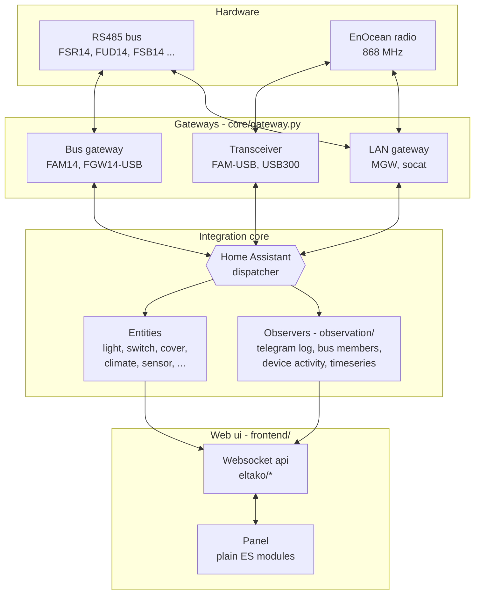
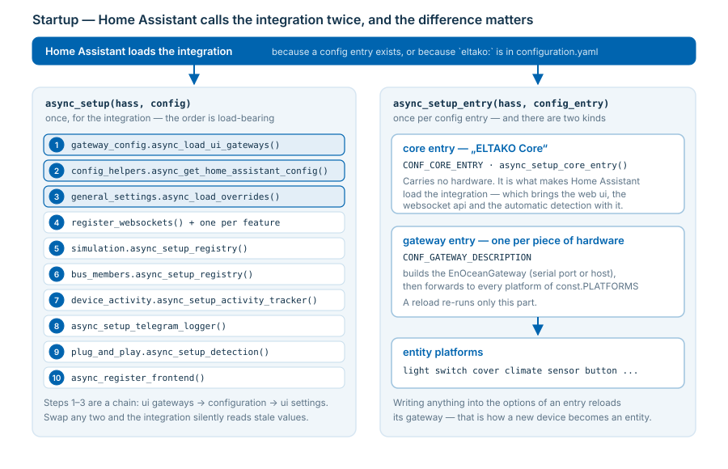
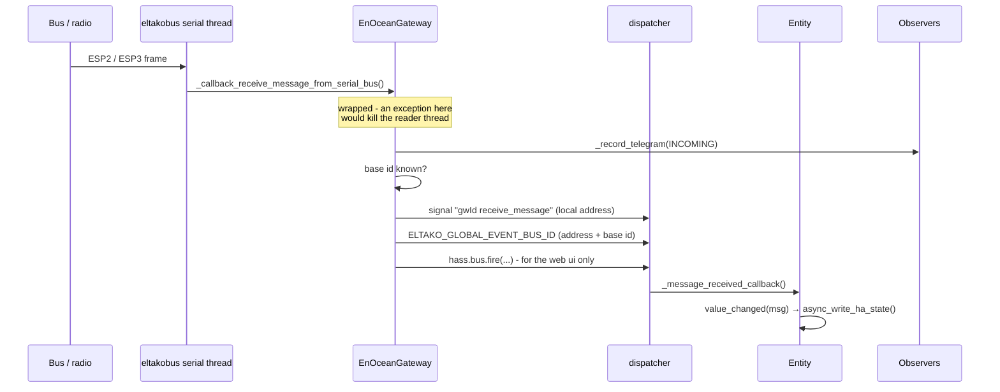
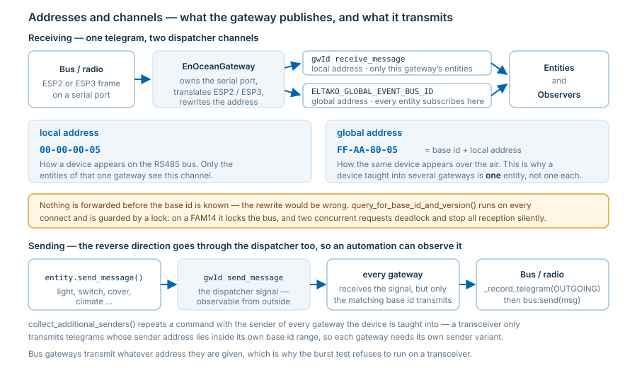
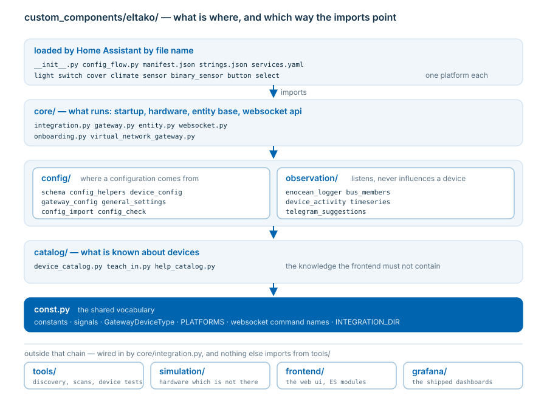
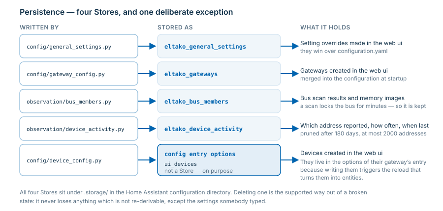
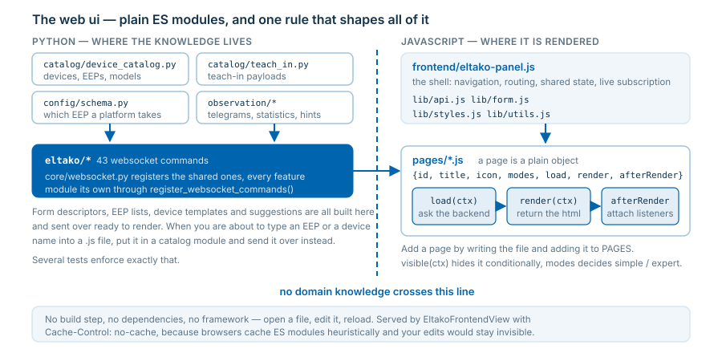

# Architecture - a developer's guide

How this integration is put together, why it is put together that way, and where to start when
you want to change something. It describes the code as it is, not a plan - every module,
signal and file named here exists.

> **Reading order.** [The shape of the thing](#the-shape-of-the-thing) →
> [Startup](#startup-what-happens-when) → [The life of a telegram](#the-life-of-a-telegram).
> Those three explain nine tenths of the code. The rest is reference.

---

## The shape of the thing

The integration connects two worlds: **ELTAKO series 14 devices on an RS485 bus** (and EnOcean
radio devices in general) on one side, **Home Assistant entities** on the other. Everything else
follows from that.



Three properties of this design are worth knowing before you read any code:

**The gateway is not a transport detail, it is the centre.** Every telegram enters and leaves
through an `EnOceanGateway`. It owns the serial connection, translates between ESP2 and ESP3,
and publishes what it hears on the Home Assistant dispatcher. Nothing else touches a serial port.

**Entities do not poll, they listen.** There is no update loop. An entity subscribes to the
dispatcher when it is added and reacts to telegrams addressed to it. This is why the integration
is `local_push` and why a device which never sends stays in its restored state.

**Observation is separate from control.** The telegram log, the bus member registry, the activity
tracker and the timeseries export all listen to the same dispatcher signals as the entities, and
none of them can influence device behaviour. You can switch every one of them off without
breaking the lights.

---

## Startup: what happens when

Home Assistant calls the integration twice, and the difference matters.



### `async_setup(hass, config)` - once, for the integration

[`core/integration.py:36`](../../custom_components/eltako/core/integration.py#L36).
Everything global lives here, and **the order is load-bearing**:

| # | Step | Why it must be here |
| --- | --- | --- |
| 1 | `gateway_config.async_load_ui_gateways()` | Gateways created in the web ui are merged **into** the configuration, so they must exist before it is read |
| 2 | `config_helpers.async_get_home_assistant_config()` | Reads and validates `configuration.yaml` against `CONFIG_SCHEMA` |
| 3 | `general_settings.async_load_overrides()` | Settings changed in the web ui override the yaml, so they must be loaded before anything reads a setting |
| 4 | `register_websockets()` + one `register_websocket_commands()` per feature | The api must answer even when the web ui itself is off |
| 5 | `simulation.async_setup_registry()` | The gateways marked `simulated` in the configuration decide which devices are simulated, so the configuration has to be read first |
| 6 | `bus_members.async_setup_registry()` | Restores the memory images of the last bus scan |
| 7 | `device_activity.async_setup_activity_tracker()` | Long term "who has ever reported" |
| 8 | `async_setup_telegram_logger()` | Recording, statistics, live stream |
| 9 | `plug_and_play.async_setup_detection()` | Optional, off by default |
| 10 | `async_register_frontend()` | Panel + static files, only when `enable_frontend`; whether it also gets a sidebar entry is `show_panel_in_sidebar` |

The panel follows the config entries: it is registered again by every `async_setup_entry()`
(Home Assistant does not repeat `async_setup()` while the component stays loaded) and removed
by `async_remove_entry()` when the last entry is gone - an integration without an entry on its
page must not keep a navigation entry which leads nowhere. A `configuration.yaml` with an
`eltako:` section keeps it either way, which `DATA_YAML_CONFIGURED` records during step 0.

Steps 1-3 are a chain: **ui gateways → configuration → ui settings**. Swap any two and the
integration silently reads stale values.

### The core entry and the gateway entries

Two kinds of config entry exist, and they are not the same thing:

| Entry | Title | What it is |
| --- | --- | --- |
| **core** (`CONF_CORE_ENTRY`, unique id `CORE_UNIQUE_ID`) | `ELTAKO Core` | The base component: it makes Home Assistant load the integration, which brings the web ui, the websocket api and the automatic detection. Carries no hardware. Created by "add integration" without a single question, handled by `async_setup_core_entry()`. |
| **gateway** (`CONF_GATEWAY_DESCRIPTION`) | the gateway description | One piece of hardware each - an `EnOceanGateway` with its serial port or host, and the entities behind it. |

The two stored values of the core entry still read `hub` / `eltako_hub`: they sit in the config
entries of every existing installation, and renaming them would leave an upgraded system with a
core entry nobody recognises. Only the title was renamed, and
`async_rename_legacy_core_entry()` carries that over for entries which still show the old one.

### `async_setup_entry(hass, config_entry)` - once per gateway

[`core/integration.py:283`](../../custom_components/eltako/core/integration.py#L283).
One config entry is one gateway. It builds the `EnOceanGateway`, then forwards to the entity
platforms listed in `const.PLATFORMS`. Each platform module has the same shape:

```python
async def async_setup_entry(hass, config_entry, async_add_entities):
    gateway = get_gateway_from_hass(hass, config_entry)          # my gateway
    config = get_device_config_for_gateway(hass, config_entry, gateway)
    # ... build one entity per configured device of this platform
```

A reload re-runs only this part - `async_reload_entry` is registered as an update listener, so
storing anything in the entry's options reloads its gateway.

---

## The life of a telegram

This is the path to understand. Everything else is a variation of it.



### Local and global addresses



A device on the bus has a **local** address (`00-00-00-05`). Over the air the same device appears
as **base id + local address** (`FF-AA-80-05`). The gateway publishes on two channels because
both views are needed:

- **`get_bus_event_type(gateway_id, SIGNAL_RECEIVE_MESSAGE)`** carries the raw message with its
  local address. Only entities of *that* gateway see it.
- **`ELTAKO_GLOBAL_EVENT_BUS_ID`** carries the message with the address rewritten to the global
  form. Entities subscribe to this one, which is what lets a wireless device taught into several
  gateways produce **one** entity instead of one per gateway.

Nothing is forwarded before the base id is known - the rewrite would be wrong. That is why
`query_for_base_id_and_version()` runs on every connect and why it is guarded by a lock (reading
the base id of a FAM14 locks the bus and disables the receive callback; two concurrent requests
deadlock and silently stop all reception).

### Sending

The reverse direction goes through the dispatcher too, so an automation can observe it:

```
entity.send_message()
  → dispatcher "<gw_id> send_message"
  → gateway._callback_send_message_to_serial_bus()
      → _record_telegram(OUTGOING)
      → self._bus.send(msg)
```

Every gateway receives the send signal; only the one whose base id matches actually transmits.
Bus gateways (FAM14, FGW14-USB) transmit whatever address they are given, which is why the burst
test of [`tools/device_tests.py`](../../custom_components/eltako/tools/device_tests.py) refuses to run on a
transceiver - see `is_wired()` there for the whole reasoning.

### Exclusive access to the bus

Some operations need the RS485 bus of a gateway **for themselves**: they lock it, switch the
receive callback off and then ask every position in turn. A telegram which goes onto the wire in
between disturbs those answers - the scan reports devices as missing which are there.

Those operations are the **bus scan** (`eltako/bus/read_memory`), the **teach-in of the HA
senders** (`eltako/bus/teach_in_senders`), the **reading of the device memories** and the **base
id / version request of a FAM14**. Each of them takes the bus through the gateway:

```
gateway.try_acquire_bus("bus scan")   → False: somebody else has it, do not start
    ... the operation runs ...
gateway.release_bus()                 → sends what waited in the meantime
with gateway.exclusive_bus_access("bus scan"):   # the same, as a context manager
```

While `gateway.is_bus_busy` is true:

- a **command** (a switch, a cover, a simulated device on this gateway) is **not** put on the
  bus but queued in `_deferred_messages` and sent as soon as the bus is free. A command which
  waited longer than `BUS_DEFER_SECONDS` (20 s) is dropped instead of arriving minutes late -
  the log says how many.
- a **second scan, teach-in or memory read is refused** (`reason: already_running`,
  `busy_with: <what runs>`) rather than queued: two of them in parallel are a mistake, not a
  queueing problem. The lock is taken **before** the scan thread starts, so two clicks in the
  same moment cannot both pass the check.
- a **device test does not start** at all (`tools/device_tests.py::_check_bus_is_free`): it
  measures answer times, and a telegram queued behind a scan would falsify every measurement.
- the **repeater mode** request is skipped, setting it raises `BusBusyError`.

`gateway.bus_busy_reason` is the text shown in the web ui ("scanning bus", "teaching in the
senders"), and `_reading_memory_of_devices_is_running` keeps being set and cleared with it, so
everything which looked at that event still works. It is all per gateway - a scan on the FAM14
does not stop a second gateway from sending.

---

## Modules

### The layout

Only what Home Assistant looks up by name stays at the top of `custom_components/eltako/`.
Everything else is grouped by the question it answers:

```
custom_components/eltako/
  __init__.py          re-exports the setup functions - Home Assistant expects them here
  const.py             the shared vocabulary: constants, signals, websocket command names
  config_flow.py       the "add integration" dialog and the "configure" options flow
                       (loaded by this name)
  light.py switch.py cover.py climate.py sensor.py binary_sensor.py button.py select.py
                       one entity platform each, also loaded by name
  manifest.json  strings.json  services.yaml  docs_index.json

  core/                what runs: startup, gateway, entity base class, websocket api
  config/              where a configuration comes from and whether it is valid
  catalog/             what is known about devices, and the help compiled from it
  observation/         everything that only listens
  simulation/          gateways and devices without any hardware
  tools/               discovery and device tests - never required to operate a device
  frontend/            the web ui, plain ES modules
  grafana/             the shipped dashboards
```



The direction of dependencies: platforms → `core` → `config`/`observation` → `catalog` → `const`.
`core/integration.py` is the exception, it is the wiring point and imports from everywhere.
Nothing outside `tools/` imports from `tools/`, except that wiring.

Every subpackage `__init__.py` lists its modules in one line each - that is the shortest
answer to "what is in here".

### Core

| Module | Lines | What it owns |
| --- | ---: | --- |
| [`core/integration.py`](../../custom_components/eltako/core/integration.py) | 520 | Startup, teardown, panel registration, `EltakoFrontendView` |
| [`core/gateway.py`](../../custom_components/eltako/core/gateway.py) | 761 | `EnOceanGateway`: serial connection, ESP2/ESP3, base id, repeater mode, dispatch |
| [`core/entity.py`](../../custom_components/eltako/core/entity.py) | 302 | `EltakoEntity`: the base every entity derives from |
| [`core/websocket.py`](../../custom_components/eltako/core/websocket.py) | 362 | The shared part of the `eltako/*` api: registration, info, send telegram |
| [`core/onboarding.py`](../../custom_components/eltako/core/onboarding.py) | 128 | Opens the web ui once after the installation - `async_consume()` hands that redirect out to exactly one browser |
| [`core/virtual_network_gateway.py`](../../custom_components/eltako/core/virtual_network_gateway.py) | 262 | `VirtualNetworkGateway`: publishes ESP2 over the network |
| [`const.py`](../../custom_components/eltako/const.py) | 356 | Constants, `GatewayDeviceType` and its classifiers, `PLATFORMS`, websocket command names, `INTEGRATION_DIR` |
| [`config/schema.py`](../../custom_components/eltako/config/schema.py) | 353 | Voluptuous schemas - **the authority on which EEP a platform accepts** |
| [`config/config_helpers.py`](../../custom_components/eltako/config/config_helpers.py) | 522 | Reading and merging the configuration, address helpers, defaults |

`INTEGRATION_DIR` in `const.py` is where the shipped files are found (`manifest.json`,
`docs_index.json`, `frontend/`, `grafana/`). Resolving them from a module's own `__file__` breaks
as soon as that module moves into another subpackage - so nothing does.

### Entity platforms

`light`, `switch`, `cover`, `climate`, `sensor`, `binary_sensor`, `button`, `select` - all listed
in `const.PLATFORMS`, all following the `async_setup_entry` pattern above. `sensor.py` (1098
lines) is the largest because one EEP can produce many measurements.

### Configuration

| Module | What it does |
| --- | --- |
| [`config/device_config.py`](../../custom_components/eltako/config/device_config.py) | Devices from **two** sources: `configuration.yaml` and the web ui (stored in the config entry's options under `ui_devices`) |
| [`config/gateway_config.py`](../../custom_components/eltako/config/gateway_config.py) | Gateways created in the web ui, in their own `Store` |
| [`config/general_settings.py`](../../custom_components/eltako/config/general_settings.py) | The editable settings and their overrides, incl. `LOCKED_SETTINGS` |
| [`config/config_import.py`](../../custom_components/eltako/config/config_import.py) | Import from PCT14 / EnOcean Device Manager exports |
| [`config/config_check.py`](../../custom_components/eltako/config/config_check.py) | Everything verifiable without sending a telegram |

**The override rule:** a value stored by the web ui wins over `configuration.yaml`, which wins
over the default. Deliberate - it lets the integration be configured without yaml - but it means
yaml cannot undo a ui override. `enable_frontend` is locked in the ui for exactly that reason
(switching it off there would remove the page needed to switch it back on).

The same settings are editable from the Home Assistant integration page ("configure"): the
options flow in `config_flow.py` builds its form from `SETTING_DESCRIPTORS` and writes through
`general_settings.async_set_overrides()`, so both uis share one storage and one precedence. It
stores only the values which really changed - saving a form must not turn a whole group into
overrides and detach it from the yaml. `show_panel_in_sidebar` is the reason that flow exists:
it is the one setting whose "off" position can hide the web ui that carries all the others.

### What is known about devices

| Module | What it knows |
| --- | --- |
| [`catalog/device_catalog.py`](../../custom_components/eltako/catalog/device_catalog.py) | The known devices - one source, used by the forms, the device page and the help page |
| [`catalog/teach_in.py`](../../custom_components/eltako/catalog/teach_in.py) | Which sender EEPs can be taught in, and the payload of their teach-in telegram |
| [`catalog/help_catalog.py`](../../custom_components/eltako/catalog/help_catalog.py) | What is supported and which documentation exists - compiled from the code |

This is the knowledge the frontend must not contain. A device name, an EEP or a teach-in payload
belongs in one of these three, and reaches the web ui through a websocket command.

### Observation

None of these can influence a device. All of them listen to the same signals as the entities.

| Module | What it observes |
| --- | --- |
| [`observation/enocean_logger.py`](../../custom_components/eltako/observation/enocean_logger.py) | Every telegram: file log with rotation, statistics, live stream to the web ui |
| [`observation/bus_members.py`](../../custom_components/eltako/observation/bus_members.py) | Which devices sit on the bus, derived passively from the traffic, plus their memory images |
| [`observation/device_activity.py`](../../custom_components/eltako/observation/device_activity.py) | Which addresses have ever reported, how often, when last |
| [`observation/timeseries.py`](../../custom_components/eltako/observation/timeseries.py) | Export into InfluxDB for Grafana |
| [`observation/telegram_suggestions.py`](../../custom_components/eltako/observation/telegram_suggestions.py) | Which EEP and which device could an unknown address be? |

### Discovery and tools

Useful, never required to operate a device:
[`tools/gateway_scan.py`](../../custom_components/eltako/tools/gateway_scan.py) (serial ports),
[`tools/plug_and_play.py`](../../custom_components/eltako/tools/plug_and_play.py) (detect gateways, read the
bus, add unambiguous devices), [`tools/device_tests.py`](../../custom_components/eltako/tools/device_tests.py)
(burst test, cover travel times),
[`tools/grafana_sync.py`](../../custom_components/eltako/tools/grafana_sync.py) (upload the shipped
dashboards).

### Simulation

[`simulation/`](../../custom_components/eltako/simulation) answers "does this work at all?" without
a single piece of hardware. A gateway which carries `simulated: True` in its configuration is a
normal gateway of a real type - id, base id, config entry, entities - only its connection is the
simulation instead of a serial port, so everything behind the gateway is exercised unchanged.
`simulation/core/` deliberately imports no Home Assistant at all. The package docstrings of
[`simulation/__init__.py`](../../custom_components/eltako/simulation/__init__.py) and
[`simulation/core/__init__.py`](../../custom_components/eltako/simulation/core/__init__.py) describe it
in full.

---

## Persistence



Four `Store`s, all under `.storage/` in the Home Assistant configuration directory:

| Key | Content |
| --- | --- |
| `eltako_general_settings` | Setting overrides made in the web ui |
| `eltako_gateways` | Gateways created in the web ui |
| `eltako_bus_members` | Bus scan results and memory images |
| `eltako_device_activity` | Long term activity per address |

Plus **config entry options** (`ui_devices`) for devices created in the web ui - they live there
rather than in a `Store` because writing them triggers the reload that makes them entities.

Deleting a `Store` file is the supported way out of a broken state; it never loses anything that
is not re-derivable, except the settings a user typed.

---

## The web ui



Plain ES modules. **No build step, no dependencies, no framework** - open a file, edit it, reload.

```
frontend/
  eltako-panel.js     the shell: navigation, routing, shared state, live subscription
  lib/api.js          websocket wrapper + the command names
  lib/form.js         renderFields() / readFields() - forms from backend descriptors
  lib/styles.js       the whole stylesheet, Eltako palette
  lib/utils.js        escapeHtml, card, chip, formatting
  pages/*.js          one object per page: {id, title, icon, load, render, afterRender}
```

A page is a plain object. The shell calls `load(ctx)`, then `render(ctx)` for the html, then
`afterRender(ctx, root)` to attach listeners. `visible(ctx)` hides it conditionally. Add a page by
writing the file and adding it to `PAGES` in `eltako-panel.js`.

**The rule that shapes it: no domain knowledge in the frontend.** Which EEPs exist, which devices
are known, which fields a form has, which gateways a test may use - all of it is delivered by the
backend and rendered generically. When you are about to type an EEP or a device name into a `.js`
file, put it in a catalog module instead and send it over. Several tests enforce this.

The panel is served by `EltakoFrontendView` with `Cache-Control: no-cache` - without it browsers
cache ES modules heuristically and your edits stay invisible.

### Websocket api

55 commands, all named `eltako/*`, grouped by the feature they belong to:

| Group | Commands | Owned by |
| --- | --- | --- |
| Integration, help, onboarding | `integration_info`, `info`, `configured_gateways`, `potential_usb_ports`, `help/catalog`, `onboarding/consume` | `core/websocket.py`, `core/onboarding.py` |
| Settings | `settings/{get,set,reset}` | `config/general_settings.py` |
| Devices | `devices/{form,list,add,update,remove}`, `devices/{activity,activity_clear}` | `config/device_config.py`, `observation/device_activity.py` |
| Gateways | `gateways/{form,add,update,remove,scan}` | `config/gateway_config.py`, `tools/gateway_scan.py` |
| The bus | `bus/{members,read_memory,teach_in_senders}` | `observation/bus_members.py` |
| Telegrams | `telegram_log/{info,statistics,recent,subscribe,clear,refresh_devices}`, `send_telegram{,_form}`, `grafana/sync` | `observation/enocean_logger.py`, `core/websocket.py` |
| Plug & play | `plug_and_play/{status,run,probe}` | `tools/plug_and_play.py` |
| Device tests | `device_tests/{info,start,stop,subscribe}` | `tools/device_tests.py` |
| Simulation | `simulator/{form,preset,activate,base_id,teach_in,trigger}`, `simulator/gateway_{add,remove}`, `simulator/device_{add,update,remove}` | `simulation/websocket.py` |
| Import | `config/import` | `config/config_import.py` |
| Serial bridge | `bridge/{list,start,stop}` | `tools/serial_bridge.py` |

47 of the names are `WS_*` constants in `const.py`; `device_tests/*` and `config/import` are named
in their own module because those features are self contained, and three legacy ones are literals
in `core/websocket.py`. Most are mirrored in `lib/api.js`.

**[Full reference: every command with its parameters and what it answers](websocket-api.md)** -
including how to call one by hand against a running Home Assistant, which is the fastest way to
tell a backend problem from a rendering one.

---

## The standalone runtime

The integration also runs **without Home Assistant**, through a shim that implements just enough
of the `homeassistant` package:

```
eltako_standalone/
  runtime.py            boots the integration against the shim
  server.py             http + websocket, serves the same frontend
  entity_api.py         entity states for the standalone ui
  cli.py                command line
  hass_shim/homeassistant/    core, config_entries, helpers, components
```

This is not a second implementation - it loads the same `custom_components/eltako` code. That is
also why the two test suites **must not run in one pytest process**: the shim replaces the real
`homeassistant` package and poisons the other suite's imports.

```bash
python -m pytest tests/                    # integration
python -m pytest eltako_standalone/tests   # standalone
```

---

## Working on it

### Adding a module - where does it go?

Ask what the module *does*, in this order, and stop at the first yes:

| Question | Place |
| --- | --- |
| Does Home Assistant load it by its file name? (a platform, `config_flow`) | next to `__init__.py` |
| Does it talk to hardware, or is it the base of an entity, or the startup? | `core/` |
| Does it read, merge, validate or store a configuration? | `config/` |
| Is it knowledge about devices - names, EEPs, payloads, what is supported? | `catalog/` |
| Does it only listen and never influence a device? | `observation/` |
| Does it pretend to be hardware which is not there? | `simulation/` |
| Would the integration still control every device without it? | `tools/` |

Two rules keep the direction of dependencies intact: nothing imports from `tools/` except
`core/integration.py` (the wiring point), and nothing resolves a shipped file from its own
`__file__` - use `INTEGRATION_DIR` from `const.py`, otherwise the next move breaks it.

Then add one line for it to the `__init__.py` of its subpackage and, if it is worth knowing
about, to the table above in [Modules](#modules). `test_architecture_doc.py` insists that no
module appears at the top level which Home Assistant does not load by name.

### Adding a device type

1. Add it to `DEVICE_CATALOG` in `catalog/device_catalog.py` - hardware type, EEP, platform, address count.
2. If its EEP is new to a platform, add it to that platform's schema in `config/schema.py`.
3. If its sender EEP can be taught in, add the payload to `EEP_WITH_TEACH_IN_BUTTONS` in
   `catalog/teach_in.py` - the teach-in button appears on its own.
4. If the platform needs to handle it specially, extend the platform module.

The device form, the device page and the help page pick it up on their own. Do not touch the
frontend.

### Adding a setting

Add a descriptor to `SETTING_DESCRIPTORS` in `config/general_settings.py` (group, type, label, help,
`restart_required`) and a default in `DEFAULT_GENERAL_SETTINGS`. The settings page renders it.
Add `'locked': True` to show it read-only.

### Adding a websocket command

Name it in `const.py`, write the handler next to the feature it belongs to, register it in that
module's `register_websocket_commands()`, and mirror the name in `lib/api.js`. The long version,
with what a handler should return and who may call it, is in
[the websocket api reference](websocket-api.md#adding-a-command).

### Things that will bite you

- **The serial reader thread.** An exception escaping `_handle_received_message()` kills it. The
  connection then looks alive while nothing arrives. It is wrapped for that reason - keep it so.
- **The FAM14 base id request locks the bus** and disables the receive callback until its
  `finally`. Two concurrent requests deadlock and stop all reception. Everything which talks on
  the bus for itself therefore goes through `try_acquire_bus()` - see *Exclusive access to the
  bus* above. When you add such an operation, take the bus, and give it back in a `finally`.
- **`_attr_*` versus properties.** Assigning `self._attr_native_value` on a class that defines
  `native_value` as a read-only property raises `AttributeError`. `test_readonly_entity_properties.py`
  catches it statically - in entity classes only, because `state` or `options` are perfectly
  normal attribute names in a plain model class.
- **Timestamps in the timeseries export** need microsecond resolution plus a tiebreaker; InfluxDB
  silently overwrites points that share a timestamp and tag set.
- **A path built from `__file__`** finds `manifest.json`, `docs_index.json`, `frontend/` or
  `grafana/` only as long as the module does not move. `INTEGRATION_DIR` does not have that
  problem.
- **`from ..const import *`** hides where a name comes from. It is used a lot and it is not worth
  unpicking, but when you add an import, spell it out - `test_no_undefined_names.py` resolves the
  star imports of every module, subpackages included, and tells you what it cannot find.

### Tests

Roughly 850 integration and 60 standalone tests, all offline - no hardware needed. Beyond unit
tests they include
static checks (AST scans for read-only property assignment and for undefined names, greps that
keep domain knowledge out of the frontend, a check that the shipped docs index matches the
`docs/` tree, and this document against the code) and headless rendering of frontend logic
under Node.

The two suites must not run in one pytest process - see
[The standalone runtime](#the-standalone-runtime).

---

## Where to look first

| You want to ... | Start at |
| --- | --- |
| understand the data flow | `core/gateway.py` → `_handle_received_message()` |
| add or fix an entity | the platform module + `core/entity.py` |
| change what the ui shows | the page in `frontend/pages/`, then its websocket command |
| change what is configurable | `config/schema.py` and `config/general_settings.py` |
| know what is supported | `catalog/device_catalog.py` and `catalog/help_catalog.py` |
| debug reception | the *Telegrams* page, or `docs/telegram-analysis/` |
| work without hardware | `simulation/` - a gateway of a real type whose devices are simulated |
| find out what is in a subpackage | its `__init__.py`, one line per module |
