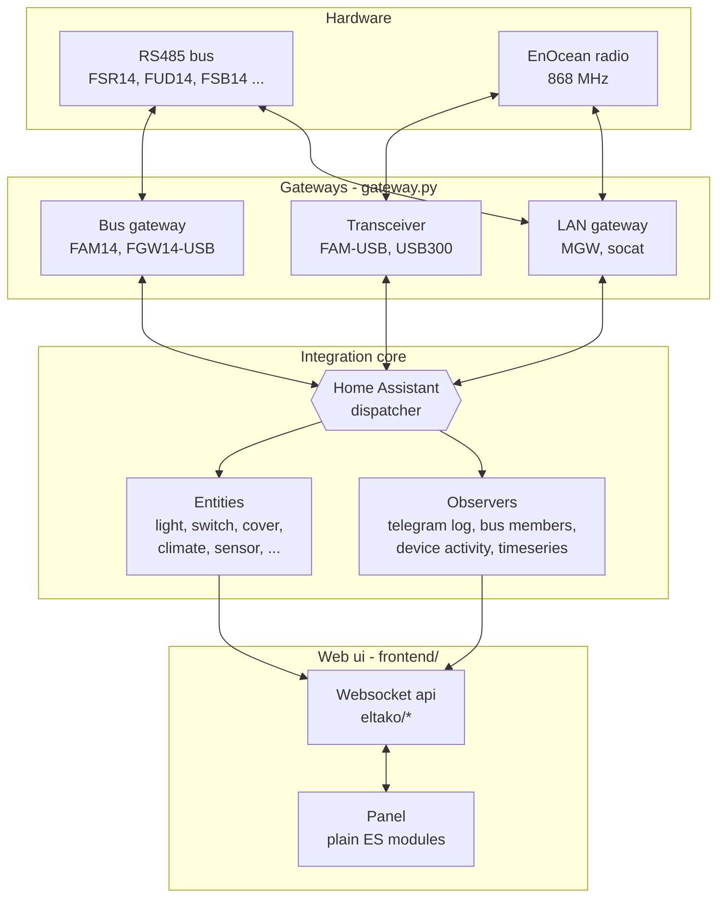
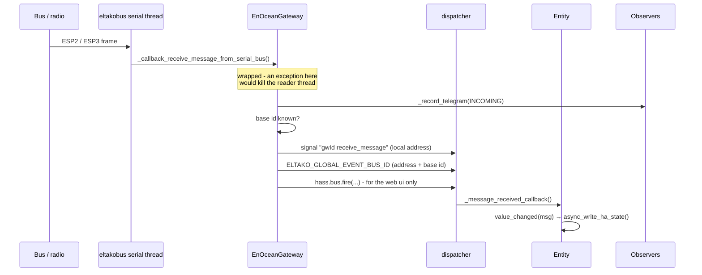

# Architecture - a developer's guide

How this integration is put together, why it is put together that way, and where to start when
you want to change something. It describes the code as it is, not a plan - every module,
signal and file named here exists.

> **Reading order.** [The shape of the thing](#the-shape-of-the-thing) →
> [Startup](#startup-what-happens-when) → [The life of a telegram](#the-life-of-a-telegram).
> Those three explain nine tenths of the code. The rest is reference.

---

## The shape of the thing

The integration connects two worlds: **Eltako series 14 devices on an RS485 bus** (and EnOcean
radio devices in general) on one side, **Home Assistant entities** on the other. Everything else
follows from that.



Three properties of this design are worth knowing before you read any code:

**The gateway is not a transport detail, it is the centre.** Every telegram enters and leaves
through an `EnOceanGateway`. It owns the serial connection, translates between ESP2 and ESP3,
and publishes what it hears on the Home Assistant dispatcher. Nothing else touches a serial port.

**Entities do not poll, they listen.** There is no update loop. An entity subscribes to the
dispatcher when it is added and reacts to telegrams addressed to it. This is why the integration
is `local_push` and why a device which never sends stays in its restored state.

**Observation is separate from control.** The telegram log, the bus member registry, the activity
tracker and the timeseries export all listen to the same dispatcher signals as the entities, and
none of them can influence device behaviour. You can switch every one of them off without
breaking the lights.

---

## Startup: what happens when

Home Assistant calls the integration twice, and the difference matters.

### `async_setup(hass, config)` - once, for the integration

[`eltako_integration_init.py:36`](../../custom_components/eltako/eltako_integration_init.py#L36).
Everything global lives here, and **the order is load-bearing**:

| # | Step | Why it must be here |
| --- | --- | --- |
| 1 | `gateway_config.async_load_ui_gateways()` | Gateways created in the web ui are merged **into** the configuration, so they must exist before it is read |
| 2 | `config_helpers.async_get_home_assistant_config()` | Reads and validates `configuration.yaml` against `CONFIG_SCHEMA` |
| 3 | `general_settings.async_load_overrides()` | Settings changed in the web ui override the yaml, so they must be loaded before anything reads a setting |
| 4 | `register_websockets()` + six `register_websocket_commands()` | The api must answer even when the web ui itself is off |
| 5 | `bus_members.async_setup_registry()` | Restores the memory images of the last bus scan |
| 6 | `device_activity.async_setup_activity_tracker()` | Long term "who has ever reported" |
| 7 | `async_setup_telegram_logger()` | Recording, statistics, live stream |
| 8 | `plug_and_play.async_setup_detection()` | Optional, off by default |
| 9 | `async_register_frontend()` | Panel + static files, only when `enable_frontend` |

Steps 1-3 are a chain: **ui gateways → configuration → ui settings**. Swap any two and the
integration silently reads stale values.

### `async_setup_entry(hass, config_entry)` - once per gateway

[`eltako_integration_init.py:259`](../../custom_components/eltako/eltako_integration_init.py#L259).
One config entry is one gateway. It builds the `EnOceanGateway`, then forwards to the entity
platforms listed in `const.PLATFORMS`. Each platform module has the same shape:

```python
async def async_setup_entry(hass, config_entry, async_add_entities):
    gateway = get_gateway_from_hass(hass, config_entry)          # my gateway
    config = get_device_config_for_gateway(hass, config_entry, gateway)
    # ... build one entity per configured device of this platform
```

A reload re-runs only this part - `async_reload_entry` is registered as an update listener, so
storing anything in the entry's options reloads its gateway.

---

## The life of a telegram

This is the path to understand. Everything else is a variation of it.



### Local and global addresses

A device on the bus has a **local** address (`00-00-00-05`). Over the air the same device appears
as **base id + local address** (`FF-AA-80-05`). The gateway publishes on two channels because
both views are needed:

- **`get_bus_event_type(gateway_id, SIGNAL_RECEIVE_MESSAGE)`** carries the raw message with its
  local address. Only entities of *that* gateway see it.
- **`ELTAKO_GLOBAL_EVENT_BUS_ID`** carries the message with the address rewritten to the global
  form. Entities subscribe to this one, which is what lets a wireless device taught into several
  gateways produce **one** entity instead of one per gateway.

Nothing is forwarded before the base id is known - the rewrite would be wrong. That is why
`query_for_base_id_and_version()` runs on every connect and why it is guarded by a lock (reading
the base id of a FAM14 locks the bus and disables the receive callback; two concurrent requests
deadlock and silently stop all reception).

### Sending

The reverse direction goes through the dispatcher too, so an automation can observe it:

```
entity.send_message()
  → dispatcher "<gw_id> send_message"
  → gateway._callback_send_message_to_serial_bus()
      → _record_telegram(OUTGOING)
      → self._bus.send(msg)
```

Every gateway receives the send signal; only the one whose base id matches actually transmits.
Bus gateways (FAM14, FGW14-USB) transmit whatever address they are given, which is why the burst
test of [`device_tests.py`](../../custom_components/eltako/device_tests.py) refuses to run on a
transceiver - see `is_wired()` there for the whole reasoning.

---

## Modules

### Core

| Module | Lines | What it owns |
| --- | ---: | --- |
| [`eltako_integration_init.py`](../../custom_components/eltako/eltako_integration_init.py) | 418 | Startup, teardown, panel registration, `EltakoFrontendView` |
| [`gateway.py`](../../custom_components/eltako/gateway.py) | 761 | `EnOceanGateway`: serial connection, ESP2/ESP3, base id, repeater mode, dispatch |
| [`device.py`](../../custom_components/eltako/device.py) | 302 | `EltakoEntity`: the base every entity derives from |
| [`const.py`](../../custom_components/eltako/const.py) | 318 | Constants, `GatewayDeviceType` and its classifiers, `PLATFORMS`, websocket command names |
| [`schema.py`](../../custom_components/eltako/schema.py) | 351 | Voluptuous schemas - **the authority on which EEP a platform accepts** |
| [`config_helpers.py`](../../custom_components/eltako/config_helpers.py) | 497 | Reading and merging the configuration, address helpers, defaults |

### Entity platforms

`light`, `switch`, `cover`, `climate`, `sensor`, `binary_sensor`, `button`, `select` - all listed
in `const.PLATFORMS`, all following the `async_setup_entry` pattern above. `sensor.py` (1098
lines) is the largest because one EEP can produce many measurements.

### Configuration

| Module | What it does |
| --- | --- |
| [`device_config.py`](../../custom_components/eltako/device_config.py) | Devices from **two** sources: `configuration.yaml` and the web ui (stored in the config entry's options under `ui_devices`) |
| [`gateway_config.py`](../../custom_components/eltako/gateway_config.py) | Gateways created in the web ui, in their own `Store` |
| [`general_settings.py`](../../custom_components/eltako/general_settings.py) | The editable settings and their overrides, incl. `LOCKED_SETTINGS` |
| [`config_import.py`](../../custom_components/eltako/config_import.py) | Import from PCT14 / EnOcean Device Manager exports |
| [`config_check.py`](../../custom_components/eltako/config_check.py) | Everything verifiable without sending a telegram |
| [`device_catalog.py`](../../custom_components/eltako/device_catalog.py) | The known devices - one source, used by the forms, the device page and the help page |

**The override rule:** a value stored by the web ui wins over `configuration.yaml`, which wins
over the default. Deliberate - it lets the integration be configured without yaml - but it means
yaml cannot undo a ui override. `enable_frontend` is locked in the ui for exactly that reason
(switching it off there would remove the page needed to switch it back on).

### Observation

None of these can influence a device. All of them listen to the same signals as the entities.

| Module | What it observes |
| --- | --- |
| [`enocean_logger.py`](../../custom_components/eltako/enocean_logger.py) | Every telegram: file log with rotation, statistics, live stream to the web ui |
| [`bus_members.py`](../../custom_components/eltako/bus_members.py) | Which devices sit on the bus, derived passively from the traffic, plus their memory images |
| [`device_activity.py`](../../custom_components/eltako/device_activity.py) | Which addresses have ever reported, how often, when last |
| [`timeseries.py`](../../custom_components/eltako/timeseries.py) | Export into InfluxDB for Grafana |
| [`telegram_suggestions.py`](../../custom_components/eltako/telegram_suggestions.py) | Which EEP and which device could an unknown address be? |

### Discovery and tools

[`gateway_scan.py`](../../custom_components/eltako/gateway_scan.py) (serial ports),
[`plug_and_play.py`](../../custom_components/eltako/plug_and_play.py) (detect gateways, read the
bus, add unambiguous devices), [`device_tests.py`](../../custom_components/eltako/device_tests.py)
(burst test, cover travel times), [`grafana_sync.py`](../../custom_components/eltako/grafana_sync.py),
[`help_catalog.py`](../../custom_components/eltako/help_catalog.py) (compiles what is supported,
from the code).

---

## Persistence

Four `Store`s, all under `.storage/` in the Home Assistant configuration directory:

| Key | Content |
| --- | --- |
| `eltako_general_settings` | Setting overrides made in the web ui |
| `eltako_gateways` | Gateways created in the web ui |
| `eltako_bus_members` | Bus scan results and memory images |
| `eltako_device_activity` | Long term activity per address |

Plus **config entry options** (`ui_devices`) for devices created in the web ui - they live there
rather than in a `Store` because writing them triggers the reload that makes them entities.

Deleting a `Store` file is the supported way out of a broken state; it never loses anything that
is not re-derivable, except the settings a user typed.

---

## The web ui

Plain ES modules. **No build step, no dependencies, no framework** - open a file, edit it, reload.

```
frontend/
  eltako-panel.js     the shell: navigation, routing, shared state, live subscription
  lib/api.js          websocket wrapper + the command names
  lib/form.js         renderFields() / readFields() - forms from backend descriptors
  lib/styles.js       the whole stylesheet, Eltako palette
  lib/utils.js        escapeHtml, card, chip, formatting
  pages/*.js          one object per page: {id, title, icon, load, render, afterRender}
```

A page is a plain object. The shell calls `load(ctx)`, then `render(ctx)` for the html, then
`afterRender(ctx, root)` to attach listeners. `visible(ctx)` hides it conditionally. Add a page by
writing the file and adding it to `PAGES` in `eltako-panel.js`.

**The rule that shapes it: no domain knowledge in the frontend.** Which EEPs exist, which devices
are known, which fields a form has, which gateways a test may use - all of it is delivered by the
backend and rendered generically. When you are about to type an EEP or a device name into a `.js`
file, put it in a catalog module instead and send it over. Several tests enforce this.

The panel is served by `EltakoFrontendView` with `Cache-Control: no-cache` - without it browsers
cache ES modules heuristically and your edits stay invisible.

### Websocket api

35 commands, all named `eltako/*`. 31 of them are named in `const.py` (`WS_*`) and most are
mirrored in `lib/api.js`; the four `device_tests/*` commands are literals in their own module and
page, because that feature is self contained:

`integration_info`, `help/catalog`, `settings/{get,set,reset}`, `devices/{form,list,add,update,remove,activity,activity_clear}`,
`gateways/{form,scan,add,update,remove}`, `bus/{members,read_memory,teach_in_senders}`,
`telegram_log/{info,statistics,recent,subscribe,clear,refresh_devices}`,
`plug_and_play/{status,run}`, `send_telegram{,_form}`, `grafana/sync`, `device_tests/*`.

---

## The standalone runtime

The integration also runs **without Home Assistant**, through a shim that implements just enough
of the `homeassistant` package:

```
eltako_standalone/
  runtime.py            boots the integration against the shim
  server.py             http + websocket, serves the same frontend
  entity_api.py         entity states for the standalone ui
  cli.py                command line
  hass_shim/homeassistant/    core, config_entries, helpers, components
```

This is not a second implementation - it loads the same `custom_components/eltako` code. That is
also why the two test suites **must not run in one pytest process**: the shim replaces the real
`homeassistant` package and poisons the other suite's imports.

```bash
python -m pytest tests/                    # integration
python -m pytest eltako_standalone/tests   # standalone
```

---

## Working on it

### Adding a device type

1. Add it to `DEVICE_CATALOG` in `device_catalog.py` - hardware type, EEP, platform, address count.
2. If its EEP is new to a platform, add it to that platform's schema in `schema.py`.
3. If the platform needs to handle it specially, extend the platform module.

The device form, the device page and the help page pick it up on their own. Do not touch the
frontend.

### Adding a setting

Add a descriptor to `SETTING_DESCRIPTORS` in `general_settings.py` (group, type, label, help,
`restart_required`) and a default in `DEFAULT_GENERAL_SETTINGS`. The settings page renders it.
Add `'locked': True` to show it read-only.

### Adding a websocket command

Name it in `const.py`, write the handler next to the feature it belongs to, register it in that
module's `register_websocket_commands()`, and mirror the name in `lib/api.js`.

### Things that will bite you

- **The serial reader thread.** An exception escaping `_handle_received_message()` kills it. The
  connection then looks alive while nothing arrives. It is wrapped for that reason - keep it so.
- **The FAM14 base id request locks the bus** and disables the receive callback until its
  `finally`. Two concurrent requests deadlock and stop all reception.
- **`_attr_*` versus properties.** Assigning `self._attr_native_value` on a class that defines
  `native_value` as a read-only property raises `AttributeError`. `test_readonly_entity_properties.py`
  catches it statically.
- **Timestamps in the timeseries export** need microsecond resolution plus a tiebreaker; InfluxDB
  silently overwrites points that share a timestamp and tag set.

### Tests

Roughly 800 integration and 45 standalone tests, all offline - no hardware needed. Beyond unit
tests they include
static checks (AST scans for read-only property assignment, greps that keep domain knowledge out
of the frontend, a check that the shipped docs index matches the `docs/` tree) and headless
rendering of frontend logic under Node.

---

## Where to look first

| You want to ... | Start at |
| --- | --- |
| understand the data flow | `gateway.py` → `_handle_received_message()` |
| add or fix an entity | the platform module + `device.py` |
| change what the ui shows | the page in `frontend/pages/`, then its websocket command |
| change what is configurable | `schema.py` and `general_settings.py` |
| know what is supported | `device_catalog.py` and `help_catalog.py` |
| debug reception | the *Telegrams* page, or `docs/telegram-analysis/` |
