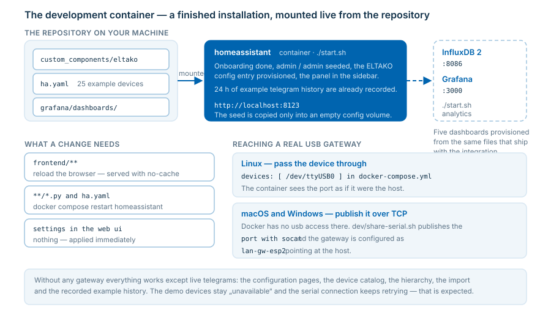

# Development container

A ready-to-use Home Assistant with this integration, example data and an optional
analysis stack - started with one command, on Linux, macOS and Windows.

Everything lives in [`dev/`](../../dev/).



## Quick start

```bash
cd dev
./start.sh                  # windows: start.bat
```

Then open **<http://localhost:8123>** and log in with **admin / admin**.

```bash
./start.sh analytics        # additionally InfluxDB + Grafana
./stop.sh                   # stop, keep all data
./stop.sh reset             # stop and delete all data (fresh install on the next start)
```

| | URL | Login |
| --- | --- | --- |
| Home Assistant | <http://localhost:8123> | `admin` / `admin` |
| InfluxDB 2 | <http://localhost:8086> | `admin` / `eltako-dev` (org `home`, bucket `eltako`, token `eltako-dev-token`) |
| Grafana | <http://localhost:3000> | `admin` / `admin` |

## What is prepared

The container starts with a finished installation - no onboarding, no manual setup:

* **Admin user** `admin`/`admin` and the completed onboarding are seeded into the config
  volume on the very first start.
* **The ELTAKO integration is already set up**: the config entry of the demo gateway exists,
  the *ELTAKO* panel is in the sidebar right away.
* **Example configuration**: the repository file [`ha.yaml`](../../ha.yaml) is mounted and
  included as a Home Assistant package - one FGW14-USB bus gateway with example devices for
  every platform (lights, dimmer, switches, covers, climate, sensors, wired and wireless
  binary sensors), several areas, telegram recording and the web ui switched on.
* **Example telegram history**: `enocean_telegrams.jsonl` holds 24 h of demo telegrams
  (temperature curve, weather station, switching cycles, an unknown wall button).
* **The integration code is mounted live** from the repository.

The seed is only copied when the config volume is empty (first start or after
`./stop.sh reset`) - a running installation is never overwritten.

## Applying changes

| changed | needed |
| --- | --- |
| Frontend (`custom_components/eltako/frontend/**`) | reload the browser page - the files are read from disk per request and served with `no-cache` |
| Backend (`custom_components/eltako/**/*.py`) | `docker compose restart homeassistant` |
| Settings in the web ui | nothing, they are applied immediately (except `enable_frontend`) |
| `ha.yaml` | `docker compose restart homeassistant` |

```bash
docker compose logs -f homeassistant      # follow the log
docker compose restart homeassistant      # after a code change
```

## Using a real gateway (USB)

The container is a Linux container, so how a usb stick gets in depends on the host.

### Linux: pass the device through

Uncomment in [`dev/docker-compose.yml`](../../dev/docker-compose.yml) and adjust the path:

```yaml
    devices:
      - "/dev/ttyUSB0:/dev/ttyUSB0"
```

Then configure the gateway as usual (`fam14`, `fgw14usb`, `fam-usb`, ...) with
`serial_path: /dev/ttyUSB0`.

### macOS and Windows: publish the port over TCP

**Why not simply pass the device through?** Because it never arrives in the vm docker runs in.
Measured on a Mac with Colima and a connected FTDI adapter:

```console
$ ls /dev/cu.usbserial*                 # on the mac: there
/dev/cu.usbserial-FTAMHS600  /dev/cu.usbserial-FTAMHS601

$ colima ssh -- ls /dev/ttyUSB*         # in the vm: nothing
no matches found

$ colima ssh -- cat /sys/bus/usb/devices/*/product
Virtual USB Keyboard
Virtual USB Digitizer
xHCI Host Controller                    # only virtual devices, no FTDI chip

$ docker run --rm --device /dev/ttyUSB0 alpine true
Error response from daemon: error gathering device information while adding
custom device "/dev/ttyUSB0": no such file or directory
```

A container can only be given what the vm has, and neither Colima/Lima nor Docker Desktop
forward usb serial devices (`colima start` has no usb option at all). So `devices:` cannot
work here - it is not a matter of permissions.

Publish the port on the host instead and let the integration connect to it as a network
gateway:

```bash
brew install socat                                          # once (macOS)
cd dev
./share-serial.sh /dev/cu.usbserial-FTAMHS601 9600 5100
```

The script prints which url and gateway type to use, and keeps running - leave that terminal
open.

#### Creating the gateway in the web ui

1. Open the **ELTAKO** panel in the sidebar, page **Overview**.
2. Click **+ Add gateway**. The port list is read freshly on every click, so a stick which was
   plugged in afterwards is there.
3. Fill in the form:

   | Field | Value | Why |
   | --- | --- | --- |
   | **Gateway type** | `lan-gw-esp2` | ESP2 over tcp. Choosing it replaces *Serial port* with *Host name or IP address*. |
   | **Host name or IP address** | `host.docker.internal` | the docker host, i.e. your machine. Not `localhost` - inside the container that is the container itself. |
   | **Port** | `5100` | the third argument of `share-serial.sh` |
   | **Gateway id** | the suggested free number | part of the entity ids |
   | **Name** | e.g. `FAM-USB via socat` | free text |
   | **Base id** | leave `00-00-00-00` | it is queried from the hardware and stored automatically |

4. **Save**. The entities appear within a few seconds; the *Overview* tile of the gateway
   switches to **connected**, and *Base id* fills itself (`FF-A5-FE-80` in this example).

If it stays **disconnected**, in this order:

* Does the terminal with `share-serial.sh` still run, and does it log `accepting connection`
  when Home Assistant tries? If not, the container does not reach the host - check the port.
* Is the **other** serial port the right one? A FAM-USB registers two (`...600`/`...601`) and
  only one carries the telegrams. Stop the script and start it with the other device.
* Is the **baud rate** right? 9600 for a FAM-USB, 57600 for FAM14/FGW14-USB. It is set on the
  host side by `share-serial.sh`, not in the gateway form.
* Is another process holding the port (a standalone runtime, PCT14, eo_man)? Only one may.

The same in `ha.yaml` instead of the web ui:

```yaml
eltako:
  gateway:
  - id: 9
    device_type: lan-gw-esp2        # ESP2 over tcp
    name: FAM-USB via socat
    base_id: 00-00-00-00            # queried from the hardware
    address: host.docker.internal   # the docker host, i.e. your machine
    port: 5100
```

The baud rate belongs to the **host** side (the third argument of `share-serial.sh`):
9600 for a FAM-USB, 57600 for FAM14/FGW14-USB and ESP3 sticks.

This is verified with real hardware: a FAM-USB published this way answers the base id
request through the bridge and forwards its radio telegrams into the container.

Notes:

* Pick a **free** port. On macOS, 5000 is occupied by the AirPlay receiver of Control Center.
* `share-serial.sh` uses `fork`, so Home Assistant can reconnect after a restart without
  restarting the bridge.
* Only one process may open the serial port. Stop a standalone runtime which uses the same
  stick first.
* If you need hardware access without any of this, run the
  [standalone runtime](../standalone/readme.md) directly on your machine - it accesses
  `COM3` / `/dev/cu.usbserial-*` natively.

### Without a gateway

Everything except live telegrams works: the configuration pages, the device catalog, the
hierarchy, the import and the recorded example history. The configured demo devices stay
"unavailable" / "never reported" and the serial connection keeps retrying - that is expected.

## Analysis with Grafana

```bash
./start-analytics.sh        # only InfluxDB + Grafana, without Home Assistant
```

Five dashboards are provisioned into the folder *ELTAKO* (tag `eltako`), the overview is the
home dashboard. They ship with the integration
(`custom_components/eltako/grafana/dashboards/`), so they are versioned together with the data
model they query:

* **Telegram overview** - rate by direction and gateway, most active addresses, distribution
  over message type and EEP, table of the unconfigured addresses
* **Telegrams per device** - per device over time, totals, first/last telegram, average
  interval between two telegrams (a battery sensor with a long interval may be empty)
* **Errors and bus health** - telegrams whose configured EEP cannot decode them (the wrong EEP
  in the configuration), unconfigured addresses, repeated telegrams and the signal strength
  per device
* **Product and test inspector** - search for a device, product or test run and look at its
  **raw telegrams**: direction, message type, data and status bytes, the round trip of
  command and answer, the distinct payloads a product sent
* **Device analysis** - any decoded EEP value over time, switching states, silent devices,
  telegrams per hour and area

What each dashboard is for, what exactly lands in the database and how to write own
queries: **[docs/grafana](../grafana/readme.md)**.

### Getting them into Grafana

Two ways, both from the same files:

* **This container** mounts the folder into the provisioning path of Grafana - the dashboards
  are simply there, nothing to click.
* **Any other Grafana** (a NAS, Grafana Cloud, a hand-made container): press **Sync
  dashboards** in the live telegram view of the web ui. It pushes them through the Grafana
  HTTP API, creates the folder *ELTAKO* and points the panels at the InfluxDB datasource which
  actually exists there. For that, set *Grafana URL* and *Grafana API token* in the settings
  (a service account token with the role **Editor**; `admin:admin` also works for a test
  setup). The result names every dashboard with a link.

Enable the export in the web ui (*About → Active configuration*, group *Timeseries export*):

| Setting | Value |
| --- | --- |
| Export telegrams to InfluxDB | on |
| InfluxDB URL | `http://influxdb:8086` |
| API token | `eltako-dev-token` |
| Organization | `home` |
| Bucket | `eltako` |
| Grafana URL | `http://localhost:3000` |

To import the history recorded before InfluxDB was up, call the service
`eltako.export_telegram_log_to_timeseries` (*Developer tools → Actions*).

The **standalone runtime** switches recording and the export on by default and links to the
dashboards from its web ui - see [standalone runtime](../standalone/readme.md).

## Host requirements

| | Linux | macOS | Windows |
| --- | --- | --- | --- |
| Docker runtime | native | Docker Desktop or [Colima](https://github.com/abiosoft/colima) (`brew install colima && colima start`) | Docker Desktop (WSL2) |
| Scripts | `start.sh` / `stop.sh` | `start.sh` / `stop.sh` | `start.bat` / `stop.bat` |
| USB gateway | pass through (`devices:`) | TCP bridge (see above) | TCP bridge, or [usbipd-win](https://github.com/dorssel/usbipd-win) into WSL2 |

`docker compose` (v2, with a space) is required. Two things which cost time on macOS:

* `brew install docker` installs the **client only**. Without Docker Desktop or Colima there
  is no daemon and every command fails with `cannot connect to /var/run/docker.sock`.
* If `docker compose` reports an unknown command, link the plugin:
  `mkdir -p ~/.docker/cli-plugins && ln -s "$(brew --prefix)/opt/docker-compose/bin/docker-compose" ~/.docker/cli-plugins/docker-compose`

On SELinux hosts (Fedora & co) bind mounts may need the `:z` suffix.

## Tests

The seed is kept in sync with the integration by
[`tests/test_dev_container.py`](../../tests/test_dev_container.py): it fails when something
the container depends on changes (the gateway naming scheme, the telegram record format, the
compose structure) instead of letting the container break silently.

```bash
python -m pytest tests                     # tests of the integration
python -m pytest eltako_standalone/tests   # tests of the standalone runtime
```
