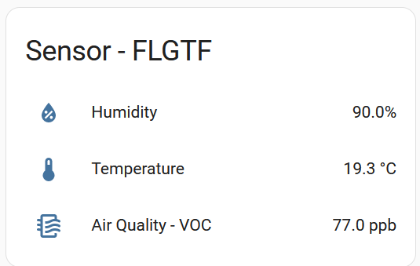

# How to configure Eltako FLGTF




[Instructions and datasheet](https://www.eltako.com/fileadmin/downloads/en/_bedienung/FLGTF55_30055520-2_gb.pdf)

## Supported EEPs by FLGTF
* **A5-04-02**-telegrams contain **current temperature** and **humidity**
* **A5-09-0C**-telegrams contain **air quality**. In the [official ESP2 standard](https://www.enocean-alliance.org/wp-content/uploads/2017/05/EnOcean_Equipment_Profiles_EEP_v2.6.7_public.pdf) there are 37 different types of substances which can be put into the message. 
  Eltako FLGTF only measures **⁠VOC⁠** (Volatile Organic Compounds) in total.

## How to configure in Home Assistant

```
  sensor:

  # Temperature and Humidity Sensor
  - id: ff-aa-dd-81
    eep: A5-04-02
    name: "Temperature and Humidity Sensor - FLGTF55"

  # Air Quality Sensor
  - id: ff-aa-dd-80
    eep: A5-09-0C
    name: "Air Quality Sensor - FLGTF55"
    language: 'en'                      # optional, default: 'en', valid values: ['en','de']
    voc-type-indexes: [0]               # optional, default: [0], valid values is an array of substance types of the official ESP2 definition of A5-09-0C. This section is only intended of other sensors providing more values.
    
```