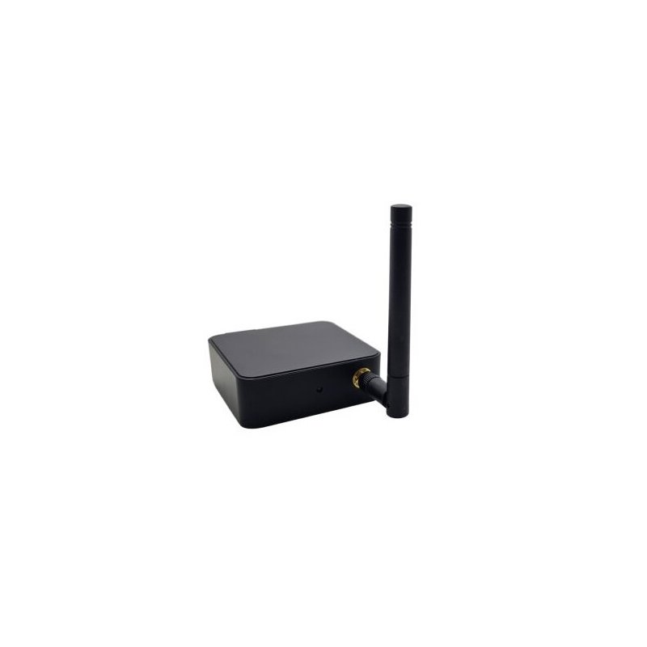
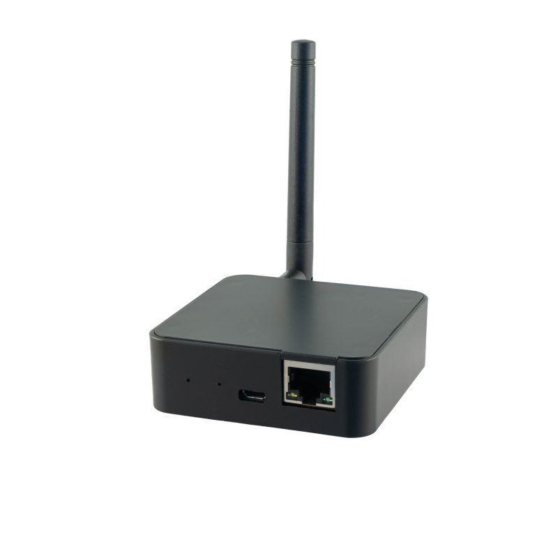

# Gateways

A gateway is the component which builds the bridge between Home Assistant and the EnOcean wireless network or the RS485 bus. The gateway listens to telegrams on the RS485 bus or in the wireless network and transfers them to Home Assistant. In Home Assistant the Eltako Integration can send telegram either into wireless network or directly on the RS485 bus dependent on the type of gateway (USB based connection or radio transmitter). Based on the delivered EnOcean telegrams the Eltako Integration can display the state of the actuators or send commands to change those states. In Home Assistant gateways are also called hubs.

## Summary of Supported Gateways
What gateway is preferred for what?

### EnOcean Transceiver (USB based like Eltako FAM-USB, USB300, PioTek FAM-USB515, PioTek MGW, ...)
* Is a good match for controlling actuators mounted on a RS485 bus with FAM14 and especially for decentralized actuators in Home Assistant.
* It also allows to send teach-in telegrams so that you can teach-in actuators by using the Eltako Integration in Home Assistant.
* It receives status update telegrams repatedly about each minute of every device on the bus.
* It cannot receive RS485 bus internal commands. E.g. FTS14EM (wired rocker switches, window contacts, ...) telegrams cannot be received. Those telegrams must be consumed on the bus although status responses of the actuators will be sent into wireless network so that FAM-USB can see the result of the changes.
* Easy installation (USB-Stick)
* Reception quality depends on how close is it to all the devices and repeaters. (Wireless connection could be instable.)

### Wired Gateways (e.g. Eltako FGW14-USB)
* Has good performance because it filters out polling messages from FAM14 what makes Home Assistant faster.
* Like FAM14, it can transfer states of actuators mounted on the same RS485 bus to Home Assistant. It can also send telegrams to the actuators to change their states.
* Has better physical USB connector than FAM14.
* Cannot read memory of actuators thus it has better security measurements.
* Cannot control and send telegrams to decentralized actuators. Only to the RS485 bus on which it is mounted.
* Installation means change to the existing bus in the electric cabinet. (Little electirc knowledge required)
* Good connection quality.

### Controller Gateway (Eltako FAM14)
* Similar to FGW14-USB
* Can read memory of actuators. You can use it to [auto-generate configuration for Home Assistant](https://github.com/grimmpp/enocean-device-manager).
* Quite a lot of unnecessary telegrams are sent to Home Assistant. Home Assistant could become slower.
* In operation it does the same like FGW14-USB.
* Like FGW14-USB, it can transfer states of actuators mounted on the same RS485 bus to Home Assistant. It can also send telegrams to the actuators to change their states, excluded decentral actuators.
* Installation: Most probably already mounted on the bus.
* Good connection quality.

### Conclusion
* Use FAM-USB for operations with Home Assistant. FAM-USB is a must for decentralized actuators. If your setup only have actuators mounted on the RS485 bus FGW14-USB is a good choice. <br />
* Use FAM14 to [generate Home Assistant configuration](https://github.com/grimmpp/enocean-device-manager).

### Limitations
Currently all gateways are limited to control up to 128 devices but you can operate more than one in parallel.

### Recoomendation
With FAM-USB (e.g. PioTek FAM-USB515) most use cases can be covered and FGW14-USB has the better connection quality but does not support sending command to decentralized devices but you can use both in parallel. 


## Types of gateways

### [**Eltako FAM14**](https://www.eltako.com/en/product/professional-smart-home-en/series-14-rs485-bus-rail-mounted-devices-for-the-centralised-wireless-building-installation/fam14/) 

FAM14 is the wireless antenna module for the Eltako RS485 bus on which actuators can be plugged in. It sends the EnOcean telegram into the wireless network and can receive them either from the bus or wireless network.
You can use its usb port to connect it to Home Assistant. 

 

| Specialty | Description |
| ----- | ----- |
| Protocol | ESP2 |
| Baud rate | 57600 |
| Configuration Tool for Eltako Bus | [PCT14](https://www.eltako.com/en/software-pct14/) | 
| Manual | [en](https://www.eltako.com/fileadmin/downloads/en/_bedienung/FAM14_30014000-2_gb.pdf), [de](https://www.eltako.com/fileadmin/downloads/de/_bedienung/FAM14_30014000-3_dt.pdf) |
| Address space | 128 internal address can be used for actuators. If you need more you can increase your setup by a second RS485 bus incl. dedicated FAM14. |

#### Pros
* Can read memory of actuators. You can use it to [auto-generate a configuration file for Home Assistant](../../eltakodevice_discovery/readme.md). 
* Not dependent on wireless network. Very stable connection.
* Receives internal command on the RS485 bu. E.g. telegrams from rocker switches conncted via wires to FTS14EM.

#### Cons
* **Overhead traffic** is transferred to Home Assistant. It can slow down Home Assistant, better use FGW14-USB it delivers only status telegrams to Home Assistant. FGW14-USB is not allowed to access memory of actuators mounted on the bus. Thus it doesn't support auto-generation of Home Assistant configuration.
* **Only sends status updates into the wireless network.** If you want to send commands to decentralized actuators then you need to use EnOcean Transceiver like FAM-USB.
* **Teach-in telegrams cannot be sent with FAM14 nor with FGW14-USB** out of Home Assistant into the wireless network. 

#### FAM14 BaseId
FAM14 is setting its baseId automatically and sends telegrams out into the wireless network but only for status telegrams of the actuators.
This is only relevant for out going communication to devices in wireless network like decentralized actuators. 
You can find the baseId of FAM14 in PCT14 (Configuration Software) or in [EnOcean Device Manager (eo-man)](https://github.com/grimmpp/enocean-device-manager).

#### Configuration (New Way)
Use [EnOcean Device Manager (eo-man)](https://github.com/grimmpp/enocean-device-manager) to autogenerate the Home Assistant configuration.
#### Configuration (Old Way)
1. Specify the type of gateway in the configuration (/homeassistant/configuration.yaml) in Home Assistant.
2. Enter your devices. I recommend to use a baseId and add the device id so that you don't get confused with all the addresses. 

**Configuration Example**:
Hint: Addresses in PCT14 are displayed in DEZ and in Home Assistant configuration in HEX.
```
eltako:
  gateway:
  - id: 1
    device_type: fam14
    base_id: FF-AA-00-00
    devices:
      light:
      - id: 00-00-00-01         # internal address from PCT14
        eep: M5-38-08
        name: FSR14_4x - 1
        sender:
          id: 00-00-B0-01       # HA sender baseId (00-00-B0-00) + internal address (0-80 HEX/128 DEZ)
          eep: A5-38-08

```


### [**Eltako FGW14-USB**](https://www.eltako.com/en/product/professional-smart-home-en/series-14-rs485-bus-rail-mounted-devices-for-the-centralised-wireless-building-installation/fgw14-usb/)

Is mounted on the rs485 bus and can read incoming telegrams from the wireless network, status telegrams of actuators mounted on the bus and can send commands to only the actuators mounted on the same rs485 bus. 

 

| Specialty | Description |
| ----- | ----- |
| Protocol | ESP2 |
| Baud rate | 57600 | 
| Manual | [de](https://www.eltako.com/fileadmin/downloads/de/_bedienung/FGW14-USB_30014049-1_dt.pdf), [en](https://www.eltako.com/fileadmin/downloads/en/_bedienung/FGW14-USB_30014049-1_gb.pdf) |


#### Pros
* Less traffic overhead than FAM14.
* Not dependent on wireless network. Very stable connection.
* Receives internal command on the RS485 bu. E.g. telegrams from rocker switches conncted via wires to FTS14EM.

#### Cons
* FGW14-USB is not allowed to access memory of actuators mounted on the bus. Thus it doesn't support auto-generation of Home Assistant configuration. You can use FAM14 for it.
* **Only sends status updates into the wireless network** via FAM14. If you want to send commands to decentralized actuators then you need to use EnOcean Transceiver like FAM-USB.
* **Teach-in telegrams cannot be sent via FAM14** out of Home Assistant into the wireless network. 

#### Configuration
Same like for FAM14.


### [**Eltako FAM-USB**](https://www.eltako.com/en/product/professional-standard-en/three-phase-energy-meters-and-one-phase-energy-meters/fam-usb/)

FAM-USB is a usb device which can receive and send EnOcean telegrams via ESP2 protocol. You can use it as gateway in Home Assistant to receive information and to control your actuators. It is connected to the decentralized actuators and to the actuators mounted on a RS485 bus via wireless network.


| Specialty | Description |
| ----- | ----- |
| Chip Set | [TCM300](https://www.enocean.com/en/product/tcm-300/?frequency=868), [Datasheet](https://www.enocean.com/wp-content/uploads/downloads-produkte/en/products/enocean_modules/tcm-300/data-sheet-pdf/TCM_300_TCM_320_DataSheet_May2019.pdf), [User Manual](https://www.enocean.com/wp-content/uploads/downloads-produkte/en/products/enocean_modules/tcm-300/user-manual-pdf/TCM300_TCM320_UserManual_Nov2021.pdf), [Firmeware](https://www.enocean.com/en/support/software-tools-kits) |
| Protocol | ESP2 |
| Baud rate | 9600 |
| Tool for chip configuration | [DolphinStudio](https://www.enocean.com/de/produkt/dolphinstudio/?ts=1701468463) |
| Sender Address Range | TCM300 has 128 address in the range of 0xFF80_0000 to 0xFFFF_FFFE starting at a base address (BaseId).  |

#### Pro
* Less traffic overhead than FAM14.
* Can receive status telegrams from all actuators each minute.
* Can send telegrams to all actuators incl. teach-in telegrams.

#### Con
* Cannot receives internal command on the RS485 bus. E.g. telegrams from rocker switches conncted via wires to FTS14EM.
* Connection quality could be bad over long distances.

#### Configuration (New Way)
Use [EnOcean Device Manager (eo-man)](https://github.com/grimmpp/enocean-device-manager) to autogenerate the Home Assistant configuration.
#### Configuration (Old Way)
1. Specify the type of gateway in the configuration (/homeassistant/configuration.yaml) in Home Assistant.
2. Find out  baseId of FAM-USB (start address for sender addresses). Use [DolphinStudio](https://www.enocean.com/de/produkt/dolphinstudio/?ts=1701468463) to read meta data from the chip.
   In this example we use FF-80-80-00 as start address.
   
   Or use [eltakotool.py](https://github.com/grimmpp/eltako14bus) `./eltakotool.py --eltakobus /dev/ttyUSB1 --baud_rate 9600 send_raw ab 58 00 00 00 00 00 00 00 00 00` 
3. If your actuator is on a RS485 bus behind FAM14 find out the baseId of FAM14. Use [PCT14](https://www.eltako.com/en/software-pct14/) to read the meta information of FAM14.
   In this example we use FF-AA-00-00
   
4. For all actuators on the bus take the FAM14 baseId and add the internal address. In PCT14 all actuator address are displayed in DEZ. You need to convert them to HEX. (E.g. 26 in DEZ = 1A in HEX) For decentralized actuators just take their addresses.
5. For all Home Assistant senders take the baseId of FAM-USB and add the internal address from PCT14. 

```
eltako:
  gateway:
  - id: 1
    device_type: fam-usb
    base_id: FF-80-80-00        # baseId of FAM-USB gateway
    devices:
      light:
      - id: FF-AA-00-01         # baseId of FAM14 (FF-AA-00-00) + internal address
        eep: M5-38-08
        name: FSR14_4x - 1
        sender:
          id: FF-80-80-01       # baseId of FAM-USB (FF-80-80-00) + sender id (0-80 HEX/128 DEZ)
          eep: A5-38-08

```

### [**EnOcean GmbH USB300**](https://www.enocean.com/en/product/usb-300/)

USB300 is a usb device which can receive and send EnOcean telegrams via **ESP3** protocol. ESP3 is made compatible on the feature set of ESP2 by [esp2_gateway_adapter](https://github.com/grimmpp/esp2_gateway_adapter). 


| Specialty | Description |
| ----- | ----- |
| Chip Set | [TCM 310](https://www.enocean.com/en/product/tcm-310/?frequency=868&ts=1710856253) |
| Docs | [Datasheet](https://www.enocean.com/wp-content/uploads/downloads-produkte/en/products/enocean_modules_928mhz/usb-400j/data-sheet-pdf/USB_300_USB_400J_USB_500U_Data_Sheet.pdf), [User Manual](https://www.enocean.com/wp-content/uploads/downloads-produkte/en/products/enocean_modules_928mhz/usb-400j/user-manual-pdf/USB_300_USB_400J__USB_500U_User_Manual_06042022.pdf) |
| Protocol | ESP3 |
| Baud rate | 57600 |
| Sender Address Range | TCM310 has 128 address in the range of 0xFF80_0000 to 0xFFFF_FFFE starting at a base address (BaseId).  |

#### Configuration
Use [EnOcean Device Manager (eo-man)](https://github.com/grimmpp/enocean-device-manager) to autogenerate the Home Assistant configuration.


Example Configuration:
```
eltako:
  gateway:
  - id: 1
    device_type: enocean-usb300
    base_id: FF-80-80-00        # baseId of USB300 gateway
    devices:
      light:
      - id: FF-AA-00-01         # baseId of FAM14 (FF-AA-00-00) + internal address
        eep: M5-38-08
        name: FSR14_4x - 1
        sender:
          id: FF-80-80-01       # baseId of USB300 (FF-80-80-00) + sender id (0-80 HEX/128 DEZ)
          eep: A5-38-08
```

### [PioTek EnOcean USB Gateway FAM-USB 515 ](https://www.piotek.de/FAM-USB-515)
Successor of USB300 with better range and same protocol (ESP3).



| Specialty | Description |
| ----- | ----- |
| Chip Set | [TCM515]([https://www.enocean.com/en/product/tcm-300/?frequency=868), [Datasheet](https://www.enocean.com/wp-content/uploads/downloads-produkte/en/products/enocean_modules/tcm-300/data-sheet-pdf/TCM_300_TCM_320_DataSheet_May2019.pdf](https://www.enocean.com/wp-content/uploads/downloads-produkte/en/products/enocean_modules/tcm-515/data-sheet-pdf/TCM_515_Data_Sheet_Nov2020.pdf)), [User Manual]([https://www.enocean.com/wp-content/uploads/downloads-produkte/en/products/enocean_modules/tcm-300/user-manual-pdf/TCM300_TCM320_UserManual_Nov2021.pdf), [Firmeware](https://www.enocean.com/en/support/software-tools-kits](https://www.enocean.com/wp-content/uploads/downloads-produkte/en/products/enocean_modules_928mhz/tcm-515j/user-manual-pdf/TCM-515-User-Manual-1.pdf)) |
| Protocol | ESP3 |
| Baud rate | 57600 |
| Tool | [BCS](https://www.piotek.de/mediafiles/Sonstiges/BSC-480.zip) |
| Sender Address Range | TCM515 has 128 address in the range of 0xFF80_0000 to 0xFFFF_FFFE starting at a base address (BaseId).  |

### [PioTek EnOcean Multigateway USB/LAN/Wifi](https://www.piotek.de/PioTek-MGW-POE)
Similar to PioTek FAM-USB515. Is supports ESP3 over TCP for LAN (cable) and Wifi.



| Specialty | Description |
| ----- | ----- |
| Chip Set | [TCM515]([https://www.enocean.com/en/product/tcm-300/?frequency=868), [Datasheet](https://www.enocean.com/wp-content/uploads/downloads-produkte/en/products/enocean_modules/tcm-300/data-sheet-pdf/TCM_300_TCM_320_DataSheet_May2019.pdf](https://www.enocean.com/wp-content/uploads/downloads-produkte/en/products/enocean_modules/tcm-515/data-sheet-pdf/TCM_515_Data_Sheet_Nov2020.pdf)), [User Manual]([https://www.enocean.com/wp-content/uploads/downloads-produkte/en/products/enocean_modules/tcm-300/user-manual-pdf/TCM300_TCM320_UserManual_Nov2021.pdf), [Firmeware](https://www.enocean.com/en/support/software-tools-kits](https://www.enocean.com/wp-content/uploads/downloads-produkte/en/products/enocean_modules_928mhz/tcm-515j/user-manual-pdf/TCM-515-User-Manual-1.pdf)) |
| Protocol | ESP3 |
| Baud rate | 57600 |
| Tool | [BCS](https://www.piotek.de/mediafiles/Sonstiges/BSC-480.zip) |
| Sender Address Range | TCM515 has 128 address in the range of 0xFF80_0000 to 0xFFFF_FFFE starting at a base address (BaseId).  |


Example Configuration:
```
eltako:
  gateway:
  - id: 1
    device_type: mgw-lan
    base_id: FF-80-80-00        # baseId of LAN gateway
    address: 192.168.178.15     # address is only required for LAN gateway
    port: 5100                  # optional (default value 5100). Field only valid for LAN gateway
    devices:
      light:
      - id: FF-AA-00-01         # baseId of FAM14 (FF-AA-00-00) + internal address
        eep: M5-38-08
        name: FSR14_4x - 1
        sender:
          id: FF-80-80-01       # baseId of USB300 (FF-80-80-00) + sender id (0-80 HEX/128 DEZ)
          eep: A5-38-08
```


### FTD14 - RS485 bus telegram duplicator


Other possible gateway 
