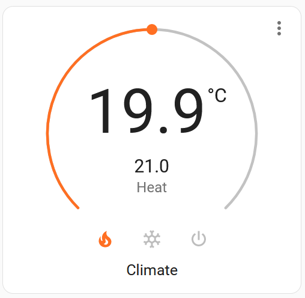
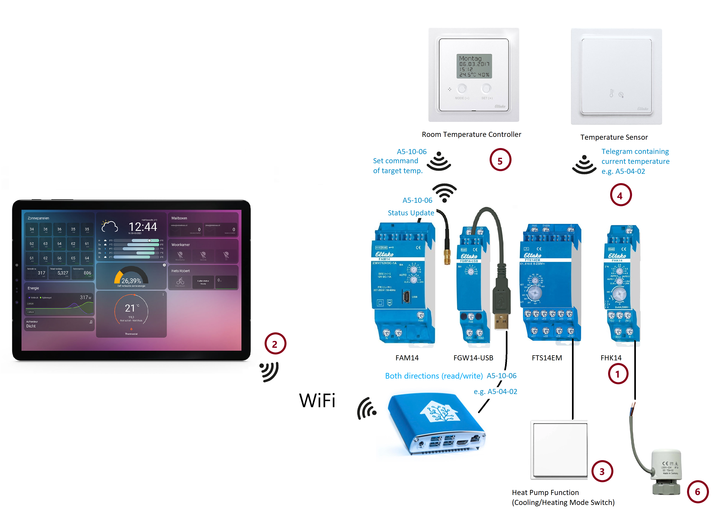
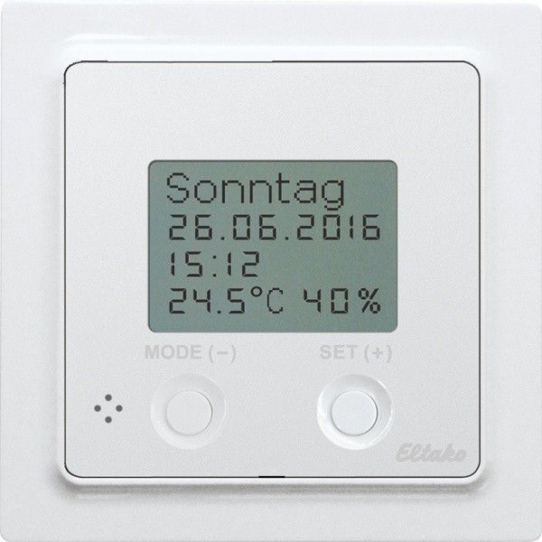

# Heating and Cooling -  Setup and Configuration

This documentation is about how to control a heating like a heat pump which is able to heat up in winter and to cool down in summer.



In the following scenario we have an actor (like FAE14, FHK14, F4HK14, F2L14, FHK61, FME14) controlling the heating valve dependent on the configured target and current temperature. The target temperature is sent frequently by a room temperature sensor and the target temperature can be set via control panel (e.g. Eltako FTAF55ED) or Home Assistant [Climate Panel](https://developers.home-assistant.io/docs/core/entity/climate).

Both control panels are updated via a frequently sent telegram from the actor based on EEP A5-10-06. For setting the target temperature the same EEP A5-10-06 is used.

Heating and cooling is supported, however it cannot be change via Climate Panel. It will be set via central rocker switch which defines the state for the whole heating. All actors need to react on it.



| Number      | Component   | Description |
| :---        | :---        | :---        |
| 1           | Heating and Cooling Actor | e.g. Eltako FHK14, FAE14SSR ... . This actor is controlling the actuator (number 6)|
| 2           | Climate Panel | Virtual temperature controller in Home Assistant. <br/>It requires an own address which needs to be entered in the function group 3 of the actor e.g. via PCT14 programming software. <br/>It's EEP is "A5-10-06". |
| 3           | Cooling Mode | Physical switch which is connected to FTS14EM and sends frequently (15min) a signal to stay in cooling mode or is off for heating. <br/>Supported EEPs: F6-02-01, F6-02-02, F6-10-00, D5-00-01, A5-08-01, M5-38-08 (FTS14EM contact signals and rocker switches are supported) <br/>In case of a rocker switch the button needs to be defined. 0x70 = top right, x50 = bottom right, 0x30 = top left, 0x10 = bottom left |
| 4           | Room Temperature Sensor | Sensor sending periodically (every 50 seconds) the current temperature of the room. |
| 5           | Temperature Controller | Physical wall-mounted temperature sensor and controller in one box. |
| 6           | Actuator | Bringing the valve into the right position. |

## Actor Configuration in Device 

* **Heating is enabled** as default.
* **Operating state** instead of switching state is enabled.
* In **function group 1 a temperature sensor** is entered which sends frequently the current room temperature.
* **Optionally**: In **function group 2** a physical room **temperature controller** is entered. (e.g. Eltako FTAF55ED)
* In **function group 3** address for **Home Assistant Climate Panel** is entered.
* **Optionally**: In **function group 4** a rocker switch is entered for changing the **heating modes** (Normal, Off, Night (4°), Setback (2°) - Predefined by Eltako)
* **Optionally**: In **function group 4** a rocker switch is entered for changing from heating into **cooling mode**. Preferred solution is to use a physical with connected to FTS14EM. 

## Home Assistant Configuration

You can find the meaning of the numbers in the table above.

### Example with physical switch connected via FTS14EM (RECOMMENDED)
```
eltako:
  
  ...
  binary_sensor:
  - id: "00-00-10-08"
    eep: "D5-00-01"
    name: "cooling switch"
  ...

  climate:
    - id: "00-00-00-09"           # Address of actor (1)
      eep: "A5-10-06"             # Telegram type of the actor (1)

      temperature_unit: "°C"      # Displayed temperature unit in Climate Panel (2)
      min_target_temperature: 17  # Optional field, default value 17 (2)
      max_target_temperature: 25  # Optional field, default value 25 (2)

      sender:                     # Virtual temperature controller (2)
        id: "00-00-B0-09"         # Sender address (2) needs to be entered .
        eep: "A5-10-06"           # 2: Sender EEP

      cooling_mode:               # Optional part - cooling mode
        sensor:                   # Rocker switch (3) must be specified in binary_sensor
          id: "00-00-10-08"       # Address of switch (3)
```


### Example with rocker switch as cooling switch which must be triggered frequently (each 15min)
```
eltako:
  
  ...
  binary_sensor:
  - id: "FF-DD-0A-1B"
    eep: "F6-02-01"

  ...

  climate:
    - id: "00-00-00-09"           # Address of actor (1)
      eep: "A5-10-06"             # Telegram type of the actor (1)

      temperature_unit: "°C"      # Displayed temperature unit in Climate Panel (2)
      min_target_temperature: 17  # Optional field, default value 17 (2)
      max_target_temperature: 25  # Optional field, default value 25 (2)

      sender:                     # Virtual temperature controller (2)
        id: "00-00-B0-09"         # Sender address (2) needs to be entered .
        eep: "A5-10-06"           # 2: Sender EEP
        
      cooling_mode:               # Optional part - cooling mode
        sensor:                   # Rocker switch (3) must be specified in binary_sensor
          id: "FF-DD-0A-1B"       # Address of switch (3)
          switch-button: 0x50     # In case of switch button needs to be specified.
                                  # for rocker switches only
```

## Information about FUTH (Temperature Controller)



### Recommendations
Purchase the 12-24UC version instead of 230V version because FUTH55ED/230V is squeaking.

### Links
* [FUTH55ED Manual](https://www.eltako.com/fileadmin/downloads/en/_bedienung/FUTH55ED_230V_30055805-3_gb.pdf)
* [FHEM Forum: Controlling FUTH65D + Address ranges of FUTH****](https://forum.fhem.de/index.php?topic=82303.0)

| Signal type |	Telegram Org | Address/ID-Offset | EEP |
| ---- | --- | ---- | ---- |
| Room 1 / FKS | (ORG=0x7) |	0x00 | A5-10-06 |
| Room 1 / FHK | (ORG=0x7)	| 0x01 | A5-10-06 |
| Room 2 / FKS | (ORG=0x7)	| 0x02 | A5-10-06 |
| Room 2 / FHK | (ORG=0x7)	| 0x03 | A5-10-06 |
| Room 3 / FKS | (ORG=0x7)	| 0x04 | A5-10-06 |
| Room 3 / FHK | (ORG=0x7)	| 0x05 | A5-10-06 |
| Room 4 / FKS | (ORG=0x7)	| 0x06 | A5-10-06 |
| Room 4 / FHK | (ORG=0x7)	| 0x07 | A5-10-06 |
| Room 5 / FKS | (ORG=0x7)	| 0x08 | A5-10-06 |
| Room 5 / FHK | (ORG=0x7)	| 0x09 | A5-10-06 |
| Room 6 / FKS | (ORG=0x7)	| 0x0A | A5-10-06 |
| Room 6 / FHK | (ORG=0x7)	| 0x0B | A5-10-06 |
| Room 7 / FKS | (ORG=0x7)	| 0x0C | A5-10-06 |
| Room 7 / FHK | (ORG=0x7)	| 0x0D | A5-10-06 |
| Room 8 / FKS | (ORG=0x7)	| 0x0E | A5-10-06 |
| Room 8 / FHK | (ORG=0x7)	| 0x0F | A5-10-06 |
| Pump | (ORG=0x5/0x7)	| 0x10 | F6-02-01 (0x70 = on, 0x50 = off) + A5-38-08 |
| Hygrostat/ Sensor |  (ORG=0x5/0x7)| 0x11 | ? |
| Hygrostat/ Sensor | (ORG=0x7)	| 0x12 | EP A5-10-12 |
| FKS-MD10 | (ORG7)	| 0x13 | ? |
| Two point controller FUTH Room1 | (ORG5/7)	| 0x14 | ? |
