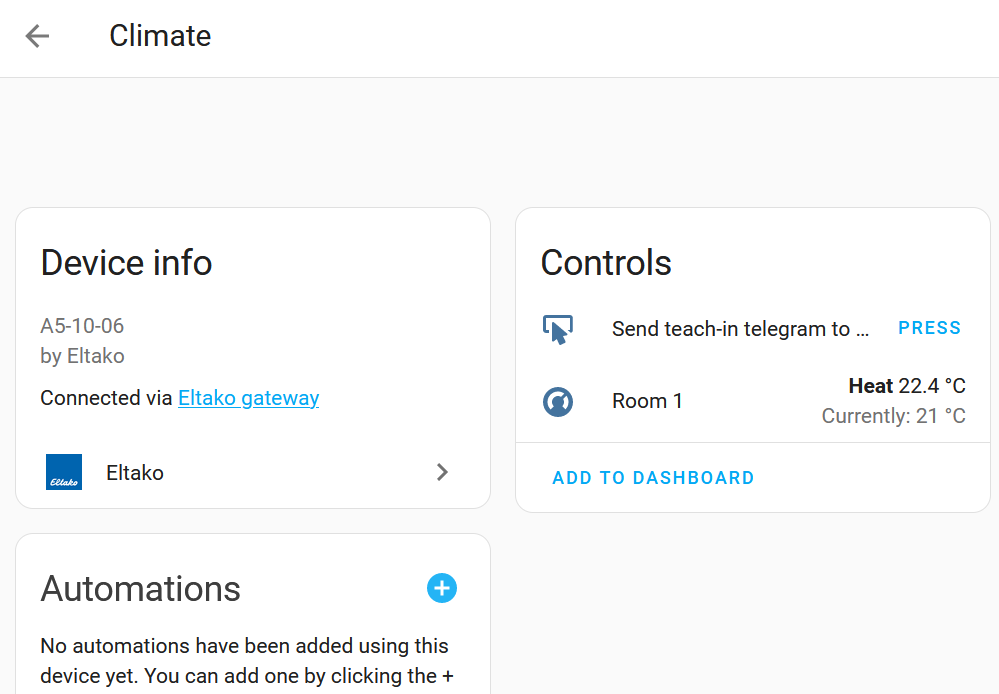
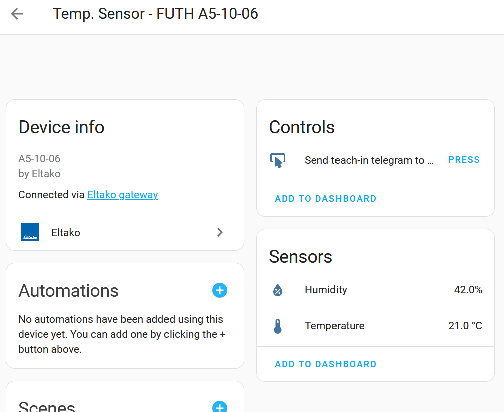

# Heating and Cooling -  Setup and Configuration

This documentation is about how to control a heating like a heat pump which is able to heat up in winter and to cool down in summer.


In the following scenario we have an actuator (like FAE14, FHK14, F4HK14, F2L14, FHK61, FME14) controlling the heating valve dependent on the configured target and current temperature. The target temperature is sent frequently by a room temperature sensor and the target temperature can be set via control panel (e.g. Eltako FTAF55ED) or Home Assistant [Climate Panel](https://developers.home-assistant.io/docs/core/entity/climate).

Both control panels are updated via a frequently sent telegram from the actuator based on EEP A5-10-06. For setting the target temperature the same EEP A5-10-06 is used.

Heating and cooling is supported, however it cannot be change via Climate Panel. It will be set via central rocker switch which defines the state for the whole heating. All actuators need to react on it.


| Number      | Component   | Description |
| :---        | :---        | :---        |
| 1           | Heating and Cooling Actuator | e.g. Eltako FHK14, FAE14SSR ... . This actuator is controlling the actuator (number 6)|
| 2           | Climate Panel | Virtual temperature controller in Home Assistant. <br/>It requires an own address which needs to be entered in the function group 3 of the actuator e.g. via PCT14 programming software. <br/>It's EEP is "A5-10-06". |
| 3           | Cooling Mode | Physical switch which is connected to FTS14EM and sends frequently (15min) a signal to stay in cooling mode or is off for heating. <br/>Supported EEPs: F6-02-01, F6-02-02, F6-10-00, D5-00-01, A5-08-01, M5-38-08 (FTS14EM contact signals and rocker switches are supported) <br/>In case of a rocker switch the button needs to be defined. 0x70 = top right, x50 = bottom right, 0x30 = top left, 0x10 = bottom left |
| 4           | Room Temperature Sensor | Sensor sending periodically (every 50 seconds) the current temperature of the room. |
| 5           | Temperature Controller | Physical wall-mounted temperature sensor and controller in one box. |
| 6           | Actuator | Bringing the valve into the right position. |

## Actuator Configuration in Device via PCT14

* **Heating is enabled** as default.
* **Operating state** instead of switching state is enabled.
* In **function group 1 a temperature sensor and controller** is entered which sends frequently the current room temperature.
<!--Not really sure what FG 2 is!* **Optionally**: In **function group 2** a hygrostat **temperature sensor and controller** is entered. -->
* In **function group 3** address for **Home Assistant Climate Panel** is entered.
* **Optionally**: In **function group 4** a rocker switch is entered for changing the **heating modes** (Normal, Off, Night reduction (-4°K), reduction (-2°K) - Predefined by Eltako). Not optional for FUTH. (See below)
* **Optionally**: In **function group 4** a rocker switch is entered for changing from heating into **cooling mode**. Preferred solution is to use a physical switch connected to FTS14EM. 

## Configuration of temperature controller e.g. FUTH
You can configure target temperature for rooms in the physical control panel e.g. FUTH.

**IMPORTANT**: You need to send a teach-in telegram to the physical control panel so that it won't override the settings from climate controller in Home Assistant. (See description below in section for FUTH)

## Home Assistant Configuration

You can find the meaning of the numbers in the table above.

### Example with physical switch connected via FTS14EM (RECOMMENDED)
```
eltako:
  
  ...
  binary_sensor:
  - id: "00-00-10-08"             # Wired via FTS14EM
    eep: "D5-00-01"
    name: "cooling switch"
  ...

  climate:
    - id: "00-00-00-09"           # Address of actuator (1)
      eep: "A5-10-06"             # Telegram type of the actuator (1)

      temperature_unit: "°C"      # Displayed temperature unit in Climate Panel (2)
      min_target_temperature: 17  # Optional field, default value 17 (2)
      max_target_temperature: 25  # Optional field, default value 25 (2)

      sender:                     # Virtual temperature controller (2)
        id: "00-00-B0-09"         # Sender address (2) needs to be entered .
        eep: "A5-10-06"           # 2: Sender EEP

      cooling_mode:               # Optional part - cooling mode
        sensor:                   # Rocker switch (3) must be specified in binary_sensor
          id: "00-00-10-08"       # Address of switch (3)
```


### Example with rocker switch as cooling switch which must be triggered frequently (each 15min)
```
eltako:
  
  ...
  binary_sensor:
  - id: "FF-DD-0A-1B"
    eep: "F6-02-01"

  ...

  climate:
    - id: "00-00-00-09"           # Address of actuator (1)
      eep: "A5-10-06"             # Telegram type of the actuator (1)

      temperature_unit: "°C"      # Displayed temperature unit in Climate Panel (2)
      min_target_temperature: 17  # Optional field, default value 17 (2)
      max_target_temperature: 25  # Optional field, default value 25 (2)

      sender:                     # Virtual temperature controller (2)
        id: "00-00-B0-09"         # Sender address (2) needs to be entered .
        eep: "A5-10-06"           # 2: Sender EEP
        
      cooling_mode:               # Optional part - cooling mode
        sensor:                   # Rocker switch (3) must be specified in binary_sensor
          id: "FF-DD-0A-1B"       # Address of switch (3)
          switch-button: 0x50     # In case of switch button needs to be specified.
                                  # for rocker switches only
```

## Information about Eltako FLGTF


* EEP A5-04-02 for temperature and humidity.
* EEP A5-09-05 for air quality. (Not yet supported)
* EEP A5-09-0C for air quality. (Not yet supported)

### Configuration in Home Assistant

```
eltako:
  gateway:
    device: fgw14usb
  sensor:
  - id: ff-ee-dd-81
    eep: A5-04-02
    name: "Temp. and Humidity Sensor - FLGTF"
 ...
```


## Information about Eltako FUTH (Temperature Controller)


### Recommendations
* Purchase the 12-24UC version instead of 230V version because FUTH55ED/230V is squeaking.

### Configuration of FHK/FAE via PCT14

| Function Group |  Function | Description | 
| ---: | ---: | --- |
| 1 | 64 | Target and Current Temperature (EEP **A5-10-06**) <br/>Room address must be selected. (See below, default = 0x01 offset) | 
| 3 | 65 | Home Automation SW (Temp Controller SW EEP **A5-10-06**) |
| 4 | 30 | 4x push button <br/>Mandatory value. Offset 0x11 |

### Configuration in Home Assistant

Actually the temperature controller (Climate Entity) in Home Assistant gets its messages from FHK/FAE/... actuator instead of the controller itself. However you can reuse the built-in hygrostat sensor (temp. + humidity with EEP A5-10-12) and the temperature controller with current temperature (EEP A5-04-02) as separate sensor.

Example Hygrostat Sensor and single Temperature Sensor:
```
eltako:
  gateway:
    device: fgw14usb
  sensor:
  - id: FF-EE-55-92
    eep: A5-10-12
    name: "Temp. and Humidity Sensor - FUTH"
  - id: FF-EE-55-81
    eep: A5-04-02
    name: "Temp. Sensor - Room 1 FUTH"
 ...
```


## Teach-in FUTH
In Home Assistant you will find either in the climate controller or temperature sensor for EEP A5-10-06 a button to send teach-in telegram to the physical temperature controller.




### Telegrams

| Signal type |	Telegram Org | Address/ID-Offset | EEP | Function in PCT14 |
| ---- | --- | ---- | ---- | ---- |
| Room 1 / FKS | (ORG=0x7) |	0x00 | A5-20-01, A5-20-04 | function group: 1, function: 64 |
| Room 1 / FHK | (ORG=0x7)	| 0x01 | A5-10-06 | |
| Room 2 / FKS | (ORG=0x7)	| 0x02 | A5-20-01, A5-20-04 | function group: 1, function: 64 |
| Room 2 / FHK | (ORG=0x7)	| 0x03 | A5-10-06 | |
| Room 3 / FKS | (ORG=0x7)	| 0x04 | A5-20-01, A5-20-04 | function group: 1, function: 64 |
| Room 3 / FHK | (ORG=0x7)	| 0x05 | A5-10-06 | |
| Room 4 / FKS | (ORG=0x7)	| 0x06 | A5-20-01, A5-20-04 | function group: 1, function: 64 |
| Room 4 / FHK | (ORG=0x7)	| 0x07 | A5-10-06 | |
| Room 5 / FKS | (ORG=0x7)	| 0x08 | A5-20-01, A5-20-04 | function group: 1, function: 64 |
| Room 5 / FHK | (ORG=0x7)	| 0x09 | A5-10-06 | |
| Room 6 / FKS | (ORG=0x7)	| 0x0A | A5-20-01, A5-20-04 | function group: 1, function: 64 |
| Room 6 / FHK | (ORG=0x7)	| 0x0B | A5-10-06 | |
| Room 7 / FKS | (ORG=0x7)	| 0x0C | A5-20-01, A5-20-04 | function group: 1, function: 64 |
| Room 7 / FHK | (ORG=0x7)	| 0x0D | A5-10-06 | |
| Room 8 / FKS | (ORG=0x7)	| 0x0E | A5-20-01, A5-20-04 | function group: 1, function: 64 |
| Room 8 / FHK | (ORG=0x7)	| 0x0F | A5-10-06 | |
| Pump | (ORG=0x5/0x7)	| 0x10 | F6-02-01 (0x70 = on, 0x50 = off) <br/>A5-38-08 | ? |
| 4x Push Button |  (ORG=0x5/0x7)| 0x11 | F6-02-01 (0x70 = normal, 0x50 = night reduction (-4°K), 0x30 = reduction (-2°K), 0x10 = off) | function group: 4: function: 30 |
| Hygrostat/ Sensor | (ORG=0x7)	| 0x12 | EP A5-10-12 | function group: 2: function: 149 |
| FKS-MD10 | (ORG7)	| 0x13 | A5-20-01/A5-20-04 ? | - |
| Two point controller FUTH Room1 | (ORG5/7)	| 0x14 | ? | ? |

### Links
* [FUTH55ED Manual](https://www.eltako.com/fileadmin/downloads/en/_bedienung/FUTH55ED_230V_30055805-3_gb.pdf)
* [FHEM Forum: Controlling FUTH65D + Address ranges of FUTH****](https://forum.fhem.de/index.php?topic=82303.0)