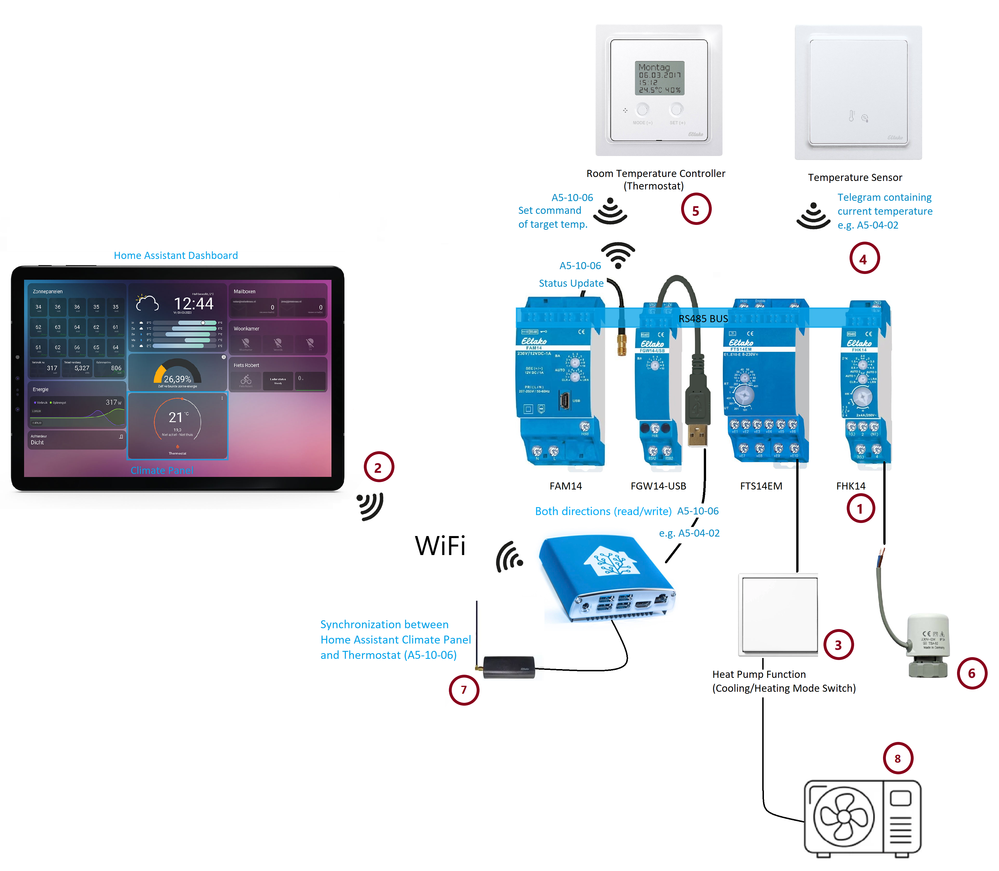

# Heating and cooling

The integration exposes an Eltako A5-10-06 heating actuator as a native Home
Assistant `climate` entity. It can control a heating valve, and optionally switch
between heating and cooling when an Eltako input reports a cooling-mode signal.

The physical thermostat is configured with the YAML/UI key `thermostat` (the UI
label is **Physical thermostat**).

## What is supported

| Home Assistant entity | EEP | Purpose |
| --- | --- | --- |
| `climate` | `A5-10-06` | Heating/cooling actuator and target temperature control |
| Climate sender | `A5-10-06` | Sender address used by Home Assistant to command the actuator |
| Optional room thermostat | `A5-10-06` | Physical thermostat whose telegrams update the same climate entity |
| Optional cooling sensor | `F6-02-01`, `F6-02-02`, `F6-10-00`, `D5-00-01`, `A5-08-01`, `M5-38-08` | Selects cooling when a recent signal is received |
| Optional cooling sender | `A5-10-06` | Keeps the actuator in cooling mode when required |
| Optional HA room sensor | Any HA temperature entity | Supplies the current temperature in outgoing A5-10-06 telegrams |

The climate entity exposes:

- `heat` and `off` by default;
- `cool` as an additional HVAC mode when `cooling_mode` is configured;
- target temperature control;
- presets `home` (normal), `eco` (−2 K) and `sleep` (−4 K);
- the configured minimum and maximum target temperatures;
- the current temperature reported by the actuator, physical thermostat or
  configured Home Assistant room sensor.

When `off_temperature` is configured, `off` is represented by an A5-10-06 normal
telegram with the anti-frost target. This makes the off state visible in actuator
feedback. In that mode the RPS preset telegrams for `eco` and `sleep` are not sent,
because the actuator cannot report those RPS-only commands back reliably.

## Recommended setup through the Home Assistant Web UI

The Web UI is the standard setup path; YAML is not required. Open the Eltako panel,
choose **Devices → Add device**, select **Climate**, and select the heating/cooling
actuator template. Fill in:

1. the actuator address and `A5-10-06` EEP;
2. the Home Assistant sender address and `A5-10-06` sender EEP;
3. the optional room sensor, target limits and anti-frost temperature;
4. the optional **Physical thermostat** group;
5. the optional **Cooling mode** group with the Eltako input and, if needed, an
   additional A5-10-06 cooling sender.

Saving the device creates the climate entity. If Cooling mode is configured, the
same device also receives the HA switch **Cooling mode**. The form and the YAML
schema use the same validation, so the fields have the same meaning in both paths.

After saving, use **Devices → check & teach in configured senders** while the FAM14
is connected. For a climate device this writes the primary HA sender, the configured
physical thermostat sender and the optional cooling sender into the bus actuator;
PCT14 is not needed for those sender-memory entries. For a wireless actuator, open
the device's teach-in action, put the actuator into learn mode, and send the teach-in
telegrams through a suitable wireless gateway. The climate sender, thermostat sender
and cooling sender are sent by the same action.

The actuator's operating mode and function-group assignment remain hardware
configuration. The Web UI cannot change those PCT14 parameters, but it can now teach
all configured climate senders into the actuator.

## Gateway limitation: RS485 bus and wireless thermostats

The gateway path matters when the physical thermostat is wireless. An FAM14 or
FGW14-USB connected to the RS485 bus can receive telegrams and write sender
memory in an FHK14 bus actuator, but it cannot transmit EnOcean radio telegrams
to a wireless thermostat. Consequently, Home Assistant can control the FHK14,
while target-temperature, current-temperature or heating/cooling telegrams may
not reach the thermostat. The thermostat can then overwrite the target value
shown by Home Assistant. The wireless thermostat also needs these telegrams to
display changes made in Home Assistant, especially a newly selected target
temperature. Without the wireless return path, the target shown on the
thermostat can remain unchanged even though Home Assistant has sent a new value
to the FHK14.

For this setup, add one of the following to the message path:

- a telegram duplicator, such as the FTD14, when the relevant telegrams are
  already available on the bus;
- a radio-capable gateway/transceiver, such as the FAM-USB or USB300, when Home
  Assistant must transmit wireless telegrams.

The thermostat sends its wireless telegrams to the FTD14 or radio gateway. That
device forwards them onto the RS485 bus through the FAM14; the thermostat does
not send them directly to the FHK14. In the opposite direction, messages for a
wireless thermostat must also pass through the FTD14 or a radio gateway before
they can reach the thermostat.

An RS485-only gateway is still sufficient for bus actuator control and for
teaching bus sender memory, but it is not a replacement for a wireless gateway.
The Web UI can configure and teach the sender entries; it cannot make a
bus-only gateway transmit radio telegrams.

The complete installation overview is shown below. The diagram uses an FHK14 as
the actuator example and marks the relevant components and signal paths with
the numbers 1 to 8.



### Explanation of the numbered points

1. **FHK14 actuator** – The FHK14 switches the heating or cooling output. It
   receives the `A5-10-06` commands and controls the connected valve or load.
2. **Home Assistant Climate Panel** – Home Assistant displays the climate
   entity and sends target-temperature or mode changes through the configured
   gateway connection.
3. **Heating/cooling mode input** – This input selects whether the heat pump
   operates in heating or cooling mode. The signal is evaluated through the
   configured cooling-mode sensor.
4. **Temperature sensor** – The sensor sends the current room temperature as an
   EnOcean telegram, for example `A5-04-02`. The value can be used as the
   current temperature of the climate entity.
5. **Physical thermostat** – The thermostat sends `A5-10-06` telegrams with its
   target/current temperature and status. The FAM14 can receive these telegrams
   on the RS485 side. It cannot forward Home Assistant's target-temperature
   changes back to the wireless thermostat; that requires a radio-capable
   gateway such as FAM-USB or USB300.
6. **Heating valve / actuator output** – This is the controlled heating or
   cooling load connected to the FHK14.
7. **Radio gateway** – The FAM-USB provides the wireless path between Home
   Assistant and the thermostat. Its network connection is used to synchronize
   the Home Assistant climate panel with the physical thermostat.
8. **Heat pump** – The heat pump represents the actual heating/cooling system;
   its operating mode is selected through point 3 and its output is controlled
   through point 1.

## Use cases

### 1. Home Assistant controls heating

Configure an A5-10-06 actuator and a free A5-10-06 sender address. Home Assistant
sends the target and current temperature to the actuator. If no physical thermostat
is configured, the integration uses controller priority `ACTUATOR_ACK` (`0x0F`),
which is required by several A5-10-06 actuators.

The sender must be taught into the actuator. For RS485 bus actuators use the
integration's **check & teach in configured senders** action, PCT14 or the EnOcean
Device Manager. A wireless actuator must first be put into teach-in mode manually.

```yaml
climate:
  - id: 00-00-00-08
    eep: A5-10-06
    name: Living room heating
    sender:
      id: FF-80-80-08
      eep: A5-10-06
    temperature_unit: "°C"
    min_target_temperature: 17
    max_target_temperature: 25
```

### 2. Home Assistant uses a separate room sensor

Set `room_sensor` to an existing Home Assistant temperature entity. Its numeric
state is used as the current temperature in every command sent by Home Assistant,
including commands caused by a target-temperature change or a sensor update.

```yaml
    room_sensor: sensor.living_room_temperature
```

The room sensor is a Home Assistant entity and does not require EnOcean teach-in.
Unavailable, unknown or non-numeric sensor states are ignored until a usable value
is available.

### 3. Anti-frost temperature when switched off

Set `off_temperature` to a value between 0 and 40 °C. Switching the climate entity
off sends that target temperature and stores the previous target. Switching it back
on restores the previous target, or the configured minimum temperature if no target
was previously available.

```yaml
    off_temperature: 8
```

### 4. Physical thermostat and Home Assistant together

Configure the physical thermostat under `thermostat`. Telegrams from its
configured address are accepted by the climate entity, and the priority select
entity is created so the user can choose between automatic, Home Assistant and
thermostat control.

```yaml
    thermostat:
      id: FF-EE-55-81
      eep: A5-10-06
```

With a physical thermostat configured, the climate entity starts with priority
`AUTO`. The Web UI device teach-in action covers the configured primary Home
Assistant sender, the physical thermostat sender and an optional
`cooling_mode.sender`.

### 5. Heating and cooling with an Eltako input

The cooling sensor is an Eltako device configured inside `cooling_mode`. A recent
signal (15 minutes or less) selects `cool`; when it expires, the entity returns to
`heat`. For a rocker switch, configure the button that represents the cooling
signal. If `cooling_mode` is configured, Home Assistant also creates a virtual
switch named **Cooling mode** for the climate device: `on` selects cooling and
`off` selects heating. The HA selection temporarily overrides the Eltako input;
the next input telegram returns control to the Eltako input. If a cooling sender
is configured, the integration periodically sends the cooling command while the
cooling signal is active.

```yaml
binary_sensor:
  - id: 00-00-10-08
    eep: D5-00-01
    name: Cooling mode switch

climate:
  - id: 00-00-00-08
    eep: A5-10-06
    name: Heat pump
    sender:
      id: FF-80-80-08
      eep: A5-10-06
    cooling_mode:
      sensor:
        id: 00-00-10-08
      sender:
        id: FF-80-80-09
        eep: A5-10-06
```

For a rocker switch, add `switch_button`, for example `0x50`, to the nested
`sensor` configuration. The cooling sensor address and the optional cooling sender
are validated like the other device addresses.

## Hardware prerequisites and teach-in

The integration configures and controls the HA entities; it does not replace the
hardware setup in PCT14. The actuator must be configured for the desired operating
mode and its function groups must contain the relevant room/control addresses.

Teach-in requirements are separate for each sender:

1. Teach the primary Home Assistant A5-10-06 sender into the actuator. This is
   supported by the device row's **teach in** action and, when enabled, by the
   generated Home Assistant teach-in button entity.
2. If `thermostat` is used, teach that physical thermostat into the actuator.
3. If `cooling_mode.sender` is configured, teach that additional A5-10-06 sender
   into the actuator as well.
4. If a wireless thermostat must receive commands from Home Assistant, use a
   gateway capable of transmitting into the wireless network and teach the HA
   sender using the device's teach-in procedure.

FAM14/FGW14 bus connections can program RS485 actuator memory, but they do not
replace a wireless teach-in procedure for a remote device. The room sensor option
does not add an EnOcean sender and therefore has no teach-in step.

## Configuration through the Home Assistant UI

The Eltako device form offers all climate options supported by the schema:

- address, EEP, name and area;
- sender address and sender EEP;
- temperature unit and target limits;
- optional room sensor entity ID;
- optional anti-frost/off temperature;
- optional physical room thermostat;
- optional cooling-mode sensor and sender.

The YAML schema and the UI use the same validation. `room_sensor` must have a valid
Home Assistant entity-ID format and `off_temperature` must be between 0 and 40 °C.

## Related entity codes

The important codes used by this integration are:

| Code | Meaning |
| --- | --- |
| `A5-10-06` | Temperature controller telegram: mode, target temperature, current temperature and priority |
| `ACTUATOR_ACK` / `0x0F` | Priority used without a physical thermostat for compatible actuators |
| `AUTO` | Priority used when a physical thermostat is configured |
| `0x70` | RPS normal/heating command |
| `0x50` | RPS night reduction or cooling keep-alive, depending on the configured function |
| `0x30` | RPS setback command |
| `0x10` | RPS off command |

The RPS mode commands are only used when `off_temperature` is not configured. The
A5-10-06 telegram is used for temperature control and for the anti-frost off mode.
