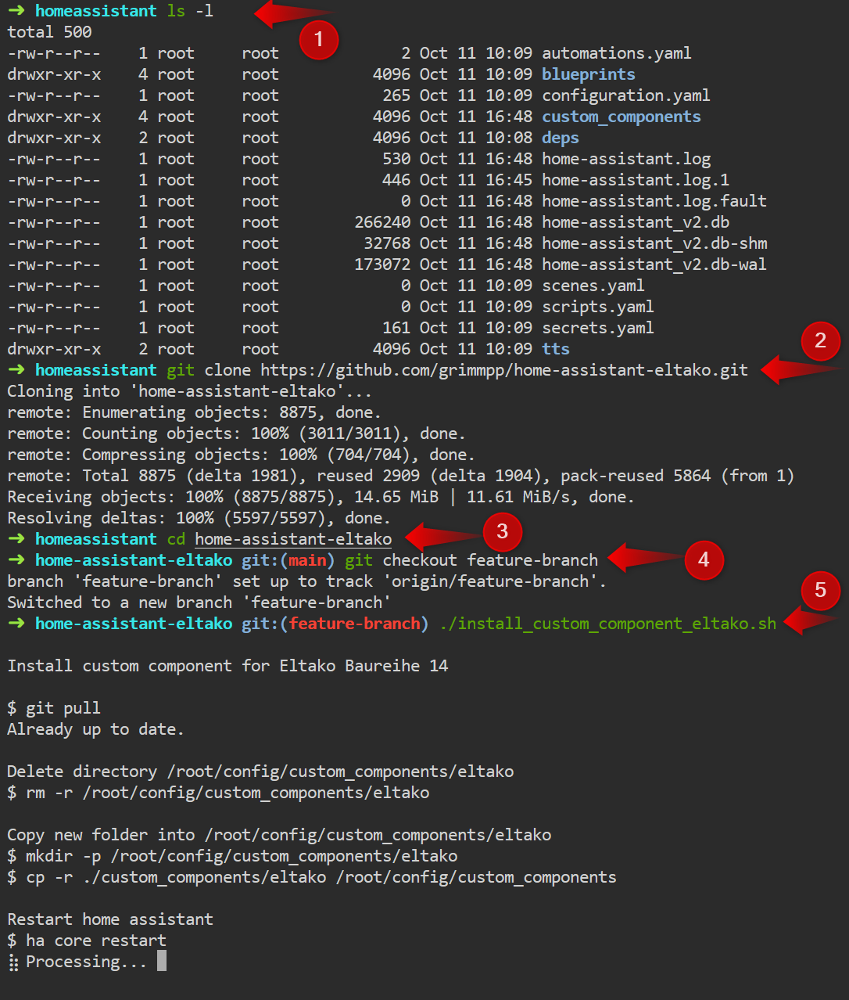

# How to install a specific version or branch

This documentation tells you how you can install e.g. a specific branch of this integration.

## Prerequisites
* Add-on "Terminal & SSH" is installed.

## How to change version
1. Open "Terminal & SSH".
2. Type `git clone https://github.com/grimmpp/home-assistant-eltako/`
3. Wait until downloaded and change into folder `cd home-assistant-eltako`
4. Change to your version, tag, or branch by using `git checkout VERSION_TAG_BRANCH` (If you want to use main branch (latest version) just skip this step.)
6. Update by running install script: `./install_custom_component_eltako.sh`
7. Wait until Home Assistant is restarted. DONE!

Hint: Your can past into "Terminal & SSH" by using key combination: `SHIFT + STRG + V`

