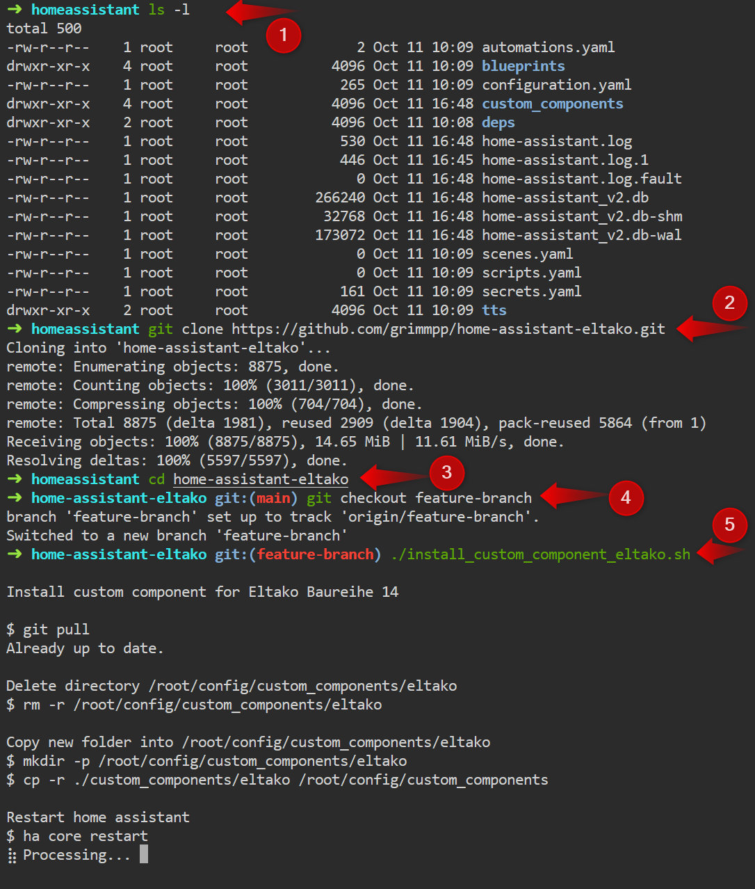

# How to install a specific version or branch

This documentation tells you how you can install e.g. a specific branch of this integration.

## Beta versions and release candidates (through HACS)

A version whose number carries a marker - `2.2.0rc1` (**r**elease **c**andidate), `2.3.0b1`
(beta) - is **not a finished release**. It is published to try out what is new and to find
what is broken *before* it becomes a release, and it can contain bugs a release does not have.

Such a version is a **pre-release** on github, and HACS hides it: nobody gets it by accident,
and an installation which only takes releases stays where it is. To install one on purpose:

1. HACS &rarr; open **ELTAKO** &rarr; the three-dot menu at the top right.
2. Switch **Show beta versions** on (the wording differs slightly between HACS versions -
   "beta" is in it).
3. Three-dot menu &rarr; **Redownload** &rarr; pick the version with the marker.
4. Restart Home Assistant.

You can tell an installed pre-release from a release **inside the web ui**: the version in the
header carries a `pre-release` tag on every page, and the *About* page says what that means
and how to get back. Which is: switch *show beta versions* off again, redownload, pick the
latest release, restart.

Please report what you find in the [issue tracker](https://github.com/grimmpp/home-assistant-eltako/issues) -
that is what a release candidate is for.

## Creating one (maintainers)

The version number decides everything else, so it is the first step:

1. Set the same version in `custom_components/eltako/manifest.json` and in
   `eltako_standalone/__init__.py` - e.g. `2.2.0rc1`. `changes.md` keeps the section of the
   release it is a candidate for (`## Version 2.2.0`); a test checks all of this.
2. Commit, then create the release **marked as a pre-release**:

   ```bash
   gh release create v2.2.0rc1 --prerelease \
      --title "2.2.0rc1 - release candidate" \
      --notes "Release candidate for 2.2.0. Not an official release - see changes.md."
   ```

   Without `--prerelease` HACS would offer it to everybody; the
   [build pipeline](../.github/workflows/build_package.yml) refuses to publish in that case
   and says so, and it refuses the opposite mistake (a finished version marked as a
   pre-release) as well.
3. The pipeline builds the pip package, smoke tests it and uploads it to PyPI, where the
   marker makes it a pre-release too: `pip install eltako-enocean-tool` keeps installing the
   last real release, `pip install --pre eltako-enocean-tool` takes the candidate.


## Prerequisites
* Add-on "Terminal & SSH" is installed.

## How to change version
1. Open "Terminal & SSH".
2. Type `git clone https://github.com/grimmpp/home-assistant-eltako/`
3. Wait until downloaded and change into folder `cd home-assistant-eltako`
4. Change to your version, tag, or branch by using `git checkout VERSION_TAG_BRANCH` (If you want to use main branch (latest version) just skip this step.)
6. Update by running install script: `./install_custom_component_eltako.sh`
7. Wait until Home Assistant is restarted. DONE!

Hint: Your can past into "Terminal & SSH" by using key combination: `SHIFT + STRG + V`


