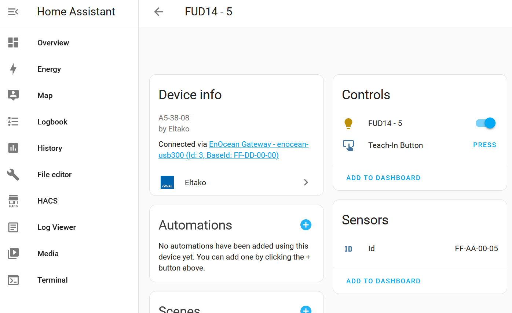

# Lights in Home Assistant Eltako Integration

This tutorial describes how to configure a light so that its status updates will be displayed in Home Assistant and so that you can control it out of Home Assistant.



## Configure Home Assistant (Eltako FSR14*, FUD14*, FSR61*, ...)

Every Eltako devices which shall be represented in Home Assistant needs to be entered into the Home Assistant configuration (`/config/configuration.yaml`). Find details about how to configure Home Assistant for this integration manually [here](../update_home_assistant_configuration.md). You can also auto-generate the confuguration by using [EnOcean Device Manager (eo_man)](https://github.com/grimmpp/enocean-device-manager)

For lights you need to create an entries in the light section. You need to specify the id/address of the device so that Home Assistant knows when a status update/change comes by that it needs to react on it. In addition we need to specify the address of the sender button in Home Assistant. A good pattern for the sender id/address is to use a base id + the same local id of the light. EEPs define the type of telegram. In case of light and series 14 devices I wouldn't change this behavior.


The configuration could look like the following for USB300 as a gateway.
```
eltako:
  gateway:
  - id: 1
    device_type: enocean-usb300
    base_id: FF-80-80-00        # baseId of USB300 gateway
    devices:
      light:
      - id: FF-AA-00-01         # baseId of FAM14 (FF-AA-00-00) + internal address
        eep: M5-38-08
        name: FSR14_4x - 1
        sender:
          id: FF-80-80-01       # baseId of USB300 (FF-80-80-00) + sender id (0-80 HEX/128 DEZ)
          eep: A5-38-08
```

In case of being directly connected via cable the use a local address space (baseId = 00-00-00-00):
```
eltako:
  gateway:
  - id: 1
    device_type: fgw14usb
    base_id: FF-AA-00-00        # baseId of FAM14 (because this is the device connected to wireless network)
    devices:
      light:
      - id: 00-00-00-01         # usage of local address (baseId = 00-00-00-00)
        eep: M5-38-08
        name: "FSR14_4x - 1"
        sender:
          id: 00-00-B0-01       # base address for Home Assistant (e.g. 00-00-B0-01) + sender id (0-80 HEX/128 DEZ)
          eep: A5-38-08
```


## Register Home Assistant Address in Actuators 

In the section before we made Home Assistant aware of what devices to be represented and on which telegram to react. Now, we need to tell the light to react on commands coming from Home Assistant. 
How to program devices (teach-in switches) you can find in the tutorial [Teach-In Buttons](../teach_in_buttons/readme.md).
