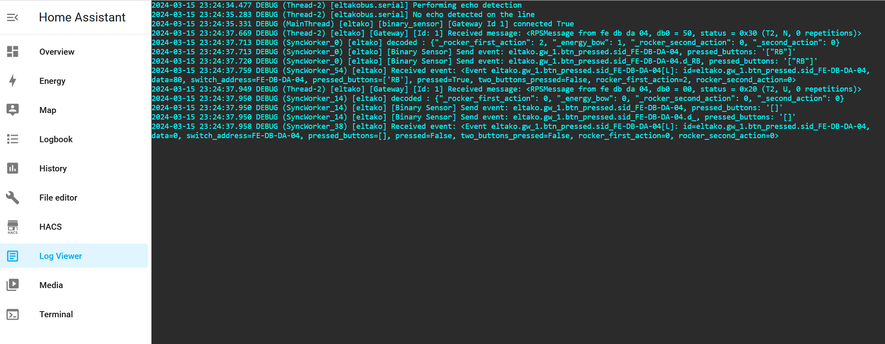

# Logging

This part is about how to get access to the logs of Home Assistant ELTAKO Integration to e.g. check
* what telegrams have been received
* what events have been sent
* if there have been any problems occurred 
* to under how the automation behaves and see what have been done.



## The Logs page of the web ui

The quickest way is the **Logs** page of the [web ui](../web-ui/readme.md) (expert view,
`/eltako#/logs`). It is available to Home Assistant administrators and shows records from the
integration's `eltako` logger without mixing them with logs from other integrations.

The page provides:

* a **log level** selector for the integration (`inherit`, `debug`, `info`, `warning` or `error`),
* a separate display filter for showing only warnings/errors,
* a text search which also searches the logger name,
* the traceback belonging to an error,
* **download** of the currently displayed in-memory records, and
* **clear buffer** to remove the records currently held by the page.

Changing the log level in the page takes effect immediately. It does not edit
`configuration.yaml`, restart Home Assistant or reload the gateways. The selected value is stored
as a web-UI override and survives a restart. Use **inherit** to let Home Assistant's `logger:`
configuration decide the effective level again. To remove the web-UI override completely, reset
the `Log level` setting on the integration's **Settings** page.

The page keeps the last 2000 records **in memory**. It therefore starts empty after a restart and
older lines eventually fall out; the page shows how many records were dropped. The Home Assistant
log file below is the persistent, complete log and is not affected by **clear buffer**.

The default is `inherit`, so the effective level normally comes from Home Assistant. In a default
Home Assistant setup this commonly means that only warnings and errors are visible. Use `debug`
temporarily when detailed diagnostics are needed: it can produce a lot of output, including bus
telegrams.


## Change log level in configuration.yaml

The web UI is recommended for a temporary diagnostic session. If the level should be part of a
file-based installation, it can still be configured in `/config/configuration.yaml`.

To edit the file in the browser, use the [File Editor add-on](https://github.com/home-assistant/addons/tree/master/configurator).

Extend or change the following part of the configuration file:
```
logger:
  default: info         # default log level of all components of Home Assistant
  logs:
    eltako: debug                                       # detailed information from the integration
    eltakobus.serial: info                              # ESP2 serial communication
    enocean.communicators.SerialCommunicator: info      # ESP3 serial communication
    eltakobus.tcp2serial: info                          # TCP-connected ESP3 communication
```

After changing `configuration.yaml`, apply the Home Assistant logger configuration as usual. A
value selected on the integration's Logs or Settings page takes precedence over the `eltako`
entry in this file until the web-UI override is reset.

## Read logs
To get the logs nicely displayed I can recommend to install and use the addon [log-viewer](https://github.com/hassio-addons/addon-log-viewer).

Logs can also be found in  `/config/home-assistant.log` and displayed by using [File Editor](https://github.com/home-assistant/addons/tree/master/configurator).

## Structured telegram log (for analysis)
If you want to analyse the EnOcean traffic instead of reading log lines, use the dedicated
[EnOcean Telegram Logging and Analysis](../telegram-analysis/readme.md). It writes all telegrams
(including EEPs, decoded values and references to the Home Assistant entities) into a separate
machine readable file and provides a web ui with device statistics and a live view.
