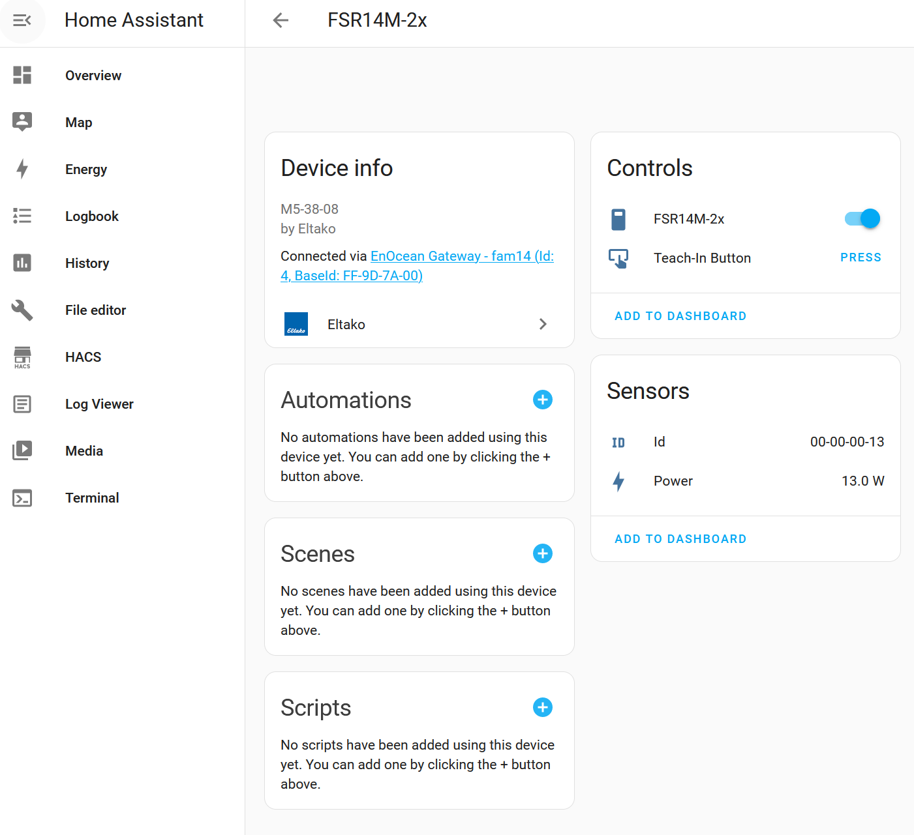

# Integrated Relays and Switches with Eltako FSR14*, FSR61, ...

This tutorial describes how to configure a switches for e.g. lights, electric socket, ... to power on and off devices connected so that they can be monitored and controlled additionally from Home Assistant.



## Configure Home Assistant (Eltako FSR14*, FUD14*, FSR61*, ...)

Every Eltako devices which shall be represented in Home Assistant need to be entered into the Home Assistant configuration (`/config/configuration.yaml`). Find details about how to configure Home Assistant for this integration manually [here](../update_home_assistant_configuration.md). You can also auto-generate the configuration by using [EnOcean Device Manager (eo_man)](https://github.com/grimmpp/enocean-device-manager)

For lights or switches you need to create an entries in the light or switch section. You need to specify the id/address of the device so that Home Assistant knows when a status update/change comes by and when it needs to react on it. In addition we need to specify the id/address of the sender button in Home Assistant. A good pattern for the sender id/address is to use a base id + the same local id of the light. EEPs define the type of telegram. 

The configuration could look like the following for USB300 as a gateway.
```
### auto-generated by eo_man

eltako:
  gateway:
  - id: 1
    device_type: enocean-usb300
    base_id: FF-80-80-00        # baseId of USB300 gateway
    devices:
      switch:                    # can be replaced through 'light' which is a different representation in Home Assistant

        # Eltako relay
        # Use 'Write HA senders to devices' button or enter manually sender id in PCT14 into function group 2 with function 51 
      - id: FF-AA-00-01         # baseId of FAM14 (FF-AA-00-00) + internal address
        name: FSR14M_2X 00-00-00-01 (1/2)
        eep: M5-38-08
        sender:
          id: FF-80-80-01       # baseId of USB300 (FF-80-80-00) + sender id (0-80 HEX/128 DEZ)
          eep: A5-38-08

        # Eltako relay
        # Use 'Write HA senders to devices' button or enter manually sender id in PCT14 into function group 2 with function 51 
      - id: FF-AA-00-02
        name: FSR14M_2X 00-00-00-02 (2/2)
        eep: M5-38-08
        sender: 
          eep: A5-38-08
          id: FF-80-80-02

```

In case of being directly connected via cable a local address space is used:
```
### auto-generated by eo_man

eltako:
  gateway:
  - id: 1
    device_type: fgw14usb
    base_id: FF-AA-00-00        # baseId of FAM14 (because this is the device connected to wireless network)
    devices:

      switch:                    # can be replaced through 'light' which is a different representation in Home Assistant

        # Eltako relay
        # Use 'Write HA senders to devices' button or enter manually sender id in PCT14 into function group 2 with function 51 
      - id: 00-00-00-01
        name: FSR14M_2X 00-00-00-01 (1/2)
        eep: M5-38-08
        sender: 
          eep: A5-38-08
          id: 00-00-B0-01

        # Eltako relay
        # Use 'Write HA senders to devices' button or enter manually sender id in PCT14 into function group 2 with function 51 
      - id: 00-00-00-02
        name: FSR14M_2X 00-00-00-02 (2/2)
        eep: M5-38-08
        sender: 
          eep: A5-38-08
          id: 00-00-B0-02
```

## Usage of power meter from FSR14M-2x

FSR14M-2x additional provides information about the current power consumption. To get the power consumption display in Home Assistant an additional sensor needs to be specified:

This example is snipped of an auto-generated configuration by (eo_man)](https://github.com/grimmpp/enocean-device-manager) for a cable connected gateway using local addresses. 

```
### auto-generated by eo_man

      sensor:
        # Automated meter reading - electricity / power
      - id: 00-00-00-01
        name: FSR14M_2X 00-00-00-01 (1/2)
        eep: A5-12-01
        meter_tariffs: []


        # Automated meter reading - electricity / power
      - id: 00-00-00-02
        name: FSR14M_2X 00-00-00-02 (2/2)
        eep: A5-12-01
        meter_tariffs: []
```
