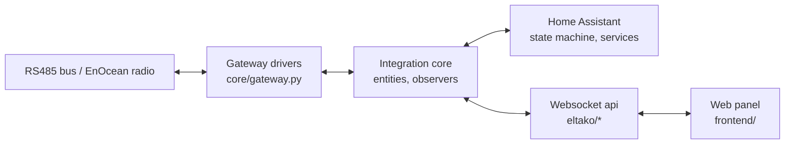

# Software Requirements Specification (SRS)

**Component:** ELTAKO Bus Integration for Home Assistant
**Purpose of this document:** a checklist to validate against while building or reviewing a
change - not a description of the architecture (that is
[docs/architecture/readme.md](../architecture/readme.md)) and not a marketing overview (that is
the root [README.md](../../README.md)). Every requirement here is meant to be verifiable: either
by an existing automated test, or by a manual step a reviewer can actually carry out.

## How to use this document

* **Adding a feature?** Find the module section it belongs to, add a requirement with the next
  free ID, and add its acceptance criteria before writing the code - they become the test.
* **Reviewing a change?** Find the requirements the change touches and check the acceptance
  criteria still hold. If a requirement changed on purpose, update it in the same PR - a
  requirement which silently stopped matching the code is worse than no requirement.
* **Regression-testing a release?** Section 8 is a manual pass over what automated tests cannot
  reach (real hardware, visual rendering, timing).

Requirement IDs are stable once assigned - do not renumber on edit, only append. A requirement
that is removed is struck through with the reason, not deleted, so history stays legible in
`git log`.

**Priority:** `MUST` (breaks the product if violated), `SHOULD` (expected, deviation needs a
reason), `MAY` (nice to have, may be traded off).

**Verification** points at the automated test file that exercises the requirement where one
exists (`tests/test_*.py`, all paths relative to the repository root), or says `Manual` with what
to look at when automation cannot reach it (real hardware, visual layout, timing-dependent UI).

---

## Table of contents

1. [Scope](#1-scope)
2. [System context](#2-system-context)
3. [Gateway management](#3-gateway-management)
4. [Device management](#4-device-management)
5. [Sender / gateway assignment](#5-sender--gateway-assignment)
6. [Telegram processing, statistics & reception](#6-telegram-processing-statistics--reception)
7. [Web UI - simple view](#7-web-ui---simple-view)
8. [Web UI - expert view](#8-web-ui---expert-view)
9. [Configuration & settings](#9-configuration--settings)
10. [Simulation](#10-simulation)
11. [Non-functional requirements](#11-non-functional-requirements)
12. [Data requirements](#12-data-requirements)
13. [Out of scope](#13-out-of-scope)
14. [Manual release checklist](#14-manual-release-checklist)
15. [Traceability matrix](#15-traceability-matrix)
16. [Glossary](#16-glossary)

---

## 1. Scope

This integration connects **ELTAKO series 14 RS485 bus devices** and **EnOcean radio devices**
(868 MHz) to Home Assistant, through a hub-style `config_entry` (`custom_components/eltako`,
domain `eltako`, `iot_class: local_push`). It ships its own web panel
(`custom_components/eltako/frontend`) served through Home Assistant's `panel_custom` and talked
to over `websocket_api` (`eltako/*` commands) - no separate package, no build step.

A second runtime, `eltako_standalone`, hosts the same panel and the same device/gateway logic
outside of Home Assistant for installation and development; requirements that are Home
Assistant-specific say so explicitly (device pages, entity registration, HA services).

**In scope:** everything under `custom_components/eltako` and `eltako_standalone`, plus the
contract between them and Home Assistant. **Out of scope:** Home Assistant core itself, the
EnOcean/eltako14bus libraries this integration depends on (they have their own repositories and
test suites), and end-user hardware installation (wiring, DIN rail mounting - see
[docs/01_getting_started](../01_getting_started)).

---

## 2. System context

Supported gateway types (`GatewayDeviceType`, `custom_components/eltako/const.py`):

| Type | Constant value | Role |
|---|---|---|
| ELTAKO FAM14 | `fam14` | RS485 bus master; only type that can read/write actuator memory |
| ELTAKO FGW14-USB | `fgw14usb` | RS485 bus, no memory access |
| ELTAKO FTD14 | `ftd14` | RS485 bus |
| ELTAKO FAM-USB | `fam-usb` | Wireless transceiver, own base id range |
| EnOcean USB300 | `enocean-usb300` | Wireless transceiver (ESP3), own base id range |
| Generic ESP3 gateway | `esp3-gateway` | Wireless transceiver |
| LAN gateway | `lan`, `mgw-lan`, `eul_lan`, `lan-gw-esp2` | Wireless transceiver over TCP |

Supported Home Assistant platforms (`const.py: PLATFORMS`): `light`, `binary_sensor`, `sensor`,
`switch`, `cover`, `climate`, `button`, `select`.

---

## 3. Gateway management

### REQ-GW-010 (MUST) - Gateways are never required in `configuration.yaml`
A gateway can be fully created, edited and removed from the *Overview* page of the web UI; no
gateway needs a yaml entry to function.
**Acceptance criteria**
- Adding a gateway through `eltako/gateways/add` persists it in the config entry options, not in
  yaml.
- An integration with zero yaml gateways and one UI-added gateway starts and detects devices.
**Verification:** `tests/test_gateway_config.py`, `tests/test_setup_without_configuration.py`

### REQ-GW-020 (MUST) - Serial and network gateways are auto-detected where possible
Plug & play probes serial ports and listens for mDNS/zeroconf announcements so most gateways
need no manual port entry.
**Acceptance criteria**
- A connected FAM14/FAM-USB/FGW14-USB on a USB-serial adapter appears in the port scan
  (`eltako/potential_usb_ports`) with a suggested port.
- A LAN gateway announcing itself over mDNS is discovered without a host being typed in.
**Verification:** `tests/test_plug_and_play.py`, `tests/test_gateway_scan.py`

### REQ-GW-030 (MUST) - Base id is queried from hardware, not typed in
For a gateway that can report it, the base id is read from the device itself during add/edit,
not left for the user to transcribe from a label.
**Acceptance criteria**
- Adding a FAM-USB/USB300 without a manually entered base id still ends up with the correct
  `base_id` stored, read from the connected hardware.
**Verification:** `tests/test_gateway_base_id_query.py`

### REQ-GW-040 (MUST) - A gateway declared in yaml cannot be edited or removed from the UI
Gateways which come from `configuration.yaml` are read-only in the panel: yaml is the source of
truth for them and editing in two places would silently diverge.
**Acceptance criteria**
- `eltako/gateways/update` and `eltako/gateways/remove` reject a yaml-sourced gateway id.
- The panel does not render edit/remove controls for a yaml gateway; it renders them for a
  UI-sourced one.
**Verification:** `tests/test_gateway_config.py`, `tests/test_frontend_render.py`

### REQ-GW-050 (MUST) - A gateway which is configured but never came up is still visible
A gateway entry that exists in the config entry but whose hardware never connected (wrong port,
unplugged) is shown, not silently absent - the whole point is diagnosing why devices are silent.
**Acceptance criteria**
- `eltako/integration_info` lists a `gateways_not_set_up` (or equivalent) entry for a configured
  gateway with no matching Home Assistant device yet.
- The simple view renders a card for it (see REQ-UI-070).
**Verification:** `tests/test_frontend_simple_view.py::test_a_gateway_which_was_never_set_up_is_visible_here_too`

### REQ-GW-060 (SHOULD) - Multiple gateways, including several on the same bus, coexist
Several gateways can be configured and used in parallel, including more than one bus gateway
acting as repeaters on the same RS485 bus.
**Acceptance criteria**
- Two bus gateways configured on independent buses both scan and report devices.
- Devices are attributed to the correct gateway (`gateway_id`) in the device list.
**Verification:** `tests/test_multi_gateway_senders.py`, [docs/multiple-gateway-support](../multiple-gateway-support/readme.md)

### REQ-GW-070 (MUST) - `can_program` / `is_transceiver` classification is exhaustive and exclusive
Every `GatewayDeviceType` value is classified as exactly one of: bus gateway that can program
memory (FAM14 only), bus gateway that cannot, or transceiver.
**Acceptance criteria**
- `GatewayDeviceType.is_transceiver()` and the bus-gateway check never both return `True` for the
  same type.
- Adding a new gateway type without updating both classifications fails a test, not silently
  falls through to the wrong bus behaviour.
**Verification:** `tests/test_gateway.py`, `tests/test_sender_gateway.py::TestWhichAddressIsPicked::test_only_a_fam14_can_write_into_an_actuator`

---

## 4. Device management

### REQ-DEV-010 (MUST) - Devices can be added without knowing the EnOcean protocol
Adding a device by hand only asks for what cannot be derived (kind of device, model/EEP,
address, name, room); nothing requires typing raw EEP bytes when the catalog already knows them.
**Acceptance criteria**
- The device catalog entry for a chosen model pre-fills EEP and default sender profile.
**Verification:** `tests/test_device_catalog.py`, `tests/test_device_config.py`

### REQ-DEV-020 (MUST) - Devices declared in `configuration.yaml` are read-only in the UI
A device with `source: yaml` cannot be edited, removed or have its sender changed from the panel
- yaml stays authoritative for it.
**Acceptance criteria**
- `eltako/devices/update` and `eltako/devices/remove` reject a yaml-sourced device.
- `renderSenderPicker()` returns nothing for a device with `editable: false`.
**Verification:** `tests/test_device_config.py`, `tests/test_frontend_sender_gateway.py::test_only_an_actuator_of_the_web_ui_offers_the_choice`

### REQ-DEV-030 (MUST) - Automatic bus scan discovers positions and offers them for adoption
Scanning a bus enumerates its positions, reads the device class where the hardware reports one,
and offers each undetected position through "+ Add device" instead of requiring the bus position
to be looked up by hand.
**Acceptance criteria**
- After `eltako/bus/members`, every populated position on a connected bus gateway is present in
  the response, with `device_class` populated when the hardware answered it.
**Verification:** `tests/test_bus_members.py`, `tests/test_bus_scan_resume.py`

### REQ-DEV-040 (MUST) - An unconfigured address that sent a telegram is discoverable
An EnOcean address that transmitted but has no device entry appears in
`statistics.unknown_devices` with its best-guess EEP (from a 4BS teach-in telegram when seen,
otherwise inferred from message shape) so it can be added with one click.
**Acceptance criteria**
- A telegram from an address with no configured device produces an entry with `address`,
  `msg_types`, `count`, and - when derivable - `suggested.eep`.
**Verification:** `tests/test_telegram_suggestions.py`, `tests/test_frontend_unknown_telegram.py`

### REQ-DEV-050 (SHOULD) - Devices can be imported from EnOcean Device Manager, PCT14 or yaml
Migrating an existing installation does not require re-adding every device by hand.
**Acceptance criteria**
- An `.eodm` export and a PCT14 export each produce configured devices matching their source
  file's addresses and profiles.
**Verification:** `tests/test_incremental_adoption.py`

### REQ-DEV-060 (MUST) - "Remove all & search again" is destructive only to UI-added devices
Resetting and re-scanning removes every device created through the web UI, but leaves
`configuration.yaml` devices and all gateways untouched, and confirms the count once before
acting.
**Acceptance criteria**
- After the reset, yaml-sourced devices are still present and unchanged.
- The confirmation dialog names the number of devices that will be removed before the call is
  made.
**Verification:** `tests/test_frontend_reset_and_search.py`

### REQ-DEV-070 (MUST) - Bus memory of an actuator is exposed per taught-in row
For a bus position, every sender address found in the actuator's own memory is listed
individually (address, what it does, which gateway or device it belongs to) and can be removed
one row at a time.
**Acceptance criteria**
- `eltako/bus/members` includes a `taught_in` list per bus position with one entry per memory
  row read from the actuator.
- `eltako/bus/delete_memory_line` removes exactly the targeted row and no other.
**Verification:** `tests/test_bus_members.py`, `custom_components/eltako/observation/bus_members.py`

### REQ-DEV-080 (MUST) - A memory row that was never read is distinguished from one confirmed empty
"Not programmed" (read, and genuinely empty) and "not looked at yet" (never read) are different
states and must not be presented identically - only the former justifies a write.
**Acceptance criteria**
- A bus position whose memory scan has not completed reports an "unknown" status distinct from
  "0 senders in memory".
**Verification:** `tests/test_bus_members.py`, `tests/test_frontend_bus_scan_progress.py`

---

## 5. Sender / gateway assignment

This is the mechanism that lets Home Assistant "hand over" an installation from one gateway to
another. Two things have to stay consistent: **which address a bus actuator reacts to** (its own
memory, only a FAM14 can write it) and **which address Home Assistant sends as** (the
device's `sender`, in `configuration.yaml` or the UI config entry).

### REQ-SND-010 (MUST) - Picking a gateway updates both halves atomically from the caller's view
`eltako/devices/sender_gateway` computes the target sender address
(`base id of the target gateway + last byte of the actuator address` off the bus, the target
gateway's own address on the bus) and stores it as the device's Home Assistant sender in the
same call that (conditionally, see REQ-SND-030) writes the actuator's memory.
**Acceptance criteria**
- After a successful call, the device's configured `sender.id` equals the computed target
  address.
**Verification:** `tests/test_sender_gateway.py::TestTheDevicesWhichAreSwitchedOver`

### REQ-SND-020 (MUST) - Every gateway is offered as a target, including bus gateways
The default-gateway choice of the setup guide (and the per-row picker where applicable) lists
every gateway that can carry the installation - wireless/LAN gateways with a base id *and* the
bus gateways themselves - because moving back onto the FAM14 changes the Home Assistant sender
addresses (to the local `00-00-B0-xx` range) exactly as much as moving away from it does.
**Acceptance criteria**
- `defaultGatewayChoices()` includes bus-type gateways (`isBusGatewayType`) as well as every
  gateway with a non-null `base_id`; it excludes a wireless gateway that never reported a base
  id.
- The gateway currently carrying the installation (derived from the actuators' current senders)
  is pre-selected.
**Verification:** `tests/test_frontend_sender_gateway.py::test_every_gateway_with_addresses_can_take_over_the_installation`, `::test_the_gateway_which_carries_the_installation_is_preselected`

### REQ-SND-030 (MUST) - Only addresses missing from actuator memory are written
Before writing, each actuator's memory is checked (`sender_is_taught_in()`); an actuator that
already carries the target address is switched over in Home Assistant only, with no bus write.
**Acceptance criteria**
- A batch containing one actuator that already has the address and one that does not results in
  exactly one write job on the bus.
- A batch where every actuator already carries the target address results in zero bus writes and
  zero calls to the low-level write function.
**Verification:** `tests/test_sender_gateway.py::TestOnlyWhatIsMissingIsWritten`

### REQ-SND-040 (MUST) - A connected FAM14 is required only when a write is actually needed
The "no FAM14 connected" error is raised only if there is at least one pending (missing-address)
job; a run that needs no write succeeds without a FAM14 present.
**Acceptance criteria**
- Reassigning to a gateway where every actuator already carries the target address succeeds with
  only a non-programming bus gateway (e.g. FGW14-USB) connected.
- Reassigning where at least one actuator is missing the address, with no FAM14 connected,
  returns error `no_fam14` and writes nothing.
**Verification:** `tests/test_sender_gateway.py::test_and_needs_no_fam14_for_it`, `::test_a_missing_address_still_demands_the_fam14`

### REQ-SND-050 (MUST) - A memory row that was never read counts as missing, not as present
`sender_is_taught_in()` returning `None` (memory never scanned) is treated the same as "not
taught in" - the safe assumption is to write, and `ensure_programmed()` re-checks at write time.
**Acceptance criteria**
- An actuator with no memory scan on record is included in the pending (write) list.
**Verification:** `tests/test_sender_gateway.py::test_a_memory_which_was_never_read_counts_as_missing`

### REQ-SND-060 (MUST) - A device out of `configuration.yaml` or without a sender offers no gateway picker
The picker is not rendered for a device that is not editable (yaml) or has no sender EEP (e.g. a
binary sensor) - offering a choice that cannot be honoured is worse than offering none.
**Acceptance criteria**
- `renderSenderPicker()` returns an empty string for a yaml device and for a device with
  `sender: null`.
**Verification:** `tests/test_frontend_sender_gateway.py::test_only_an_actuator_of_the_web_ui_offers_the_choice`

### REQ-SND-070 (MUST) - A wireless actuator is switched via teach-in, not a silent write
A wireless device has no memory that can be written remotely; choosing a gateway for it arms a
"teach in" action that only takes effect once a teach-in telegram is actually sent while the
device is in learn mode.
**Acceptance criteria**
- Changing the picker's value alone (no teach-in press) does not call
  `eltako/devices/sender_gateway` for a wireless device.
- Pressing "teach in" sends the call with the picked gateway's address.
**Verification:** `tests/test_frontend_sender_gateway.py::test_only_the_wireless_row_carries_a_teach_in_button`

### REQ-SND-080 (SHOULD) - A refused write keeps the actuator's previous sender in Home Assistant
If the bus write for one actuator fails (offline position, refused write), that device's stored
sender is left unchanged - Home Assistant must never claim to send with an address the actuator
does not actually hold.
**Acceptance criteria**
- A simulated write failure for one of several actuators leaves that device's `sender.id`
  unchanged while the others update.
**Verification:** `tests/test_sender_gateway.py::TestTheDevicesWhichAreSwitchedOver::test_an_actuator_which_refused_the_write_keeps_its_sender`

### REQ-SND-090 (SHOULD) - An address collision resolves to the first free slot, not a silent overwrite
When two devices would end up with the same computed sender address, the mechanism moves one to
the next free address in the target gateway's range instead of letting two devices answer to one
address.
**Acceptance criteria**
- `radio_sender_id_for()` given a `taken` set skips every occupied offset and returns the lowest
  free one.
**Verification:** `tests/test_sender_gateway.py::TestWhichAddressIsPicked::test_an_address_which_is_taken_moves_to_the_first_free_one`

---

## 6. Telegram processing, statistics & reception

### REQ_TEL-010 (MUST) - Telegram recording is off by default and explains itself when off
`log_enocean_telegrams` defaults to disabled (ring buffer costs memory); the *Live telegrams* and
*Statistics* pages, when recording is off, explain how to switch it on instead of rendering an
empty table with no reason given.
**Acceptance criteria**
- A fresh install with default settings shows the "recording is off" explanation on both pages.
- Toggling `eltako/settings/set` for this key takes effect without a restart.
**Verification:** `tests/test_general_settings.py`, `tests/test_frontend_activity.py`

### REQ-TEL-020 (MUST) - Every recorded telegram carries enough to filter and export it
A recorded telegram includes time, direction, gateway, address, matched device name/entity ids
(when known), EEP, raw data and decoded values.
**Acceptance criteria**
- `eltako/telegram_log/recent` entries contain all of the above fields; an entry for an unmatched
  address has empty (not missing) device/entity fields.
**Verification:** `tests/test_rssi_logging.py`, `tests/test_frontend_render.py`

### REQ-TEL-030 (SHOULD) - Statistics aggregate per address, not per telegram
The *Statistics* page shows one row per EnOcean address with running counters (count, first/last
seen, message types, current decoded value) rather than a raw log a human has to aggregate by
eye.
**Acceptance criteria**
- Two telegrams from the same address produce one statistics row with `count == 2`, not two rows.
**Verification:** `tests/test_frontend_render.py`, `custom_components/eltako/observation/`

### REQ-TEL-040 (SHOULD) - Radio reception comparison attributes a telegram to every gateway that heard it
For an installation with several wireless gateways, the reception survey reports, per telegram,
which gateways received it and which did not - including signal strength where available -
without requiring the telegrams to be bit-identical across gateways to be recognised as the same
event.
**Acceptance criteria**
- Two gateways reporting the same EnOcean telegram (same address, same data, timestamps within
  the correlation window) are merged into one survey entry listing both.
**Verification:** `tests/test_reception.py`, `tests/test_radio_comparison.py`

### REQ-TEL-050 (MUST) - Telegrams can be sent from the Live telegrams page for testing
A raw telegram (address, EEP, payload) can be constructed and sent through a chosen gateway from
the UI, for debugging without external tooling.
**Acceptance criteria**
- `eltako/send_telegram` accepts a well-formed request and the gateway stub records the sent
  bytes.
**Verification:** `tests/test_send_telegram.py`

---

## 7. Web UI - simple view

The simple view is the default for Home Assistant users: cards, no EEPs, no bus positions, no
base ids in the primary flow.

### REQ-UI-010 (MUST) - The state of a switchable device is itself the control
The chip that displays a light/socket/cover's current state is a button that toggles it - not a
label next to a separate control - because it is the element that visually says "on" and
therefore the element a user presses.
**Acceptance criteria**
- The state chip element is a `<button>`; clicking it calls the matching Home Assistant service
  (`toggle` for light/switch, direction service for cover).
- A platform with no controllable state (e.g. `sensor`) renders the chip as a non-interactive
  ``.
**Verification:** `tests/test_frontend_simple_view.py::test_the_state_of_a_light_is_a_button`, `::test_a_state_which_cannot_be_switched_stays_a_label`

### REQ-UI-020 (MUST) - "details" opens an in-panel popup, never a bare navigation
Every "details" affordance (device card, gateway card, bus-position row) opens the shared
details popup (`frontend/lib/details.js`); it never navigates away by itself. The jump into the
Home Assistant device page is one explicit button *inside* that popup, offered only where the
target page exists.
**Acceptance criteria**
- No element carries `data-ha-device` outside of a popup's action row.
- `canOpenInHa()` returns `false` in the standalone runtime (`window.eltakoStandalone`), and the
  popup renders no "Open in Home Assistant" button in that case.
**Verification:** `tests/test_frontend_device_details.py`, `tests/test_frontend_simple_view.py::test_the_standalone_runtime_has_no_device_page_to_offer`

### REQ-UI-030 (MUST) - The details popup for a device answers "what is this and does it work"
Address, profile (EEP), gateway, sender address, whether the sender is taught in, room, entities
with live state, when it last reported, and whether it comes from yaml or the UI - in one place,
without reading an 11-column table.
**Acceptance criteria**
- `deviceDetails()` rows include, when the value exists: address, external address, room, EEP,
  gateway, sender id/EEP, taught-in status, last reported, source.
**Verification:** `tests/test_frontend_device_details.py::test_the_popup_answers_what_the_device_is`

### REQ-UI-040 (MUST) - The Initial Setup guide is the first thing shown on a bus installation
On an installation that has a bus gateway, the *Initial Setup* guide renders as the first block
of the simple view, above the counters, gateways and device cards - it is the first thing a
fresh installation needs.
**Acceptance criteria**
- The first child element of the simple view's content root is the `
`
  element when a bus gateway is configured.
**Verification:** `tests/test_frontend_simple_view.py::test_it_stands_at_the_very_top_of_the_page`

### REQ-UI-050 (MUST) - The setup guide is a 4-step checklist with persisted collapse state
Steps: (1) connect the FAM14, (2) search & teach in, (3) check the list, (4) optionally pick the
gateway for everyday use. Each step ticks off as done; the whole block is an HTML `
` so
it folds away, and its open/closed state survives a reload via `localStorage`
(`eltako-simple-setup-open`) - a fresh browser defaults to open.
**Acceptance criteria**
- Exactly 4 `<li>` steps are rendered; step 2 contains the search button, step 4 the gateway
  picker.
- Toggling the `
` element writes `"0"`/`"1"` to the storage key; re-rendering with that
  key set reproduces the same open/closed state.
**Verification:** `tests/test_frontend_simple_view.py::test_it_is_called_initial_setup_and_says_how_far_it_is`, `::test_folding_it_away_is_remembered`, `::test_folding_it_out_again_is_remembered_too`

### REQ-UI-060 (MUST) - Step 4 defaults to the gateway currently carrying the installation
The default-gateway select is pre-selected to whichever gateway the actuators' current sender
addresses indicate, so the list states the current fact rather than proposing an unrequested
change.
**Acceptance criteria**
- With actuators sending on `00-00-B0-xx`, the FAM14 (bus) option is pre-selected.
**Verification:** `tests/test_frontend_sender_gateway.py::test_the_gateway_which_carries_the_installation_is_preselected`

### REQ-UI-070 (MUST) - Gateways are visible cards on the simple view, not just a counter
Each configured gateway (including one never successfully set up) is its own card with a
connected/offline indicator, device count, and a "details" button - so a silent installation's
actual cause (an offline gateway) is visible without switching to the expert view.
**Acceptance criteria**
- One card per configured gateway; an offline gateway's card carries a distinct visual state
  (`silent`/similar class) and its details popup names what to check.
**Verification:** `tests/test_frontend_simple_view.py::test_the_gateways_are_on_the_page`, `::test_a_gateway_without_connection_is_marked_and_says_what_to_do`

### REQ-UI-080 (SHOULD) - Adding a device asks only for what cannot be guessed
The simple-view add form for a device is a reduced form: kind of device, model, address, name,
room - no EEP byte entry, no bus position math.
**Acceptance criteria**
- The simple-view add form has strictly fewer required fields than the expert-view add form for
  the same device kind.
**Verification:** `tests/test_frontend_device_editor_popup.py`

---

## 8. Web UI - expert view

### REQ-EXP-010 (MUST) - The expert view exposes every operation the panel supports
Nothing that can be done through the backend is unreachable from the expert view: gateway CRUD,
plug & play, the hierarchical bus view with live memory, live telegrams, statistics, reception,
device tests, simulation, all settings.
**Acceptance criteria**
- Every `WS.*` websocket command in `frontend/lib/api.js` has at least one caller reachable from
  an expert-view page.
**Verification:** `tests/test_frontend_render.py::TestEveryPageRenders`, `tests/test_frontend_api_constants.py`

### REQ-EXP-020 (MUST) - The device table distinguishes source, editability and platform clearly
Every row shows address, name, platform, EEP, sender, taught-in memory, area, gateway, telegram
activity, last reported, and source (`yaml` vs `web ui`); a yaml row's edit/remove controls are
absent, not merely disabled.
**Acceptance criteria**
- A yaml-sourced row renders no `data-edit`/`data-remove` buttons.
**Verification:** `tests/test_frontend_render.py`, `tests/test_device_config.py`

### REQ-EXP-030 (MUST) - "details" on a gateway or bus position opens the same shared popup
Gateway headings, wireless-gateway rows, and a bus position carrying a configured device each
open the shared details popup (gateway details include status, connection, base id, protocol,
baud rate, device count) instead of navigating out of the panel directly.
**Acceptance criteria**
- No `data-ha-device` element exists outside of a popup's action row on the Devices page.
- `gatewayDetails()` rows include status, connection, base id, protocol, device count.
**Verification:** `tests/test_frontend_device_details.py::TestTheDetailsPopupOfTheExpertPage` (gateway section)

### REQ-EXP-040 (MUST) - "Program senders of ..." is offered only where it can succeed
The bulk-program control on a bus heading appears only for a bus that can actually write memory
(FAM14) and only when at least one wireless/LAN target gateway with a base id exists.
**Acceptance criteria**
- The control is absent on an FGW14-USB heading (cannot program).
- The control is absent when no target gateway has a base id.
**Verification:** `tests/test_frontend_render.py`, `custom_components/eltako/config/sender_gateway.py::can_program`

### REQ-EXP-050 (MUST) - A running bus scan shows progress and can be cancelled
A bus scan or memory read in progress renders position-by-position progress and a cancel control;
cancelling actually stops further bus traffic rather than merely hiding the progress bar.
**Acceptance criteria**
- `eltako/bus/cancel` on a running scan stops further `eltako/bus/read_memory` traffic to that
  bus within the current polling interval.
- The cancel control remains offered even for a scan the page did not itself start (e.g. after
  a reload) - see the recovery note in `lib/bus_scan.js` (`BUS_CANCEL_TITLE`).
**Verification:** `tests/test_bus_cancel.py`, `tests/test_frontend_bus_scan_progress.py`

### REQ-EXP-060 (MUST) - Only one bus operation runs at a time per bus
A bus scan, memory read, teach-in write, or program-gateway write on the same bus gateway are
mutually exclusive - a second one is refused or queued, never interleaved on the wire.
**Acceptance criteria**
- Starting a second bus-write operation while one is running on the same gateway returns a
  "busy" response naming the reason, and sends no telegram for the second request.
**Verification:** `tests/test_bus_exclusive_access.py`

---

## 9. Configuration & settings

### REQ-CFG-010 (MUST) - `configuration.yaml` entries always take precedence conceptually, but the UI can override at runtime
A value set through the *Settings* page is stored as an override in the config entry options and
wins over the yaml value; every overridden setting shows its origin (yaml vs UI) and can be reset
back to the yaml value.
**Acceptance criteria**
- `eltako/settings/set` for a key present in yaml creates an override; `eltako/settings/get`
  reports `source: "override"` for it.
- `eltako/settings/reset` removes the override and the effective value reverts to the yaml value.
**Verification:** `tests/test_general_settings.py`, `tests/test_locked_settings.py`

### REQ-CFG-020 (MUST) - `enable_frontend` cannot be turned off from the panel it controls
`enable_frontend` is settable only in `configuration.yaml`, never through the web UI - switching
it off through the very page it controls would remove the only way to switch it back on.
**Acceptance criteria**
- `eltako/settings/set` rejects (or ignores) an attempt to change `enable_frontend`.
- Setting `enable_frontend: False` in yaml and restarting removes the sidebar panel entirely.
**Verification:** `tests/test_locked_settings.py`, `tests/test_general_settings.py`

### REQ-CFG-030 (MUST) - `enable_frontend` is the only setting requiring a Home Assistant restart
Every other general setting (telegram logging, plug & play interval, teach-in buttons, ...) takes
effect immediately after being set, with no restart.
**Acceptance criteria**
- Toggling `log_enocean_telegrams` at runtime changes recording behaviour on the next telegram,
  without a config entry reload.
**Verification:** `tests/test_general_settings.py`, `tests/test_integration_page_settings.py`

### REQ-CFG-040 (MUST) - A deprecated yaml key still works and is reported as deprecated
`CONF_DEPRECATED_ENABLE_FRONTEND`, `CONF_DEPRECATED_FRONTEND_DEV_URL`, and
`CONF_DEPRECATED_ENABLE_TELEGRAM_WEB_UI` continue to be honoured for backward compatibility, with
a deprecation notice, rather than silently ignored or a hard failure.
**Acceptance criteria**
- A config using a deprecated key starts successfully and produces a repair/log entry naming the
  replacement key.
**Verification:** `tests/test_config_check.py`, `tests/test_id_validation.py`

### REQ-CFG-050 (MUST) - The device/gateway id format is validated before it reaches the bus
An address must match the EnOcean id pattern (`^([0-9a-fA-F]{2})-([0-9a-fA-F]{2})-([0-9a-fA-F]{2})-([0-9a-fA-F]{2})( (left|right))?$`,
`CONF_ID_REGEX`); a malformed id is rejected at the config/add boundary with a clear error, not
somewhere deep in telegram encoding.
**Acceptance criteria**
- Adding a device with a malformed address string returns a validation error and creates no
  config entry.
**Verification:** `tests/test_id_validation.py`

---

## 10. Simulation

### REQ-SIM-010 (SHOULD) - A gateway and its devices can be fully simulated without hardware
A simulated FAM14/FAM-USB/LAN gateway, with simulated lights, covers, climate and sensors, can be
added, produce telegrams, and be taught in - so the full flow can be exercised in CI and in
demos without physical hardware.
**Acceptance criteria**
- `eltako/simulator/gateway_add` followed by `eltako/simulator/device_add` produces a device that
  appears in `configuredDevices` with `simulated: true` and responds to `eltako/simulator/trigger`.
**Verification:** `tests/test_simulation.py`, `tests/test_simulation_core.py`

### REQ-SIM-020 (MUST) - A simulated device/gateway is visibly marked as simulated everywhere it appears
Device cards, table rows and details popups show a "simulated" tag for anything with
`simulated: true`, so a demo installation cannot be mistaken for real hardware in a screenshot or
a support request.
**Acceptance criteria**
- Every render path that shows a device or gateway name renders the simulated tag when the
  underlying record is simulated.
**Verification:** `tests/test_frontend_render.py`, `tests/test_simulation.py`

---

## 11. Non-functional requirements

### REQ-NFR-010 (MUST) - No build step for the frontend
The panel is plain ES modules served directly from `custom_components/eltako/frontend`; there is
no bundler, transpiler or `node_modules` dependency required to run or modify it.
**Acceptance criteria:** the frontend runs unmodified in a browser and in the Node-based test
harness (`tests/frontend_dom_stub.py`) from source files as committed.
**Verification:** `tests/test_frontend_render.py` (imports the modules directly)

### REQ-NFR-020 (MUST) - The integration starts and serves entities with zero configuration beyond adding it
After *Settings → Devices & services → Add integration → ELTAKO*, the panel appears and is usable
without any `configuration.yaml` content.
**Verification:** `tests/test_first_start_web_ui.py`, `tests/test_setup_without_configuration.py`

### REQ-NFR-030 (SHOULD) - A bus operation never blocks the Home Assistant event loop
Bus I/O (scan, memory read/write, telegram send) runs off the event loop or is fully async; a
slow/hanging serial connection degrades that bus's own operations, not other integrations or the
UI of unrelated pages.
**Verification:** `tests/test_bus_exclusive_access.py`, `tests/test_serial_bridge.py`

### REQ-NFR-040 (MUST) - Entity properties exposed to Home Assistant are read-only where the domain requires it
A `binary_sensor`/`sensor` entity never exposes a settable property that would suggest it can be
written to; a `light`/`switch`/`cover` entity's writable properties always round-trip through the
gateway, never fake a state change locally before hardware confirmation where the platform
contract requires confirmation.
**Verification:** `tests/test_readonly_entity_properties.py`

### REQ-NFR-050 (MUST) - Entity registration survives partial/erroneous state without crashing setup
A malformed device config entry, a duplicate unique id, or a gateway that never connects must
degrade that one entity/gateway, not abort the whole config entry setup.
**Verification:** `tests/test_entity_registration_robustness.py`, `tests/test_receive_callback_robustness.py`

### REQ-NFR-060 (SHOULD) - Generated documentation matches the running code
The supported-devices/EEP list in `docs/supported-devices.md` and the *Help* page's catalog are
generated from the code (`generate_docs.py`), not hand-maintained, so they cannot drift from what
a given version actually supports.
**Verification:** `tests/test_generated_docs.py`, `tests/test_help_catalog.py`

### REQ-NFR-070 (MUST) - Internal links between documents are relative and resolve
A markdown link between two documents in this repository is relative (not a `github.com/.../tree/main/...`
absolute link) and points at a file that exists, so it survives forks, branches and local
checkouts.
**Verification:** `tests/test_doc_links.py`

### REQ-NFR-080 (SHOULD) - No undefined names ship in either language
Static analysis catches an undefined Python name and an unreferenced/undeclared JS identifier
before merge, in both the integration code and the frontend.
**Verification:** `tests/test_no_undefined_names.py`

---

## 12. Data requirements

### 12.1 Gateway record (config entry data, `CONF_GATEWAY`)
| Field | Constant | Notes |
|---|---|---|
| id | `CONF_GATEWAY_ID` | stable per config entry |
| device_type | `CONF_DEVICE_TYPE` | one of `GatewayDeviceType` |
| base_id | `CONF_BASE_ID` | `null` for bus gateways and never-connected transceivers |
| serial_path / port | `CONF_SERIAL_PATH`, `CONF_GATEWAY_PORT` | mutually relevant to the connection kind |
| address | `CONF_GATEWAY_ADDRESS` | LAN gateways |
| message_delay | `CONF_GATEWAY_MESSAGE_DELAY` | throttling |
| auto_reconnect | `CONF_GATEWAY_AUTO_RECONNECT` | boolean |
| simulated | `CONF_SIMULATED` | boolean, see REQ-SIM-020 |

### 12.2 Device record (config entry options, per platform)
| Field | Constant | Notes |
|---|---|---|
| id / address | (platform key) | validated against `CONF_ID_REGEX` |
| eep | `CONF_EEP` | device's own profile |
| sender | `CONF_SENDER` | `{id, eep}` - what Home Assistant transmits as, see section 5 |
| sensor | `CONF_SENSOR` | linked sensor for some platforms (e.g. cover position feedback) |
| comment | `CONF_COMMENT` | free text |
| area | `CONF_AREA` | room assignment |
| source | (derived) | `"yaml"` or `"ui"`; drives `editable` |

### 12.3 General settings (`CONF_GERNERAL_SETTINGS` section)
`enable_frontend`, `show_panel_in_sidebar`, `enable_test_page`, `enable_teach_in_buttons`,
`fast_status_change`, `plug_and_play`, `plug_and_play_interval`, `show_dev_id_in_dev_name`,
`log_enocean_telegrams`, `telegram_log_filename`, `telegram_log_format`,
`telegram_log_max_file_size_mb`, `telegram_log_rotate_days`, `telegram_log_backup_count`,
`telegram_log_include_polling`, `telegram_log_decode_eep`, `telegram_log_buffer_size`.
Every key here must be covered by REQ-CFG-010 (override + origin) unless explicitly exempted
(only `enable_frontend`, REQ-CFG-020).

### 12.4 Websocket command surface (`frontend/lib/api.js: WS`)
The full command surface (`eltako/integration_info`, `eltako/devices/*`, `eltako/bus/*`,
`eltako/gateways/*`, `eltako/simulator/*`, `eltako/settings/*`, `eltako/telegram_log/*`,
`eltako/radio_comparison/*`, `eltako/logs/*`, `eltako/reception/survey`, `eltako/send_telegram*`,
`eltako/plug_and_play/*`, `eltako/help/catalog`, `eltako/grafana/sync`) is the entire contract
between panel and backend. **Rule:** a command is added to `WS` in the same change that adds its
handler in `core/websocket.py` and at least one test exercising both - see
[docs/architecture/websocket-api.md](../architecture/websocket-api.md) for the registration
pattern.

---

## 13. Out of scope

* The EnOcean and RS485 wire protocols themselves (owned by `eltako14bus`, `python-enocean`,
  `esp2_gateway_adapter` - separate repositories, separate test suites).
* Home Assistant core behaviour (entity registry semantics, the frontend shell, `panel_custom`
  loading) beyond the contract this integration relies on.
* Physical installation of ELTAKO hardware (wiring, DIN rail, mains safety) - see
  [docs/01_getting_started](../01_getting_started) and [docs/gateways](../gateways/readme.md)
  for user-facing guidance; this document covers software behaviour only.
* Long-term historical storage / Grafana dashboards beyond the `eltako/grafana/sync` export point
  - what happens to the data afterwards is outside this integration.

---

## 14. Manual release checklist

Automated tests do not reach real hardware timing, visual layout, or Home Assistant's actual
frontend chrome. Before a release, walk this list against a real FAM14 + at least one wireless
gateway:

- [ ] Fresh install (no yaml): add the integration, panel appears in sidebar, simple view opens.
- [ ] Initial Setup guide is open by default, ticks off steps 1-3 as you connect/search/review.
- [ ] Fold the guide, reload the browser tab: it stays folded.
- [ ] Search & teach in against real hardware: device list matches what is physically wired.
- [ ] Pick a wireless gateway in step 4 with the FAM14 connected: devices switch over, previously
      switched devices keep working.
- [ ] Disconnect the FAM14, repeat the same pick for a gateway already fully taught in: succeeds
      with no FAM14 connected (REQ-SND-040).
- [ ] Expert view: bus scan progress renders live and can be cancelled mid-scan without leaving
      the bus locked.
- [ ] Details popup on a device, a gateway, and a bus position each open correctly and the "Open
      in Home Assistant" button lands on the right device page.
- [ ] Dark mode and light mode both render the watermark and table contrast readably.
- [ ] Mobile viewport (< 600px): simple view cards and the setup guide remain usable.
- [ ] `docs/supported-devices.md` device/EEP counts match `python generate_docs.py --check`.

---

## 15. Traceability matrix

| Module | Requirements | Primary test files |
|---|---|---|
| Gateway management | REQ-GW-010..070 | `test_gateway_config.py`, `test_plug_and_play.py`, `test_gateway_scan.py`, `test_gateway_base_id_query.py`, `test_multi_gateway_senders.py`, `test_gateway.py` |
| Device management | REQ-DEV-010..080 | `test_device_catalog.py`, `test_device_config.py`, `test_bus_members.py`, `test_bus_scan_resume.py`, `test_telegram_suggestions.py`, `test_incremental_adoption.py`, `test_frontend_reset_and_search.py` |
| Sender/gateway assignment | REQ-SND-010..090 | `test_sender_gateway.py`, `test_frontend_sender_gateway.py` |
| Telegram/statistics/reception | REQ-TEL-010..050 | `test_general_settings.py`, `test_rssi_logging.py`, `test_reception.py`, `test_radio_comparison.py`, `test_send_telegram.py` |
| Web UI - simple view | REQ-UI-010..080 | `test_frontend_simple_view.py`, `test_frontend_device_details.py`, `test_frontend_device_editor_popup.py` |
| Web UI - expert view | REQ-EXP-010..060 | `test_frontend_render.py`, `test_frontend_device_details.py`, `test_bus_cancel.py`, `test_frontend_bus_scan_progress.py`, `test_bus_exclusive_access.py` |
| Configuration & settings | REQ-CFG-010..050 | `test_general_settings.py`, `test_locked_settings.py`, `test_integration_page_settings.py`, `test_config_check.py`, `test_id_validation.py` |
| Simulation | REQ-SIM-010..020 | `test_simulation.py`, `test_simulation_core.py` |
| Non-functional | REQ-NFR-010..080 | `test_first_start_web_ui.py`, `test_setup_without_configuration.py`, `test_bus_exclusive_access.py`, `test_readonly_entity_properties.py`, `test_entity_registration_robustness.py`, `test_generated_docs.py`, `test_doc_links.py`, `test_no_undefined_names.py` |

A requirement with no automated test in this table is either genuinely `Manual` (say so, and add
it to section 14) or missing coverage - it is not acceptable for it to simply have no
verification story at all.

---

## 16. Glossary

| Term | Meaning |
|---|---|
| **Bus gateway** | FAM14, FGW14-USB, FTD14: sits on the RS485 bus itself; only FAM14 can read/write actuator memory |
| **Transceiver** | Wireless gateway (FAM-USB, USB300, generic ESP3, LAN variants): has its own base id address range |
| **Base id** | The address range prefix a transceiver hands out senders from |
| **Sender** | The EnOcean address Home Assistant transmits as for a given device |
| **Taught in** | An address is present in an actuator's own memory and will react to it |
| **EEP** | EnOcean Equipment Profile - the payload format for a device/message type |
| **4BS** | 4-Byte telegram, the EnOcean message type most teach-in telegrams use |
| **Config entry** | Home Assistant's persisted integration instance (`ConfigEntry`), holds gateways/devices/settings for this integration |
| **Simple view / Expert view** | The two panel modes, see section 2 and sections 7-8 |
