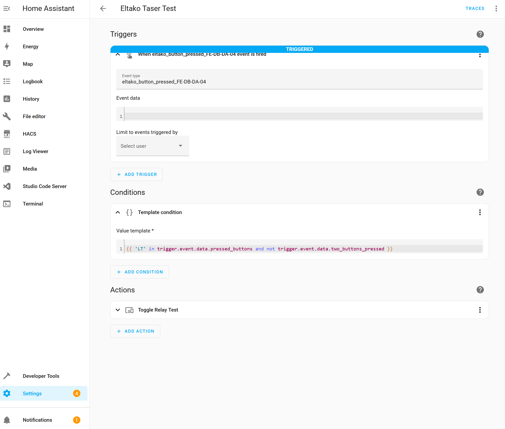

# How to detect Switch Signals and react on thoese in Home Assistant

This example is about how to trigger complex automations in home assistant by wall-mounted rocker switches.




First of all you need to register your switch in the Home assistant Configuration ``/config/configuration.yaml``. Those switches are declared as binary sensors and their eep is "F6-02-01". You can find the identifiers of your switches on a sticker at the back.

<div style="border: 2px dotted darkgrey; padding: 12px; margin-top:20px; margin-bottom: 20px; ">
📝 <b>Note:</b> <br />
You can <b>enable debug logs</b> to easily test which switch was pressed. Therefore I've installed the addon <a href="https://github.com/hassio-addons/addon-log-viewer">log-viewer</a> and extended the home assistant config with:
<code><pre>
logger:
  default: info
  logs:
    eltako: debug
</pre></code>
<b>To modify the Home Assistant configuration</b> I use <a href="https://github.com/home-assistant/addons/tree/master/configurator">File Editor</a>. After doing changes don't forget to restart Home Assistant what you can easily do in the menu of File Editor.

</div>

See example snipped to declare your switch:
```
  binary_sensor:
    - id: "FE-DB-DA-04"  # taster 1
      eep: "F6-02-01"
    - id: "FE-DB-B6-40"  # taster 2
      eep: "F6-02-01"
```

After you have registered the switch in Home Assistant configuration and after you have restarted Home Assistant you can see messages in the logger view.

To create an automation go in Home Assistant to ``Settings > Automation & Scenes > Create Automation``.
As trigger choose ``Manual Event`` and enter ``eltako.gw_[GATEWAY_BASE_ID].func_button_pressed.sid_[SWITCH_ID]`` as event id. Replace brackets `[GATEWAY_BASE_ID]` by the base_id of your gateway and `[SWITCH_ID]` by the switch id, both you can find in your configuration. Ids must be entered in the following format and in upper letters: `FF-AA-80-00`.

Choose your action you would like to trigger in the action section. In the following examples I change the state of light (toggle mode).

Now any button on your rocker switch will be detected. You can filter for specific buttons or button combinations on your switch by using conditions. To do so you need a ``template condition`` which is unfortunately not available in the webUI, therefore just switch to yaml mode in the right upper corner. 

## Automation Example Single Button

In my example below the automation is listening on a switch. There is one condition which filters out the upper left button. Only then the action is triggered. The action itself is a simple relay which is switched either on or off.:
```
alias: Eltako Taser Test - Single Button
description: ""
trigger:
  - platform: event
    event_type: eltako.gw_FF-AA-00-00.func_button_pressed.sid_FE-DB-DA-04
condition:
  - condition: template
    value_template: >-
      {{ 'LT' in trigger.event.data.pressed_buttons and not
      trigger.event.data.two_buttons_pressed }}
action:
  - type: toggle
    device_id: fe25388ed8dcd06b38ca2efd736cdc0c
    entity_id: light.eltako_00000001
    domain: light
    enabled: true
mode: single
```
After saving the automation and by pushing the switch you can see a popup when the automation recognizes the event triggered by the switch.

## Automation Example Button Combination

In this example the upper left button and the lower right need to be pressed at the same time to change the light status.
```
alias: Trun light on
description: ""
trigger:
  - platform: event
    event_type: eltako.gw_FF-AA-00-00.func_button_pressed.sid_FE-DB-DA-04
condition:
  - condition:
      - condition: template
        value_template: >-
          {{ 'LT' in trigger.event.data.pressed_buttons and 
          'RB' in trigger.event.data.pressed_buttons and
          trigger.event.data.two_buttons_pressed }}
action:
  - type: toggle
    device_id: db2490938e697f6d8b7fdae197ddfc35
    entity_id: 67ad5e7ce543e5915462892e92020b6c
    domain: light
mode: single
```

## Home Assistant Configuration

This action only works if you have previously registered the light/relay in the Home Assistant configuration. 
Below you can find the whole configuration of Home Assistant for this example:
```
# Loads default set of integrations. Do not remove.
default_config:

# Load frontend themes from the themes folder
frontend:
  themes: !include_dir_merge_named themes

# Text to speech
tts:
  - platform: google_translate

automation: !include automations.yaml
script: !include scripts.yaml
scene: !include scenes.yaml

eltako:
  general_settings:
    fast_status_change: False   # True: Changes status in HA immediately without waiting for actuator response. Default: False
  gateway:
    device: fgw14usb            # Supported gateways: gam14, fgw14usb
    base_id: FF-AA-00-00
  light:
    - id: "00-00-00-01"
      name: "Relay Test"
      eep: "M5-38-08"
      sender:
          id: "00-00-B1-01"
          eep: "A5-38-08"
  binary_sensor:
    - id: "FE-DB-DA-04"  # taster 1
      eep: "F6-02-01"
    - id: "FE-DB-B6-40"  # taster 2
      eep: "F6-02-01"
      
logger:
  default: info
  logs:
    eltako: debug
```

In this example the sender id ``00-00-B1-01`` for the light must be registered in the corresponding relay e.g. via [Eltako Software PCT14](https://www.eltako.com/en/software-pct14/). Don't forget to choose function type ``51`` for software controlled command.

Code for detecting the switch and firing the event can be found in function ``value_changed`` in [binary_sensor.py](/eltako/binary_sensor.py).

