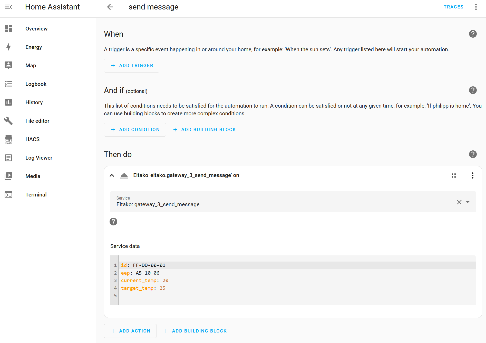
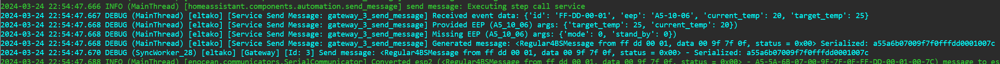

# Send Message Service

This service is mainly inteded to combine none-EnOcean and EnOcean devices. Services which cannot communicate nativcely because they are based on different communication protocols, you can use automations in Home Assistant to e.g. receive trigger from an none-EnOcean sender and send a EnOcean message to an relay or sync states of a thermostat. ...

## Configuration



Create an [automation](https://www.home-assistant.io/getting-started/automation/) in Home Assistant. Use the upper sections to react on anything you like, dependent on you sensor/sender. 

`Add Action` and search for `eltako`. It proposes a service to send messages for every available gateway. In addition you need to enter in the data section what to send. The fields `id` and `eep` must be specified. `id` stands for the sender address. (Keep in mind: bus gateways do not send in wireless network and wireless tranceivers do only have 128 hardcoded addresses to be used.) `eep` is the message format you what to use. Dependent on the eep specific information is put into the messages to be sent. You can either check in the [code](https://github.com/grimmpp/eltako14bus/blob/master/eltakobus/eep.py) or in the logs what attribute need to be set. 



Values of e.g. other sensers can also be dynamically added by 
```
alias: send message
description: ""
trigger: []
condition: []
action:
  - service: eltako.gateway_3_send_message
    metadata: {}
    data:
      id: FF-DD-00-01
      eep: A5-10-06
      current_temp: {{state_attr('climate.my_other_brands_smart_thermostat_1293127', 'current_temperature') }}
      target_temp: {{state_attr('climate.my_other_brands_smart_thermostat_1293127', 'target_temperature') }}
    enabled: true
mode: single
```

By triggering this example, from above, manually you will send a message via gateway 3 containing the current and target temperature of the thermostat entity 1293127.