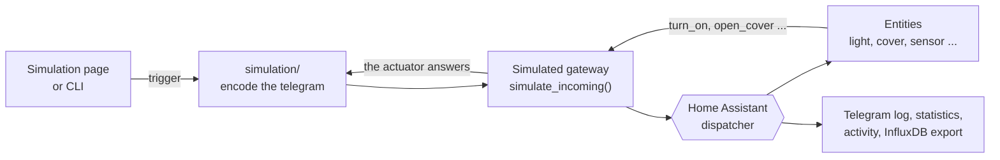

# Simulation - gateways and devices without hardware

Test the integration without a FAM14, without a stick and without a single real device. A
**simulated gateway** is a normal gateway of this integration - a FAM14, a USB300, a LAN gateway -
whose hardware simply does not exist: it has an id, a base id, a config entry and entities, only its
connection is the simulation instead of a serial port. Behind it sit **virtual devices** whose
reported values you define and whose telegrams you trigger.

Nothing behind the gateway can tell the difference, because a simulated telegram takes exactly the
same path as a real one:



**Contents:** [Step 1: open the page](#step-1-open-the-simulation-page) &middot;
[Step 2: starter set](#step-2-create-the-starter-set) &middot;
[Step 3: search devices](#step-3-let-home-assistant-find-the-devices) &middot;
[Step 4: values and telegrams](#step-4-define-values-and-trigger-telegrams) &middot;
[Step 5: switch an actuator](#step-5-switch-a-simulated-actuator) &middot;
[Teach senders in](#teaching-senders-in-also-real-ones) &middot;
[Real gateways](#virtual-devices-on-a-real-gateway) &middot;
[Switching it off](#deactivating-the-simulation) &middot;
[Marking](#where-a-simulation-is-marked-as-one) &middot;
[Own devices](#creating-your-own-gateways-and-devices) &middot;
[Cleaning up](#cleaning-up) &middot;
[Command line](#the-same-on-the-command-line) &middot;
[Troubleshooting](#troubleshooting) &middot;
[How it works](#how-it-works-inside)

---

## Step 1: open the simulation page

1. Open the **ELTAKO** panel in the sidebar of Home Assistant.
2. Switch to the **Expert** view - the button at the right end of the navigation bar.
3. Open **Simulation**.

The page is empty on the first visit and offers the starter set. If it says *"The simulation is not
available in this Home Assistant"*, Home Assistant is still running the python code it loaded at
startup - see [troubleshooting](#troubleshooting).

## Step 2: create the starter set

Press **Create starter set**. It creates the three kinds of gateway this integration talks to, each
with the same eight example devices:

| Gateway | Type | Its devices use |
| --- | --- | --- |
| Simulated LAN gateway | `mgw-lan` | wireless addresses of its base id range, `FF-C0-00-xx` |
| Simulated USB300 | `enocean-usb300` | wireless addresses of its base id range, `FF-C0-01-xx` |
| Simulated FAM14 | `fam14` | local bus addresses `00-00-00-xx`, senders `00-00-B0-xx` |

The addresses follow the real hardware, so the address validation of the integration stays
meaningful: a bus gateway addresses its devices by their position on the bus, a wireless transceiver
may only transmit senders out of its own base id range.

Each gateway is created **with its config entry**, so it is live immediately - no restart. On the
*Overview* page the three new gateways appear as tiles, marked **⚗ simulated**.

The example devices per gateway:

| Device | Platform | EEP | Imitates (bus / wireless) |
| --- | --- | --- | --- |
| Light | `light` | `M5-38-08` | FSR14_4x / FSR61NP-230V |
| Dimmable light | `light` | `A5-38-08` | FUD14 / FUD61NP-230V |
| Cover | `cover` | `G5-3F-7F` | FSB14 / FSB61NP-230V |
| Heating / cooling | `climate` | `A5-10-06` | FHK14 / FAE14SSR |
| Temperature and humidity | `sensor` | `A5-04-02` | FLGTF |
| Motion | `binary_sensor` | `A5-07-01` | FB55EB |
| 4-way wall switch | `binary_sensor` | `F6-02-01` | F4T55E |
| Window contact | `binary_sensor` | `F6-10-00` | FTKE |

## Step 3: let Home Assistant find the devices

A simulated device is **not configured yet** - like a device which sits on the bus but was never
entered anywhere. Two clicks make it a real entity:

1. Go to **Devices** (expert) or **My devices** (simple view).
2. Press **Search devices** (on the overview page: *Search for gateways & devices*).

The [plug & play detection](../plug-and-play/readme.md) takes every simulated device over into the
configuration: with its EEP, its name and, for an actuator, its sender address. Nothing has to be
decided by hand - a simulated device states everything about itself, which makes it the most
reliable source the detection has. Running it again adds nothing twice.

The bus of a simulated FAM14 is **not** read: there is no device memory behind it, and waiting for
that timeout would only look like a hanging detection.

Afterwards every device is an entity (`light.eltako_gw_2_00_00_00_01`, …) and appears in the device
list - marked **⚗ simulated** so it can never be mistaken for real hardware.

### The gateway itself: report the base id

Every simulated gateway has a **Send base id** button in its header. It sends the base id info
telegram (`8B 98 …`) - the answer a real FAM14 or ESP3 stick gives when it is asked for its base id
right after connecting. That answer is what the base id sensor of the gateway, the validation of
sender addresses and the stored configuration of a gateway created in the web ui are fed from, so the
button makes that whole path testable.

A simulated gateway reports its base id automatically when it connects; the button is for triggering
it again at any time (e.g. after the base id sensor was cleared or to watch the telegram in the live
view).

## Step 4: define values and trigger telegrams

Every device row on the *Simulation* page has one input per value its profile carries plus these
actions:

| Button | What it sends |
| --- | --- |
| **Send telegram** | the telegram of this device with the values which are in the inputs |
| **Profile teach-in (4BS/1BS/RPS)** | how this device announces itself - see [announcing the profile](#announcing-the-profile-teach-in) |
| **ELTAKO teach-in** (actuators and profiles which have one) | the teach-in telegram of its *sender* profile - see below |
| **Start / Stop** (with the seconds next to it) | repeats the telegram on its own - see [sending on its own](#sending-on-its-own) |
| **+ teach in** (actuators only) | lets another sender control this actuator - see [teaching senders in](#teaching-senders-in-also-real-ones) |

The values are **stored**: the device keeps reporting them until they are changed again. The row
shows when it last sent and how often.

These are the values of the example devices which actually change something:

| Device | Value | Meaning |
| --- | --- | --- |
| Temperature and humidity (`A5-04-02`) | `temperature` | °C, range 0 … 40 |
| | `humidity` | %, range 0 … 100 |
| Motion (`A5-07-01`) | `pir_status` | **≥ 128 = motion detected**, below = quiet |
| 4-way wall switch (`F6-02-01`) | `rocker_first_action` | the button: `0` left bottom, `1` left top, `2` right bottom, `3` right top |
| | `energy_bow` | `1` = pressed (this is what fires the event), `0` = released |
| Window contact (`F6-10-00`) | `movement` | `0xF0` (240) closed, `0xC0` (192) or `0xE0` (224) open, `0xD0` (208) tilted |
| Light (`M5-38-08`) | `state` | `1` on, `0` off - as if it was switched by hand on the actuator |
| Dimmable light (`A5-38-08`) | `command` | `1` switching, `2` dimming |
| | `dimming_value` | brightness in % when `command` = 2 (`dimming_range` = 0) |
| | `switching_command` | `1` on, `0` off |
| Cover (`G5-3F-7F`) | `state` | `0x70` (112) open, `0x50` (80) closed, `0x01` moving up, `0x02` moving down |
| Heating / cooling (`A5-10-06`) | `target_temp` / `current_temp` | °C |
| | `mode` | `0x70` (112) normal, `0x30` −2 K, `0x50` night −4 K, `0x10` off |

Values are entered as decimal or hex (`208` and `0xD0` are the same). `learn_button` stays `1`: it
marks the telegram as a data telegram - several profiles ignore a telegram without it.

> **Example.** Type `23.5` into `temperature`, `55` into `humidity`, press **Send telegram** - the two
> sensor entities of that device change to 23.2 °C and 54.8 %. The small deviation is not a bug: the
> profile transports one byte per value, so 23.5 °C becomes the nearest step the EEP can express.
> That is exactly what a real FLGTF does.

### Sending on its own

A real sensor is not triggered by anybody: it reports every few minutes, whether anything changed or
not. That is what makes the telegram rate, the statistics, the activity tracker ("has this device
reported lately?") and an automation which reacts on a value testable at all.

In the column **Sends on its own** every device has a number of seconds and a **Start** button:

1. Type the interval (or pick one of the suggestions: 5, 15, 30, 60, 300, 900 s).
2. Press **Start** - the button turns solid and the row says *sending every 30 s*.
3. **Stop** switches it off again. The number stays, so the same interval is one click away.

Changing the number while it is running applies it immediately. The interval is **stored with the
device**: after a restart of Home Assistant the device starts sending again by itself - which is
exactly what you want for a long running test. The header of the page counts how many devices are
currently sending.

Allowed values are 1 … 86400 seconds (`0` = off). The telegram is the same one **Send telegram**
sends, with the values which are stored - so a device which repeats every 30 s and whose temperature
you change in between reports the new value from then on.

### Announcing the profile (teach-in)

**Send profile** is the second half of the story: it is what a real device sends when its teach-in
button is pressed. What that is depends on the profile family - the button says which one it uses:

| Family | Button | What is sent |
| --- | --- | --- |
| 4BS (`A5-xx-xx`) | *Send profile (4BS)* | a real teach-in telegram which names function, type and manufacturer. The telegram analysis marks such an EEP as **confirmed**, so the detection may take the device over from the telegram alone. |
| 1BS (`D5-xx-xx`) | *Send profile (1BS)* | a teach-in telegram with the LRN bit cleared. 1BS carries no profile numbers - it is a "learn me" signal. |
| RPS (`F6-xx-xx`, and ELTAKO's `M5`/`G5` status telegrams) | *Send profile (RPS)* | RPS has **no** teach-in telegram; a receiver learns such a device from a button press. Therefore a press and its release are sent - exactly what teaching in a rocker switch does. |

That is a property of EnOcean, not of this simulation: only 4BS names the profile in the telegram.
The result line under the row says what was sent and why.

**Two telegrams are called teach-in, and they run in opposite directions:**

| | Button | Telegram | Sent from | What it is for |
| --- | --- | --- | --- | --- |
| Profile teach-in | *Profile teach-in* | 4BS variation 2 with function, type and manufacturer (1BS: learn telegram, RPS: a button press) | the **device** address | a sensor announces what it is, so a receiver knows its profile |
| ELTAKO teach-in | *ELTAKO teach-in* | 4BS with the payload of the sender profile: `A5-38-08` → `E0 40 0D 80`, `A5-10-06` → `40 30 0D 85`, `H5-3F-7F` → `FF F8 0D 80` | the **sender** address | a sender is taught into an actuator so that it obeys it - the telegram the teach-in button of a device in Home Assistant sends |

The second one only exists for profiles which have such a payload (the table in
`catalog/teach_in.py`, the same source the teach-in buttons of Home Assistant use), so a temperature
sensor has no *ELTAKO teach-in* button - it announces its profile instead.

## Step 5: switch a simulated actuator

Turn a simulated light on in Home Assistant (dashboard, the *HA Entities* page of the panel, an
automation, …) and it really turns on: the command is decoded and the simulated actuator answers
with the status telegram its real counterpart would send.

| Actuator | Reacts to | Reports back |
| --- | --- | --- |
| Relay (`M5-38-08`) | `A5-38-08` central command, `F6-02-01` rocker | on / off |
| Dimmer (`A5-38-08`) | `A5-38-08` | the brightness it was set to |
| Cover (`G5-3F-7F`) | `H5-3F-7F` | the end position it reached (open / closed) |
| Heating (`A5-10-06`) | `A5-10-06` | the target temperature it acknowledges |

So `light.turn_on` → the entity becomes `on`, `cover.close_cover` → `closed`, and the *Live
telegrams* page shows both directions: the command out, the status back.

A cover **stops** without a position: an intermediate position cannot be derived without the travel
times of the actuator, so the simulation only drives to the end positions.

## Teaching senders in (also real ones)

A real ELTAKO actuator has a **memory**: every sender which was taught into it may switch it - a
wall switch, a second switch in another room, a central command. A simulated actuator has that
memory too.

In the *Sender* column of an actuator press **+ teach in** and enter

| Field | What it is |
| --- | --- |
| Address | the sender which shall control this actuator, e.g. `FF-AA-BB-CC` |
| Profile | what that sender speaks: `F6-02-01` (rocker switch), `A5-38-08` (central command), `H5-3F-7F` (shutter command), `A5-10-06` (temperature controller). Empty = the profile Home Assistant uses |
| Name | optional, so the list stays readable ("switch in the hall") |

From then on the actuator reacts to that sender exactly like to the one of Home Assistant, and the
taught-in senders are listed next to it (the `×` removes one again).

**A real device works as well.** Every telegram of the whole installation - also the one of a real
wall switch behind a real FAM14 or USB300 - is published on the global telegram bus of the
integration, and that is where a simulated gateway listens. So:

1. Press the button of the real switch **once**.
2. Its address appears in the suggestions of the address field (it comes from the activity tracker,
   which is always on) - or read it from the *Live telegrams* page.
3. Teach it in with the profile of that switch (`F6-02-01` for a rocker switch).
4. Press the real button again - the simulated light switches.

That works in both directions of the test: a **simulated** switch can be taught into a simulated
actuator the same way (that is what the example 4-way wall switch is for), and one sender can be
taught into several actuators - each of them answers, exactly like in a real installation.

> A profile the simulation cannot decode yet is stored anyway, and the answer says so: the sender is
> in the memory, but nothing will answer. Which profiles are understood is the table in
> [step 5](#step-5-switch-a-simulated-actuator).

## Virtual devices on a real gateway

A virtual device does not have to sit behind a simulated gateway. Put it on a **real** one and its
telegrams are **really transmitted** - a simulated wall switch then switches a real actuator, and a
simulated sensor really appears on the air.

On the simulation page, real gateways are offered in the box *Put a virtual device on a real
gateway*; **+ Add device** there works exactly like on a simulated gateway. The gateway then shows
up in the list marked as a **real gateway**.

Its addresses come from the base id of that gateway, and that is not a detail:

| Gateway | Addresses of its virtual devices |
| --- | --- |
| real transceiver (USB300, LAN gateway) | out of its base id range, e.g. `FF-AA-80-01` - a transceiver only transmits senders of its own range, anything else would be dropped by the chip |
| real bus gateway (FAM14, FGW14-USB) | local bus addresses `00-00-00-xx`; the external address is the base id plus that number |
| simulated gateway | the range of the simulation, `FF-C0-xx-xx` (or local ones for a simulated FAM14) |

What is *not* possible: a simulated gateway cannot reach real hardware (it has no radio), and the
**Send base id** button only exists for simulated gateways - a real one reports its own base id and
nothing may fake that for it.

## Deactivating the simulation

The **Deactivate simulation** button at the top of the page switches the whole simulation off. Then
**nothing of it exists in Home Assistant anymore**:

* every simulated device is removed from the configuration - its entities and its device entry
  disappear,
* the config entries of the simulated gateways are removed, so no gateway without hardware is left
  over either,
* nothing is sent anymore, neither periodically nor by hand.

So a deactivated simulation cannot be used - not by an automation, and not by accident.

**Nothing is lost.** The integration keeps every gateway, every device, its values, its taught-in
senders and its interval. They are still listed on the simulation page and can be created, changed
and removed there. **Activate simulation** puts everything back: the gateways are set up again and
their devices are taken over into the configuration, exactly as the detection would do it.

The state is stored, so a simulation which was switched off stays off after a restart of Home
Assistant - it does not come back on its own.

> **The telegrams are sent by the backend, not by this page.** Every interval is a timer inside Home
> Assistant (`simulation/scheduler.py`); the browser only shows what is going on. You can close the
> page, close the browser or log out - the simulated devices keep reporting, which is what a test
> running over hours needs.

## Where a simulation is marked as one

A simulation is only useful if it can never be confused with reality, so it is marked in every list:

| Place | What is marked |
| --- | --- |
| *Devices* (table and bus/radio hierarchy) | every device and every gateway of a simulation carries a **⚗ simulated** tag |
| *My devices* (simple view) | the card of a simulated device |
| *Overview* | the gateway tile, plus *simulated - no hardware* in its source row |
| *Live telegrams* | every telegram which was produced by the simulation - the flag is part of the record, so it is in the CSV export, in the log file and in the InfluxDB export as well; the filter finds `simulated` |
| *Simulation* | everything on that page belongs to a simulation by definition |

That means a recording made while testing can still be told apart from a real one afterwards.

## Creating your own gateways and devices

**A gateway**: *+ Add gateway* &rarr; pick the type to simulate (every supported type is offered, not
only the three presets), optionally a name, optionally with the example devices.

**A device**: *+ Add device* on the gateway &rarr; kind (sensor, binary sensor, light, switch, cover,
climate), optionally a device of the catalog as template (fills in the profile), the profile itself,
for an actuator the sender EEP, and a name. **Address and sender address are not asked for**: they
are taken from the free range of that gateway. Only profiles which the configuration of that
platform accepts are offered - otherwise the detection could not take the device over afterwards.

*+ Examples* adds the eight example devices to an existing gateway.

## Cleaning up

| What | How |
| --- | --- |
| One virtual device | **Delete** in its row on the simulation page |
| A simulated gateway | **Remove gateway** - takes its config entry and all its virtual devices with it |
| The devices which were already configured | they stay: remove them on the *Devices* page (they are ui devices) |

## The same on the command line

Everything the page does is a python function, so the [standalone runtime](../standalone/readme.md)
can do it too - useful for scripted tests:

```bash
python -m eltako_standalone simulate starter                      # LAN gateway + USB300 + FAM14
python -m eltako_standalone simulate starter --gateways fam14      # only one of them
python -m eltako_standalone simulate list                          # everything which is simulated
python -m eltako_standalone simulate gateway add --type fam14 --with-devices
python -m eltako_standalone simulate device add --gateway 2 --platform sensor --eep A5-04-02
python -m eltako_standalone simulate set --gateway 2 --address 00-00-00-05 --value temperature=21.5
python -m eltako_standalone simulate trigger --gateway 2 --address 00-00-00-05
python -m eltako_standalone simulate trigger --gateway 2 --address 00-00-00-05 --teach-in
python -m eltako_standalone simulate interval --gateway 2 --address 00-00-00-05 --seconds 30
python -m eltako_standalone simulate interval --gateway 2 --address 00-00-00-05 --seconds 0
python -m eltako_standalone simulate interval --gateway 2 --address 00-00-00-05 --seconds 5 --wait 60
python -m eltako_standalone simulate teach-in --gateway 2 --address 00-00-00-01 \
       --sender FF-AA-BB-CC --sender-eep F6-02-01 --name "wall switch"
python -m eltako_standalone simulate teach-in --gateway 2 --address 00-00-00-01 \
       --sender FF-AA-BB-CC --remove
python -m eltako_standalone simulate trigger --gateway 2 --address 00-00-00-01 --eltako-teach-in
python -m eltako_standalone simulate device add --gateway 1 --platform binary_sensor \
       --eep F6-02-01                                  # 1 = a REAL gateway: really transmitted
python -m eltako_standalone simulate deactivate         # take it out of Home Assistant
python -m eltako_standalone simulate deactivate --on    # put it back
python -m eltako_standalone simulate device remove --gateway 2 --address 00-00-00-05
python -m eltako_standalone simulate gateway remove --gateway 2
```

`simulate trigger --value name=value` accepts the same values as the inputs of the page.
`simulate interval` stores the interval; `--wait` keeps the runtime alive afterwards so the
telegrams are really sent (without it the command returns immediately and nothing runs). In the
`serve` and `run` commands the intervals of all devices run permanently.

## In `configuration.yaml`

Nothing on the simulation page needs a configuration file. A simulated gateway can still be declared
like any other one - one flag makes the difference:

```yaml
eltako:
  gateway:
  - id: 2
    device_type: fam14        # any supported type
    base_id: FF-C0-02-00
    name: Simulated FAM14
    simulated: True           # nothing is opened, its devices are simulated
```

Its virtual devices live in the Home Assistant storage (`.storage/eltako_simulator`), not in the
yaml - they are created on the page or on the command line and survive a restart.

## Troubleshooting

**The page says "The simulation is not available in this Home Assistant" / the buttons do nothing.**
The page is javascript served from disk, the commands behind it are python which Home Assistant
loaded when it started. After updating the integration both have to meet again:

1. **Restart Home Assistant** (Developer tools &rarr; Restart, or restart the container). *Reloading*
   the integration is not enough - the websocket commands are registered while the component is set
   up.
2. **Reload the page with an empty cache** (Ctrl/Cmd + Shift + R), so the browser does not keep an
   old module of the panel.

**A trigger says "the simulated gateway is not set up".** Its config entry is missing or the gateway
is being reloaded right now (adding devices reloads it). The page waits for a reload by itself;
if it stays, check the *Overview* page - the gateway tile has to be there and *ready*.

**The telegram is sent but no entity changes.** The device is simulated but not *configured* yet -
press **Search devices** (step 3). The *Live telegrams* page shows the telegram in any case, which
is the quickest way to tell the two cases apart.

**The value in the entity differs slightly from what was entered.** That is the profile, not the
simulation: an EEP transports one byte per value.

**A taught-in switch does nothing.** Three things have to be right: the **address** (the one the
switch really sends with - see *Live telegrams*), the **profile** (a rocker switch is `F6-02-01`, not
the central command of Home Assistant) and the **energy bow** of the telegram: only the press
(`energy_bow` = 1) is a command, the release is not. And the actuator has to be one the simulation
can control - see the table in [step 5](#step-5-switch-a-simulated-actuator).

**Nothing is sent although an interval is set.** The simulation is probably deactivated - the button
at the top of the page says so, and the page shows a banner. Also check that the device really has an
interval and that its gateway is *ready*.

**The simulated devices are gone from Home Assistant.** That is what deactivating does; activating
puts them back. Nothing is lost in between - the simulation page still lists everything.

**A device on a real gateway sends nothing.** Its gateway has to be connected (the *Overview* page
shows it), and its address has to be inside the base id range of that gateway - which it is when the
address was suggested by the form. A gateway whose base id is still `00-00-00-00` has not reported
it yet.

**A device does not stop sending.** *Stop* cancels its timer immediately; if telegrams keep
arriving, a second device is sending (the header counts them) or an automation triggers it. A restart
of Home Assistant also stops nothing permanently: a stored interval is started again on purpose.

**A simulated device shall not be in Home Assistant anymore.** Removing the virtual device does not
remove the configured one - see [cleaning up](#cleaning-up).

## How it works inside

The logic sits in [`simulation/core/`](../../custom_components/eltako/simulation/core) and imports
**no Home Assistant at all** - only `eltakobus` and the standard library, so it can be moved into a
library of its own (a test insists on it). Everything Home Assistant specific is one level up:

| Module | What it does |
| --- | --- |
| `core/addressing.py` | which address a gateway and its devices get |
| `core/telegrams.py` | encoding the telegram a device sends (state and teach-in) |
| `core/devices.py` | `SimulatedDevice` - one virtual device |
| `core/actuators.py` | how an actuator reacts to a command - one class per kind |
| `core/model.py` | `SimulatedGateway`, `SimulationModel` - the simulation as plain data |
| `core/presets.py` | the starter set |
| `store.py` | the model in the Home Assistant storage, kept in sync with the configuration |
| `runtime.py` | `SimulatedGateway`, `SimulatorBus` - the gateway of a simulation |
| `scheduler.py` | one timer per device which sends on its own, and the pause |
| `service.py` | the actions the web ui and the cli share |
| `websocket.py` | the `eltako/simulator/*` commands |

Using it from a script or a test:

```python
from custom_components.eltako.simulation import core as sim

model = sim.SimulationModel()
gateway = model.add_gateway(2, 'fam14')          # a simulated FAM14
sim.add_preset_devices(gateway)                  # the example devices
sensor = gateway.find('00-00-00-05')
sensor.apply_state({'temperature': 21.5, 'humidity': 45})
telegram = sensor.state_telegram()               # -> inject it into a gateway
```

**Adding another simulated actuator** is a class with two lines of behaviour in
`core/actuators.py` (which device EEP it serves, which values it reports) plus a decoder for its
sender EEP in `SENDER_DECODERS`.

Tests: [`tests/test_simulation_core.py`](../../tests/test_simulation_core.py) (the logic),
[`tests/test_simulation.py`](../../tests/test_simulation.py) (storage, marking, detection, gateway),
[`eltako_standalone/tests/test_simulation.py`](../../eltako_standalone/tests/test_simulation.py)
(end to end: no hardware, no `configuration.yaml`, and the entities still switch).
