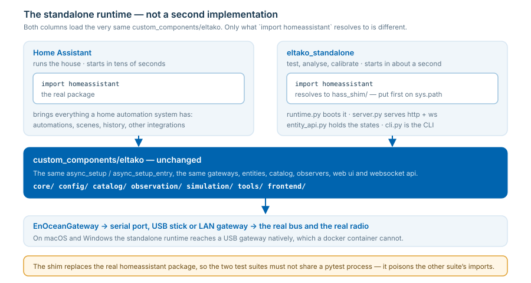

# Standalone runtime - the integration without Home Assistant

Runs `custom_components/eltako` **unchanged**, without Home Assistant: as a daemon with the
same web ui, or as a command line tool for testing, analysis and calibration. Starts in about
a second, so it is practical for a quick measurement on a real bus.

Code: [`eltako_standalone/`](../../eltako_standalone/) · in-folder readme:
[eltako_standalone/README.md](../../eltako_standalone/README.md)



## Why

| | Home Assistant | Standalone |
| --- | --- | --- |
| Purpose | run the house | test, analyse, calibrate |
| Start-up | tens of seconds | ~1 second |
| Telegram recording | opt-in | **on by default**, persisted |
| InfluxDB export / Grafana | opt-in | **on by default** |
| USB gateway on macOS/Windows | not directly (docker vm, see [dev container](../dev-container/readme.md)) | **native** (`COM3`, `/dev/cu.usbserial-*`) |
| Automations, scenes, history, other integrations | yes | no |

The last row is the trade-off: this is a tool for the EnOcean side, not a home automation
system. Everything it does know is the same code Home Assistant runs.

## Install and start

From PyPI - nothing of this repository is needed, the package contains the integration:

```bash
pip install eltako-enocean-tool    # no homeassistant needed
eet serve                          # or: eltako-enocean-tool serve
```

From a checkout of this repository (what a change to the integration is tested with):

```bash
pip install -r eltako_standalone/requirements-standalone.txt
python -m eltako_standalone serve
```

`eet`, `eltako-enocean-tool` and `python -m eltako_standalone` are the same command line -
the installed ones work in any folder, the module has to run in the repository root. `eet`
is the short name to type; the long one exists because three letters are cheap and taken
elsewhere (`/usr/bin/eet` of the EFL data tool on linux). The package is built and published
by [the build pipeline](../../.github/workflows/build_package.yml), see
[packaging](packaging.md).

Then open **<http://localhost:8124>**. That is deliberately not the 8123 of Home Assistant: on a
shared port both would share the origin of the browser, and the service worker of the Home
Assistant frontend keeps serving its cached app shell there - the standalone web ui would look
like a Home Assistant which never finishes starting. Options:

```bash
python -m eltako_standalone serve --host 0.0.0.0 --port 8200 --token SECRET
python -m eltako_standalone run                 # headless, no web ui
```

Bound to localhost without authentication by default. For remote access use
`--host 0.0.0.0 --token <secret>` and open `http://<host>:<port>/?token=<secret>`.

> The runtime must run in a process where the real `homeassistant` package was not imported.
> It may be installed - a shim wins via `sys.path`.

## Configuration

A config folder which works like the Home Assistant one (default `~/.eltako-standalone`,
override with `--config` or `ELTAKO_CONFIG_DIR`):

```text
<config>/configuration.yaml         the same `eltako:` section as in Home Assistant
<config>/.storage/                  settings, gateways and devices created in the web ui
<config>/eltako-standalone.log      process log of `serve` / `run` (like home-assistant.log)
<config>/enocean_telegrams.jsonl    the telegram recording (on by default, see below)
```

Minimal `configuration.yaml`:

```yaml
eltako:
  gateway:
  - id: 1
    device_type: fam-usb          # 9600 baud, ESP2 transceiver
    base_id: 00-00-00-00          # queried from the hardware
    serial_path: /dev/cu.usbserial-FTAMHS601
```

You can also start with an **empty** `eltako:` section and create gateways and devices
entirely in the web ui - they are stored in `.storage/` and survive a restart. The format
matches Home Assistant, so pointing the runtime at a copy of an HA config folder picks up the
same settings, ui gateways and ui devices.

## Recording and Grafana are on by default

On the **first** start of a config folder these settings are seeded
(`eltako_standalone/defaults.py`):

| Setting | Default | Environment override |
| --- | --- | --- |
| `log_enocean_telegrams` | on | |
| `telegram_log_filename` | `enocean_telegrams.jsonl` | |
| `timeseries_enabled` | on | |
| `timeseries_url` | `http://localhost:8086` | `ELTAKO_INFLUX_URL` |
| `timeseries_token` / `_org` / `_bucket` | `eltako-dev-token` / `home` / `eltako` | `ELTAKO_INFLUX_TOKEN`, `..._ORG`, `..._BUCKET` |
| `grafana_url` | `http://localhost:3000` | `ELTAKO_GRAFANA_URL` |

They are **seeded once, not enforced**: whatever you change afterwards in the web ui
(*About → Active configuration*) is kept, and a value set explicitly in `configuration.yaml`
is never seeded so it cannot be shadowed. To get the defaults back, delete
`<config>/.storage/eltako_general_settings`.

Start InfluxDB and Grafana (no Home Assistant involved):

```bash
cd dev && ./start-analytics.sh
```

Two dashboards are provisioned (folder *ELTAKO*): *Telegram overview* and *Device analysis*.
The **Grafana** button in the live telegram view links to them. If no InfluxDB is running the
exporter reports the connection error in the web ui and keeps retrying - the recording itself
is unaffected. To import what was recorded before InfluxDB was up, call the service
`eltako.export_telegram_log_to_timeseries`.

## Command line

```bash
python -m eltako_standalone scan            # serial ports incl. gateway suggestions (no runtime)
python -m eltako_standalone listen          # decoded live telegrams (--json for jsonl)
python -m eltako_standalone devices         # all entities with their state (--platform light)
python -m eltako_standalone state cover.eltako_gw_1_00_00_00_06
python -m eltako_standalone control light.eltako_gw_1_00_00_00_01 turn_on brightness=128
python -m eltako_standalone control cover.eltako_gw_1_00_00_00_06 set_cover_position position=50
python -m eltako_standalone send --gateway 1 --sender 00-00-B0-01 --eep A5-38-08 \
        --field command=1 --field switching_command=1
python -m eltako_standalone send --gateway 1 --raw "0b 07 00 64 00 00 00 00 b0 01 00"
```

All commands accept `--config <folder>` and `--debug`.

## Web ui

The **same** web ui as inside Home Assistant (overview, live telegrams, devices incl. the
unconfigured addresses, statistics, settings) plus a standalone-only page **HA Entities**: every
entity grouped by area with buttons, sliders and dropdowns.

## Device tests (calibration)

```bash
# bus burst: gateway 1 sends a burst, gateway 2 must receive all of it
python -m eltako_standalone devicetest burst --gateway1 1 --gateway2 2 [--count 44] [--runs 1]

# cover travel times - the basis for time_closes / time_opens of an FSB actuator
python -m eltako_standalone devicetest cover --gateway 1 \
        [--covers 00-00-00-06,00-00-00-07] [--senders 00-00-B0-06,00-00-B0-07] \
        [--sequence "up:25,pause:2,down:25"] [--runs 1]
```

`--covers` and `--senders` are the actuator and sender addresses, used pairwise by position:

| given | tested |
| --- | --- |
| neither | every configured cover with its configured sender |
| only `--covers` | those configured covers |
| both | exactly these pairs - **also actuators which are not configured yet**, which is the point when calibrating a fresh FSB |
| one `--sender` for several actuators | that sender for all of them |

The same tests run from the web ui page **Tests**, controlled by the general setting
`enable_test_page`.

## Importing a configuration

```bash
python -m eltako_standalone --demo serve                    # bundled eo_man example data
python -m eltako_standalone --import my_project.eodm serve
python -m eltako_standalone --import my_bus_PCT14_export.xml serve
```

`--demo` loads `eltako_standalone/examples/demo.eodm` (a FAM14 bus with FSR14/FSB14/FMZ14
actuators, FTS14EM inputs, radio buttons and a weather station) - ideal without hardware. The
same import is available in the web ui (*Devices → Import…*), with a preview before anything
is written. Three formats are accepted - which one it is, is detected from the content:

| format | comes from | what is imported |
| --- | --- | --- |
| `.eodm` | [EnOcean Device Manager](https://github.com/grimmpp/enocean-device-manager) | every gateway and every device marked *Export to HA* |
| `.xml` | export of the ELTAKO **PCT14** tool | the FAM14 of the export as gateway, its bus devices per channel (name, EEP and sender from the device catalog, the descriptions of PCT14 as names) and the senders taught into them as radio pushbuttons, FTS14EM inputs and sensors |
| `.yaml` | an `eltako:` section | exactly what the file declares |

**All** gateways and devices of the file are imported, also several gateways on one bus.
Re-importing changes nothing; importing an extended file adds exactly the new parts. An
`.eodm` file and a PCT14 export do not know the serial port of this machine - a placeholder is
used and reported, correct it afterwards.

A PCT14 export describes one bus, so only its `<rootdevice>` becomes a gateway; further bus
gateways of the same rack (an FGW14-USB, an FTD14) and bus devices whose type the device
catalog does not know are reported in the preview and skipped.

## Windows, macOS, Linux

| | Linux | macOS | Windows |
| --- | --- | --- | --- |
| Runtime, web ui, CLI | yes | yes | yes |
| Serial gateway path | `/dev/ttyUSB0` (or `/dev/serial/by-id/...`) | `/dev/cu.usbserial-XXXX` | `COM3` |
| Port scan (`scan`, web ui) | udev + sysfs (full detail) | via pyserial | via pyserial |
| Find the stick again after re-plugging (by usb serial number) | yes | no (needs sysfs) | no (needs sysfs) |
| Ctrl+C | signal handler | signal handler | `KeyboardInterrupt` (handled) |

Use the **`cu.*`** device on macOS, not `tty.*` - the latter blocks until DCD. LAN gateways
(`address`/`port` instead of `serial_path`) behave identically everywhere.

Devices which register two serial ports (e.g. the ELTAKO FAM-USB shows up as
`...600` and `...601`) only carry the telegrams on **one** of them - usually the second. The
`scan` command says so in its hint.

## Logging

Three layers, all in the config folder or on the terminal:

* **Process log** &ndash; `serve` and `run` write `<config>/eltako-standalone.log` (10 MB, 3
  rotated backups), the same lines Home Assistant would put into `home-assistant.log`: INFO
  and up, DEBUG with `--debug`. The **terminal** stays quiet (warnings and errors only) so the
  CLI output remains readable - the file is where the detail goes. The quick commands (`scan`,
  `detect`, `state`, ...) log to the terminal only; they must not interleave their lines into
  the file of a running daemon.
* **Telegram log** &ndash; every EnOcean telegram, decoded, as jsonl:
  `<config>/enocean_telegrams.jsonl`, on by default (see above). Live: the *Telegrams* page or
  `python -m eltako_standalone listen`.
* **Timeseries export** &ndash; InfluxDB + Grafana, on by default, see
  [docs/grafana](../grafana/readme.md).

The fine-grained switches of the integration (`log_level_incoming`, `log_level_bus_messages`,
`log_level_polling`, ...) work unchanged - set them in the web ui under *About &rarr; Active
configuration*. They decide what is logged at all; the file/terminal split above decides where
it lands.

## Refreshing after a change

| changed | needed |
| --- | --- |
| Frontend (`custom_components/eltako/frontend/**`) | reload the browser page (served with `no-cache`) |
| Backend (`**/*.py`) | restart the process: `Ctrl+C`, then `serve` again |
| Settings in the web ui | nothing, applied immediately (except `enable_frontend`) |

There is no hot reload - Python imports a module once.

## How it works, and its limits

* `runtime.py` puts `hass_shim/` at the front of `sys.path`, so `import homeassistant`
  resolves to a shim which provides exactly the subset of the API the integration uses
  (entities, dispatcher, storage, websocket commands, registries). Then the normal
  `async_setup` / `async_setup_entry` of the integration is called and a config entry is
  created for every configured gateway.
* Entity states live in a small state machine and are persisted on shutdown, so
  `RestoreEntity` behaves like in Home Assistant.
* The web server implements the small websocket subset the frontend uses.
* **Not implemented** (the integration does not use it standalone): automations, scripts,
  recorder/history, HA cloud, other integrations.
* The shim mirrors the HA API of the version the integration is developed against. When the
  integration starts using a new API, the shim needs the matching addition - the standalone
  tests catch that immediately.

## Tests

```bash
python -m pytest eltako_standalone/tests    # own process, the shim must win
python -m pytest tests                      # tests of the integration, unchanged
python -m eltako_standalone test --list     # run the suites from the CLI (or the web ui)
```
