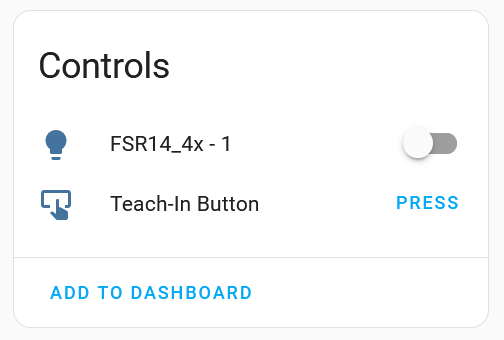

# Teach-In Buttons

Teach-In buttons are used to program the actuators so that they react on sensors or switches. 
When we want to power on and off a light by using Home Assistant we need to tell the actuator that it needs to react on a specific button in Home Assistant. Every button in Home Assistant has its own id/address and sends telegrams either onto the bus or into wireless network. The actuators are listening for telegrams and if the corresponding address is programmed in / teached in for this button they react will on there telegrams.

# Teach-In Progress
1. Most of the time you need to turn on the rotary switch of a device and bring it into learning mode. Usually the devices start to blink. (You should check the specific behavior of the devices in their manual.)
2. While the device is blinking you need to push the Teach-In Button in Home Assistant to program the device for this Home Assistant functionality. 
3. The device stops with blinking and you can turn back the rotary switches, into a position which tells the device what function to perform. 

# Better Alternative to Teach-In Bus Devices
In case of teach-in/programming bus devices I recommend to use either [EnOcean Device Manager (eo_man)](https://github.com/grimmpp/enocean-device-manager) which can enter all address by just pushing one button or [PCT14 from Eltako](https://www.eltako.com/en/software-pct14/) which allows you to manage the memory entries of the devices via a nice application. 

# Limitation
If you are connected via wire to the bus e.g. with FAM14 or FGW14-USB you can only reach the devices directly mounted on the bus. If you want to teach-in other wireless devices or devices mounted on a different bus you need to use either a traceiver (e.g. FAM-USB or USB300) or you can use a telegram duplicater (e.g. FTD14). 
